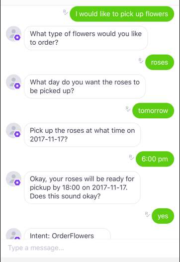

End of support notice: On September 15, 2025, AWS
will discontinue support for Amazon Lex V1. After September 15, 2025, you will
no longer be able to access the Amazon Lex V1 console or Amazon Lex V1 resources. If you are using Amazon Lex V2, refer to the [Amazon Lex V2 guide](../../../lexv2/latest/dg/what-is.md "../../../lexv2/latest/dg/what-is.md") instead.
.

# Step 4: Test the Integration

Now that you have created an association between your Amazon Lex bot and Kik, you can use
the Kik app to test the association.

1. Start the Kik app and log in. Select the bot that you created.
2. You can test the bot with the following:

As you enter each phrase, your Amazon Lex bot will respond through Kik with the
prompt that you created for each slot.
