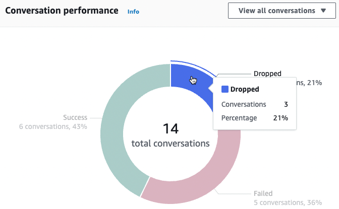
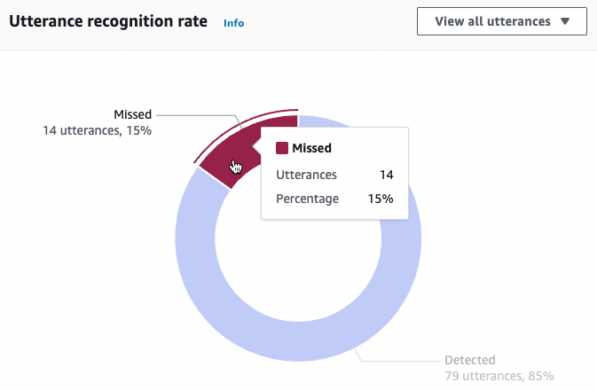
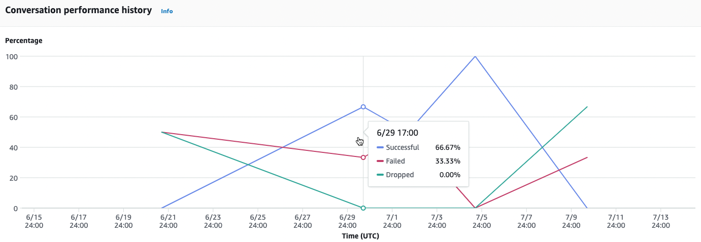
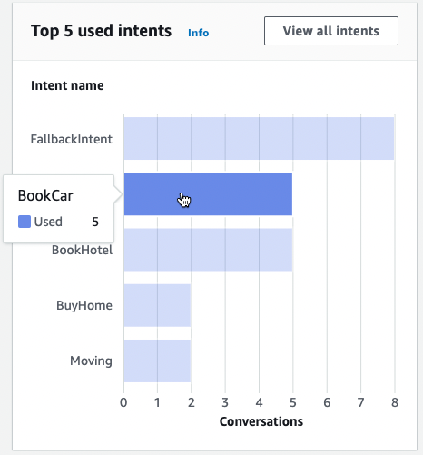
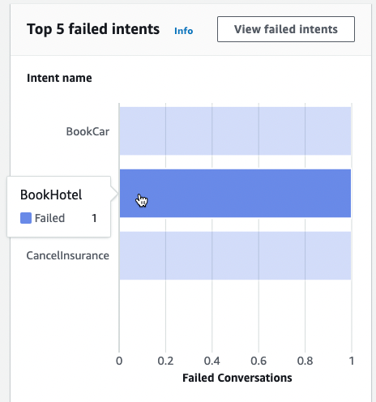

# Overview: a summary of your bot performance

The overview page summarizes your bot’s performance on conversations, utterance
recognition, and intent usage. The overview consists of the following sections:

- [Conversation performance](#conversations-performance "#conversations-performance")
- [Utterance recognition rate](#utterance-recognition-rate "#utterance-recognition-rate")
- [Conversation performance
  history](#conversation-performance-history "#conversation-performance-history")
- [Top 5 used intents](#top-five-used-intents "#top-five-used-intents")
- [Top 5 failed intents](#top-five-failed-intents "#top-five-failed-intents")

## Conversation performance

Use this chart to track the number and percentage of conversations that are
categorized as a _success_, _failed_, and
_dropped_. To access a list of conversations, select
**View all conversations** to reveal a dropdown menu. You can
choose to view a list of all user conversations with the bot or filter for
conversations with a specific result (_success_,
_failed_, or _dropped_). These links take
you to the **Conversations** subsection of the
**Conversation dashboard**. For more information, see [Conversations](conversation-dashboard.md#conversations "conversation-dashboard.md#conversations").

To reveal a box with the count and percentage of conversations with that result,
hover over a segment of the chart, as in the following image.

## Utterance recognition rate

Use this chart to track the number and percentage of utterances that were
**detected** and **missed** by your bot. To
access a list of utterances, select **View utterances** to reveal a
dropdown menu. You can choose to view a list of all user utterances or filter for
utterances with a specific result (_missed_ or
_detected_). These links take you to the **Utterance
recognition** subsection of the **Performance
dashboard**. For more information, see **View
Utterances** to navigate to [Utterance recognition](performance-dashboard.md#utterance-recognition "performance-dashboard.md#utterance-recognition").

To reveal a box with the count and percentage of utterances, hover over a segment
of the chart, as seen in the following image.

## Conversation performance

history

Use this graph to track the percentage of conversations categorized as a _success_, _failed_, and
_dropped_ over the time range that you set in
the filters. To see the percentage of conversations with a specific result in an
interval of time, hover over that interval, as in the following
image.

## Top 5 used intents

Use this chart to identify the top five intents that customers used with your bot.
Hover over a bar to see the number of times that your bot recognized that intent, as
in the following
image.

Select **View all intents** to navigate to the **Intents
performance** subsection of the **Performance
dashboard**, where you can view metrics for your bot’s performance in
fulfilling intents. For more information, see [Intent performance](performance-dashboard.md#intent-performance "performance-dashboard.md#intent-performance").

## Top 5 failed intents

Use this chart to identify the top five intents that your bot failed to fulfill (see [Intents](analytics-key-definitions.md#analytics-key-definitions-intents "analytics-key-definitions.md#analytics-key-definitions-intents") for the definition of a failed intent).
Hover over a bar to see the number of times that your bot failed to fulfill that
intent, as in the following
image.

Select **View failed intents** to navigate to the
**Intents performance** subsection of the **Performance
dashboard**, where you can view metrics for the intents that your bot
failed to fulfill. For more information, see [Intent performance](performance-dashboard.md#intent-performance "performance-dashboard.md#intent-performance").
