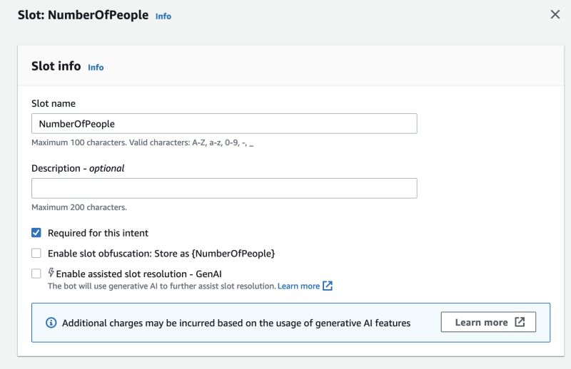

# Enable assisted slot resolution in the slot settings in Lex V2

You can enable assisted slot resolution for supported built-in slots by navigating to the slot level for each intent that has slots.
The slots must be one of the supported built-in slots listed above to have the option of activating assisted slot resolution. If the slot
does not have the option to activate assisted slot resolution, the option will be greyed out.

###### Note

You must first activate the assisted slot resolution feature on the Generative AI panel in order to activate the feature for individual slots.

1. Sign in to the AWS Management Console and open the Amazon Lex V2
   console at https://console.aws.amazon.com/lexv2/home.
2. In the navigation pane under **Bots**, select the bot you want to use for the assisted slot resolution.
3. Under All languages, select **English (US**) to expand the list.
4. In the left side panel, choose **Intents** to view a list of intents in the bot you selected.
5. In the **Intents** screen, choose the intent that contains the slots you want to modify.
6. Select the intent name to view the slots for that intent.
7. Select the **Advanced Options** button in the **Slots** section.
8. Select the check box for **Enable assisted slot resolution** to enable the feature.

 9. Choose the **Update Slot** button in the bottom right corner of the screen. This will
activate assisted slot resolution for the slots you have chosen.
**You can enable assisted slot resolution for supported built-in slots by making API calls.**

- Follow the steps at [Optimize Lex V2 bot creation and performance by using generative AI](generative-features.md "generative-features.md")
  to enable assisted slot resolution for your bot locale.
- Send an [UpdateSlot](../APIReference/API_UpdateSlot.md "../APIReference/API_UpdateSlot.md") request, specifying the slot for which you want to enable assisted
  slot resolution. In the `slotResolutionSetting` field, set the `slotResolutionStrategy`
  value as `EnhancedFallback`. To create a new slot with assisted slot resolution enabled,
  send an [CreateSlot](../APIReference/API_CreateSlot.md "../APIReference/API_CreateSlot.md") request instead.
