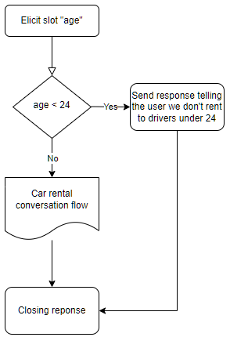
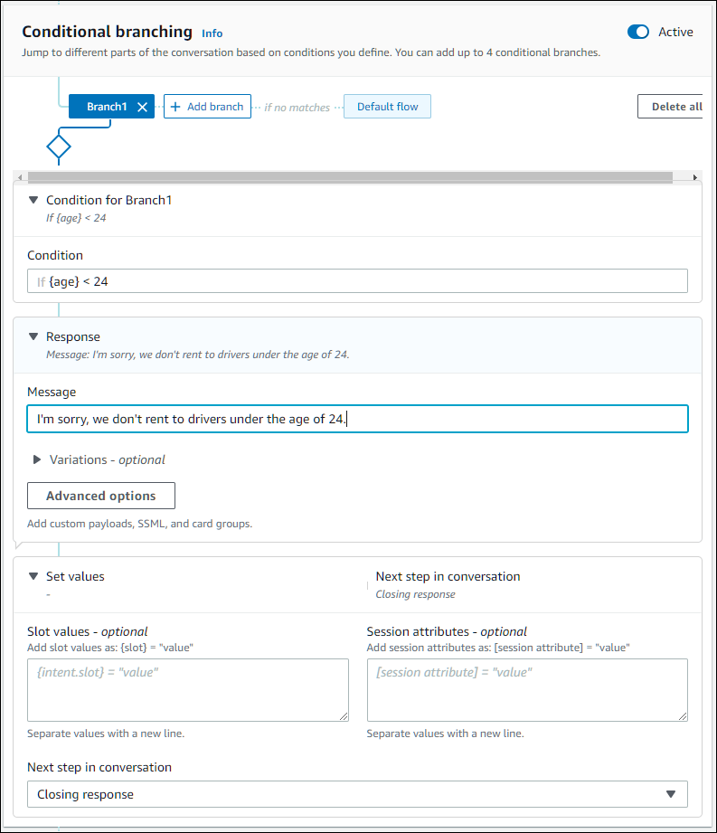

# Creating conversation paths

Typically, Amazon Lex V2 manages the flow of conversations with your users. For simple bots, the
default flow can be enough to create a good experience for your users. However, for more
complex bots, you might want to take control of the conversation and direct the flow into
more complex paths.

For example, in a bot that books car rentals, you might not rent to
younger drivers. In this case, you can create a condition that checks to
see if a driver is below a certain age, and if so, jump to the closing
response.

To design such interactions, you can configure the next step at each point in the
conversation, evaluate conditions, set values and invoke code hooks.

Conditional branching helps you create paths for your users through
complex interactions. You can use a conditional branch at any point that
you pass control of the conversation to your bot. For example, you can
create a condition before the bot elicits the first slot value, you can
create a condition between eliciting each slot value, or you can create
a condition before the bot closes the conversation. For a list of the
places that you can add conditions,
see [Adding intents](add-intents.md "add-intents.md").

When you create a bot, Amazon Lex V2 creates a default path through the conversation based on the
priority order of the slots. To customize the conversation path, you can modify the next
step at any point in the conversation. For more information,
see [Configure next steps in the
conversation](paths-nextstep.md "paths-nextstep.md").

To create alternative paths based on conditions, you can use a conditional branch at any
point in the conversation. For example, you can create a condition before the bot elicits
the first slot value. You can create a condition between eliciting each slot value, or you
can create a condition before the bot closes the conversation. For a list of the places
allowing you to add conditions,
see [Add conditions to branch
conversations](paths-branching.md "paths-branching.md").

You can set conditions based on slot values, session attributes, the input mode and input
transcript, or a response from Amazon Kendra.

You can set slot and session attribute values at each point in the conversation. For more
information,
see [Set values during the
conversation](paths-setting-values.md "paths-setting-values.md").

You can also set the next action to dialog code hook to run a Lambda function. For more
information, see [Invoke dialog code hook](paths-code-hook.md "paths-code-hook.md").

The following image shows the creation of a path for a slot in the console. In this
example, Amazon Lex V2 will elicit the slot "age". If the value of the slot is less than 24, Amazon Lex V2
jumps to the closing response, otherwise Amazon Lex V2 will follow the default path.

###### Note

On August 17, 2022, Amazon Lex V2 released a change to the way conversations
are managed with the user. This change gives you more control over
the path that the user takes through the conversation. For more information,
see [Changes to conversation flows in Amazon Lex V2](understanding-new-flows.md "understanding-new-flows.md").
Bots created before August 17, 2022 do not support dialog code hook messages, setting values,
configuring next steps, and adding conditions.
