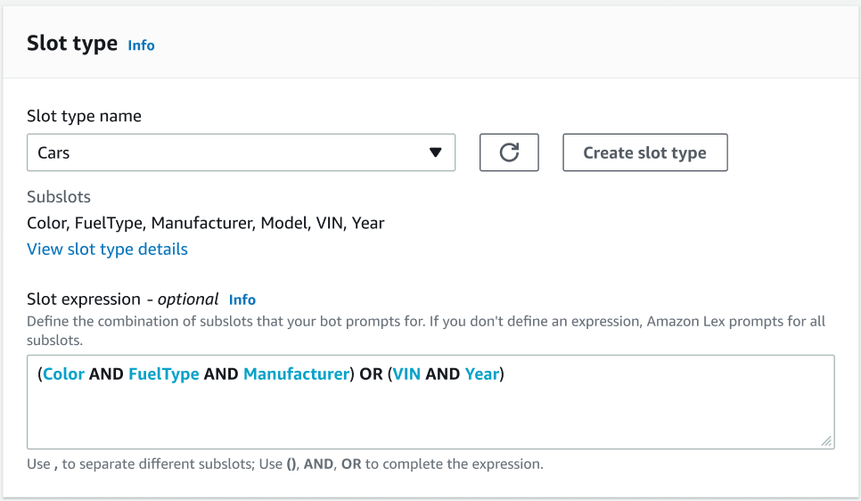
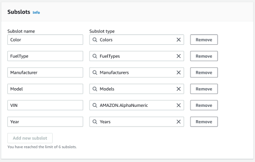
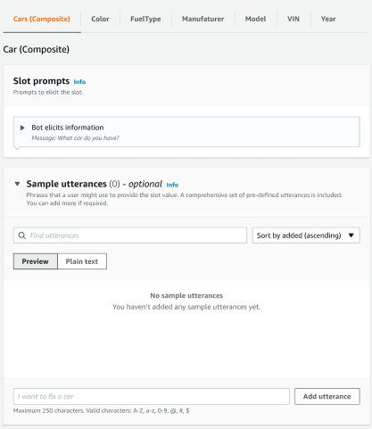
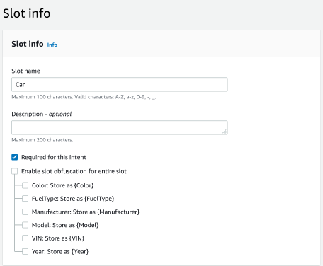
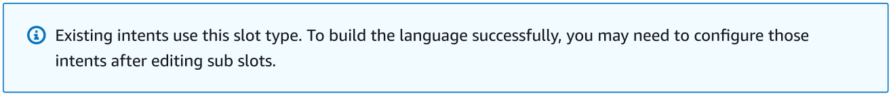
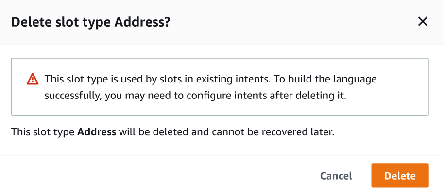

# Composite slot type

A composite slot is a combination of two or more slots that capture multiple pieces of information in a single
user input. For example, you can configure the bot to elicit the location by requesting for the “city and state or
zipcode”. In contrast, when the conversation is configured to use separate slot types resulting in a rigid
conversational experience (“What is the city?” followed by “What is the zipcode?”). With a composite slot, you can
capture all the information through a single slot. A composite slot is a combination of slots called subslots, such
as city, state, and zip code.

You can use a combination of available Amazon Lex slot types (built-ins) and
your own slots (custom slots). You can design logical expressions to
capture information within the required subslots. For example: city and state
or zipcode.

The composite slot type is only available in en-US.

**Creating a composite slot type**

To use subslots within a composite slot, you must first configure the
composite slot type. To do so, use the adding a slot type console steps
or the API operation. After you have chosen the name and a description
for the composite slot type, you have to provide information for
subslots. For more information on adding a slot type, see
[Adding slot types](add-slot-types.md "add-slot-types.md")

**Subslots**

A composite slot type requires configuration of the underlying slots,
called subslots. If you would like to elicit multiple pieces of
information from a customer in one request, configure a combination
of subslots. For example: city, state, and zipcode. You can add up to
6 subslots for a composite slot.

Slots of singular slot types may be used to add subslots to the
composite slot type. However, you cannot use a composite slot type as a
slot type for a subslot.

The following images are an illustration of a composite slot “Car”, which
is a combination of subslots: Color, FuelType, Manufacturer, Model, VIN,
and Year.




**Expression builder**

To drive fulfillment of a composite slot, you can optionally use the
expression builder. With the expression builder, you can design a logical
slot expression to capture the required subslot values in the desired order.
As part of the boolean expression, you can use operators such as AND and OR.
Based on the designed expression, when the required subslots are fulfilled,
the composite slot is considered fulfilled.

**Using a composite slot type**

For some intents, you might want to capture different slots as part of a
single slot. For example, a car maintenance scheduling bot might have an
intent with the following utterance:

`My car is a {car}`

The intent expects that the {car} composite slot contains a list of the
slots, comprising details of the car. For example, "2021 White Toyota
Camry".

The composite slot differs from a multi-valued slot. The composite slot
is comprised of multiple slots, each with its own value. Whereas, a
multi-valued slot is a singular slot that can contain a list of
values. For more information on multi-values slots
see, [Using multiple values in a
slot](multi-valued-slots.md "multi-valued-slots.md")

For a composite slot, Amazon Lex returns a value for each subslot in
the response to the `RecognizeText` or
`RecognizeUtterance` operation. The
following is the slot information returned for the utterance: "I want to
schedule a service for my “2021 White Toyota Camry" from the
CarService bot.

```
"slots": {
    "CarType": {
        "value": {
            "originalValue": "White Toyota Camry 2021",
            "interpretedValue": "White Toyota Camry 2021",
            "resolvedValues": [
                "white Toyota Camry 2021"
            ]
        },
        "subSlots": {
            "Color": {
                "value": {
                    "originalValue": "White",
                    "interpretedValue": "White",
                    "resolvedValues": [
                        "white"
                    ]
                },
                "shape": "Scalar"
            },
            "Manufacturer": {
                "value": {
                    "originalValue": "Toyota",
                    "interpretedValue": "Toyota",
                    "resolvedValues": [
                        "Toyota"
                    ]
                },
                "shape": "Scalar"
            },
            "Model": {
                "value": {
                    "originalValue": "Camry",
                    "interpretedValue": "Camry",
                    "resolvedValues": [
                       "Camry"
                    ]
                },
                "shape": "Scalar"
            },
            "Year": {
                "value": {
                    "originalValue": "2021",
                    "interpretedValue": "2021",
                    "resolvedValues": [
                        "2021"
                    ]
                },
                "shape": "Scalar"
            }
        }
    },
    ...
}
```

A composite slot can be elicited for in the first turn or the n-th turn
of a conversation. Based on the input values supplied, the composite slot
can elicit for the remaining required subslots.

Composite slots always return a value for each subslot. When the utterance does
not contain a recognizable value for a given subslot, there is no response
returned for that particular subslot.

Composite slots work with both text and voice input.

When adding a slot to an intent, a composite slot is only available as a
custom slot type.

You can use Composite slots in prompts. For example, you can set the confirmation
prompt for an intent.

`Would you like me to schedule service for your 2021 White Toyota 
 Camry?`

When Amazon Lex sends the prompt to the user, it sends "Would you like me to
schedule service for your 2021 White Toyota Camry?”

Each subslot is configured as a slot. You can add slot prompts to elicit the
subslot and sample utterances. You can enable wait and continue for a subslot as
well as default values. For more information,
see [Using default slot
values in intents for your Lex V2 bot](context-mgmt-default.md "context-mgmt-default.md")


You can use slot obfuscation to mask the whole composite slot in conversation
logs. Please note that slot obfuscation is applied at the composite slot level
and when enabled, the values for subslots belonging to a composite slot are
obfuscated. When you obfuscate slot values, the value of each of the slot values
is replaced with the name of the slot. For more information, see
[Obscuring slot values in conversation logs from Lex V2](monitoring-obfuscate.md "monitoring-obfuscate.md").


**Editing a composite slot type**

You can edit a subslot from within the composite slot configuration in order
to modify subslot name and slot type. However, when a composite slot is in use
by an intent, you will have to edit the intents before modifying the
subslot.


**Deleting a composite slot type**

You can delete a subslot from within the composite slot configuration. Please
note that when a subslot is in use within an intent, the subslots are still removed
from that intent.


The slot expression in the expression builder provides an alert to inform about
the deleted subslots.


