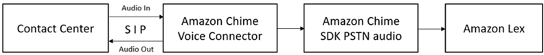

# Amazon Chime SDK

Use the Amazon Chime SDK to add real-time audio, video, screen sharing, and
messaging capabilities to your web or mobile applications. The Amazon Chime SDK
provides public switched telephone network (PSTN) audio service so that
you can build custom telephony applications with an AWS Lambda
function.

Amazon Chime PSTN audio is integrated with Amazon Lex V2. You can use this
integration to access Amazon Lex V2 bots as interactive voice response (IVR)
systems in contact centers for audio interactions. Use this to integrate
Amazon Lex V2 using PSTN audio services in the following scenarios.

**Contact center integrations**—You
can use the Amazon Chime Voice Connector and Amazon Chime SDK PSTN audio service to
access Amazon Lex V2 bots. Use them in any contact center application that uses
the session initiation protocol (SIP) for voice communications. This
integration adds natural language voice conversation experiences to your
existing on-premises or cloud-based contact center with SIP support. For
a list of supported contact center platforms, see [Amazon Chime
voice connector resources](https://aws.amazon.com/chime/voice-connector/resources/ "https://aws.amazon.com/chime/voice-connector/resources/").

The following diagram shows the integration between a contact center
using SIP and Amazon Lex V2.

**Direct telephony support**—You
can build customized IVR solutions to directly access Amazon Lex V2 bots using
a phone number provisioned in the Amazon Chime SDK.

For more information, see the following topics in the _Amazon Chime
SDK guide_.

- [SIP integration
  using an Amazon Chime voice connector](../../../chime/latest/dg/mtgs-sdk-cvc.md "../../../chime/latest/dg/mtgs-sdk-cvc.md")
- [Using
  the Amazon Chime SDK PSTN audio service](../../../chime/latest/dg/build-lambdas-for-sip-sdk.md "../../../chime/latest/dg/build-lambdas-for-sip-sdk.md")
- [Integrating Amazon Chime PSTN audio with Amazon Lex V2](../../../chime/latest/dg/start-bot-conversation.md "../../../chime/latest/dg/start-bot-conversation.md")
  When the Amazon Chime SDK sends a request to Amazon Lex V2, it includes
  platform-specific information to your Lambda function and conversation
  logs. Use this information to determine the contact center application
  that is sending traffic to your bot.

| Common request attribute    | Value                         |
| --------------------------- | ----------------------------- |
| x-amz-lex:channels:platform | `Amazon Chime SDK PSTN Audio` |
