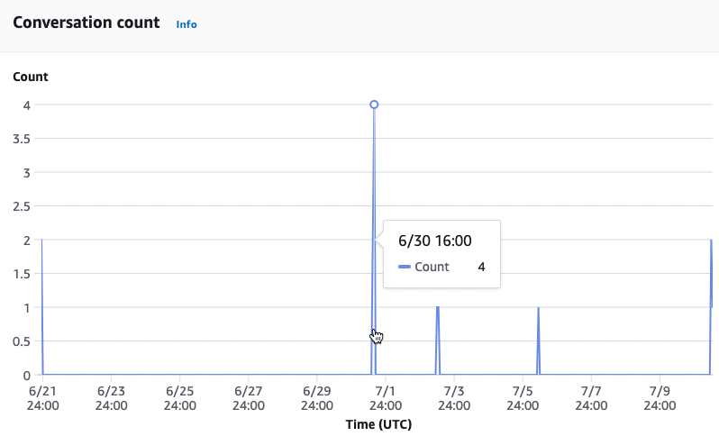
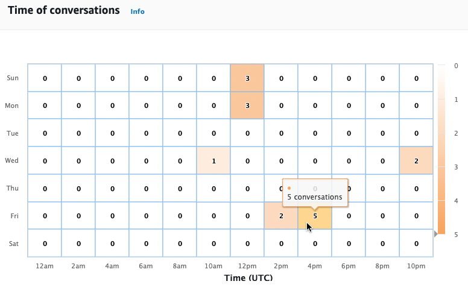
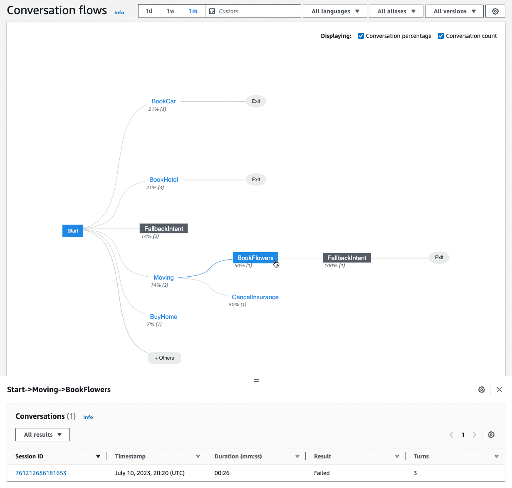

# Conversation dashboard: a summary of your bot

conversations

The conversation dashboard visualizes metrics for customers’ conversations
(see [Conversations](analytics-key-definitions.md#analytics-key-definitions-conversations "analytics-key-definitions.md#analytics-key-definitions-conversations")
for the definition of a _conversation_) with your bot.

The **Summary** contains the following information about user
conversations with your bot. The numbers are calculated based on the filter
settings.

- **Total conversations** – The total number of
  conversations with the bot.
- **Average conversation duration** – The average time of
  user conversations with the bot in minutes and seconds. The format is
  mm:ss.
- **Average turns per conversation** – The average number
  of turns that a conversation lasts.
  The **Conversation count** and **Message count**
  sections each contain a graph that shows the number of conversations and messages,
  respectively, over the time range that you specify in your filters. Hover over a segment
  of time to see the number of conversations or messages in that segment. The size of the
  time segment depends on the time range you specify:

- Less than 1 week – The count is displayed for each hour.
- 1 week or more – The count is displayed for each day.
  See an example of the hovering behavior in the following image.

The **Time of conversations** section presents the number of
conversations that took place between your bot and customers over each two hour interval
on each day of the week, within the time range that you specify in the filters. More
darkly shaded cells indicate times at which more conversations took place. Hover over a
cell to display the number of conversations in the 2 hours beginning from that time
slot. For example, the action in the following image shows the number of conversations
occurring between 4:00PM and 6:00PM UTC.

The **Conversation dashboard** contains two tools,
**Conversation flows** and **Conversations**.
Access a tool by selecting it under **Conversation dashboard** in the
left navigation pane.

## Conversation flows

Use **Conversation flows** to visualize the orders of intents
that customers take in conversations with your bot. Below each intent is the
percentage and count of conversations that invoked that intent at that point in the
conversation. You can toggle the percentage and count off by selecting
**Conversation percentage** and **Conversation
count** at the top. By default, the five most common intents at that
point in the conversation are shown in descending order of frequency. Select
**+ Others** to display all the intents.

Choose an intent to expand to a new column of branches that shows a list of
intents taken at that point in the conversation, sorted in descending frequency.

When you select a node in the conversation flow, you can expand the window below
to display a list of conversations that followed that order of intents. Choose the
**Session ID** corresponding to a conversation to view details
about that conversation. The following image shows a conversation flow and an expanded **Conversations** window at the bottom.

## Conversations

The **Conversations** tool displays a list of conversations for
your bot. You can select a column to sort by that column in ascending or descending
order.

To filter the conversations by result, select **All results** and
choose **Success**, **Failed**, or
**Dropped**.

###### To filter the conversations by duration

1. Select the search bar marked **Filter conversations by
   duration**
2. Define the filter in one of the following ways:
   - Use the predefined options.
     1. Select **Duration**.
     2. Choose between the = (equals), > (greater than), and <
        (less than) operators.
     3. Choose a length of time.

   - Enter an input in the format "Duration {operator} {number} sec" For example, to search for all conversations lasting longer than 30 seconds, enter `Duration > 30 sec`. Specify the length of time in seconds.

To view detailed information about the session, including metadata, intent usage,
and a transcript, select the **Session ID** of a
conversation.

###### Note

Because a conversation is a unique combination of a `sessionId` and
`originatingRequestId`, the same `sessionId` might
appear multiple times in the table.

The **Details** section contains the following metadata:

- **Timestamp** – Specifies the date and start time
  of the conversation. The time is in hh:mm:ss format.
- **Duration** – Specifies how long the conversation
  lasted in mm:ss format. The duration doesn't include the Session timeout
  duration (`idleSessionTTLInSeconds`).
- **Result** – Specifies whether the conversation was
  categorized as a _success_, _failed_,
  or _dropped_. See [Conversations](analytics-key-definitions.md#analytics-key-definitions-conversations "analytics-key-definitions.md#analytics-key-definitions-conversations") for more details
  about these results.
- **Mode** – Specifies whether the conversation was
  `Speech`, `Text`, or `DTMF` (touch tone
  keypad presses). A conversation consisting of multiple modes is
  `Multimode`.
- **Channel** – Specifies the channel that the
  conversation took place on, if applicable. See [Integrating an Amazon Lex V2
  bot with a messaging platform](deploying-messaging-platform.md "deploying-messaging-platform.md").
- **Language** – Specifies the language of the
  bot.

The intents that the bot elicited in the conversation are shown below
**Details**. Select **Go to Intent** to go to
that intent in the intent editor. Select **Snap to transcript** to
automatically scroll the **Transcript** to the first instance in
which the bot elicited the intent.

Select the right arrow next to the intent name to view details about the slots elicited for the intent,
including the names of the slots, the value that the bot elicited for each slot, and
the number of times the bot attempted to elicit each slot.

The **Transcript** lets you review the conversation utterances
and your bot’s behavior in eliciting intents and slots. User utterances are
displayed on the left and bot utterances are displayed on the right. Use the search
bar marked **Filter transcripts in this session** to find text in
the transcript. Next to **Showing:** there are three pieces of
information shown under each conversation turn that you can select to display or
not:

- **Timestamp** – Specifies the time of the
  utterance.
- **Intent state** – Specifies the intent that the
  bot is eliciting during an utterance and the result of the intent, if
  applicable. The following intent states are possible:
  - Invoked intent: `intent name` – The
    bot has identified an intent that the customer is invoking.
  - Switched intent: `intent name` –
    The bot has switched to a different intent based on the
    utterance.
  - `intent name`: Success – The bot
    has fulfilled the intent.

- **Slot state** – Specifies the slot that the bot is
  eliciting during an utterance, if applicable, and the value that the
  customer provides.
