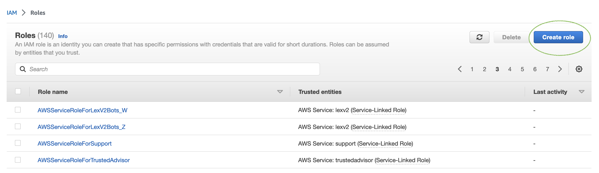
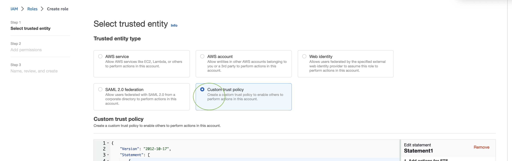
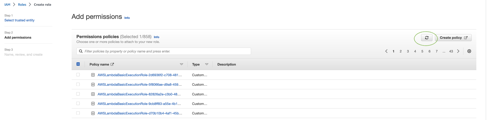

# Create an IAM role for the Test

Workbench

###### To create an IAM role for the Test Workbench

1. Follow the steps at [Create an IAM
   user](gs-account.md#gs-account-user "gs-account.md#gs-account-user") to create an IAM user which can be used to access
   test-workbench console.
2. Select the **Create role** button.

 3. Select the option for **Custom trust policy**.

 4. Enter the trust policy below and click **Next**.

JSON

```
`{
 "Version":"2012-10-17",
 "Statement": [
 {
 "Sid": "sid4",
 "Effect": "Allow",
 "Principal": {
 "Service": "lexv2.amazonaws.com"
 },
 "Action": "sts:AssumeRole"
 }
 ]
}`

```

5. Select the **Create policy** button.
6. A new tab will open in your browser where you can enter the below policy
   and click on **Next: Tags** button.

JSON

```
`{
 "Version":"2012-10-17",
 "Statement": [
 {
 "Effect": "Allow",
 "Action": [
 "s3:*"
 ],
 "Resource": "*"
 },
 {
 "Effect": "Allow",
 "Action": [
 "logs:FilterLogEvents"
 ],
 "Resource": "*"
 },
 {
 "Effect": "Allow",
 "Action": [
 "lex:*"
 ],
 "Resource": "*"
 }
 ]
}`

```

7. Enter a policy name, for example ‘LexTestWorkbenchPolicy’ and then click
   on the **Create Policy**.
8. Return to the previous tab in your browser and Refresh list of policies by
   clicking the **Refresh** button as shown below.

 9. Search in list of policies by entering policy name that you used in the
6th step and choose the policy. 10. Select the **Next** button. 11. Enter role name and then click the **Create Role**
button. 12. Choose your new IAM role when prompted in the Amazon Lex V2 console for Test
Workbench.
