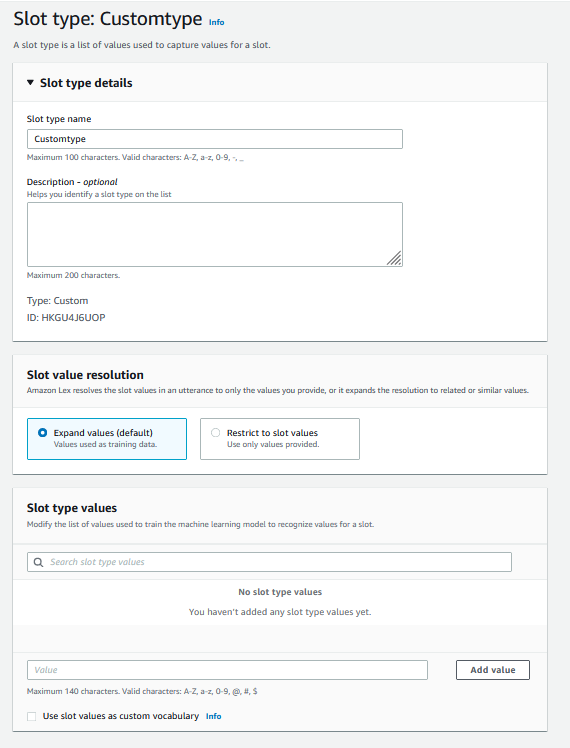

# Custom slot type

For each intent, you can specify parameters that indicate the
information that the intent needs to fulfill the user's request. These
parameters, or slots, have a type. A _slot type_ is a
list of values that Amazon Lex V2 uses to train the machine learning model to
recognize values for a slot. For example, you can define a slot type
called `Genres` with values such as "comedy," "adventure,"
"documentary," and so on. You can define synonyms for a slot type value.
For example, you can define the synonyms
"funny" and "humorous" for the value "comedy."


You can configure the slot type to expand the slot values. Slot values
will be used as training data and the model will resolve the slot to the
value provided by the user if it is similar to the slot values and synonyms
of those values. This is the default behavior. Amazon Lex V2 maintains a
list of possible resolutions for a slot. Each entry in the list provides a
_resolved value_ that Amazon Lex V2 recognized as additional
possibilities for the slot. A resolved value is the best effort to match
the slot value. The list contains up to five values.

Alternatively, you can configure the slot type to restrict resolution
to the slot values. In this case, the model will resolve a slot value
entered by the user to an existing slot value only if it is the same as
that slot value or it is a synonym. For example, if the user enters "funny"
it will resolve to the slot value "comedy."

When the value entered by the user is a synonym of a slot type value,
the model returns that slot type value as the first entry in the list of
`resolvedValues`. For example, if the user enters "funny," the
model populates the `originalValue` field with the value "funny"
and the first entry in the resolvedValues field with "comedy."
You can configure the `valueSelectionStrategy` when you create
or update a slot type with the [CreateSlotType](../APIReference/API_CreateSlotType.md "../APIReference/API_CreateSlotType.md") operation so that the
slot value is filled with the first value in the resolution list.

Custom slot types support inputs using spelling styles. You can use the
spell-by-letter and spell-by-word styles to help your customers enter letters.
For more information,
see [Capturing slot values with spelling styles during the conversation](spelling-styles.md "spelling-styles.md").

If you are using a Lambda function, the input event to the function
includes a resolution list called `resolvedValues`. The
following example shows the slot section of the input to a Lambda
function:

```

   "slots": {
      "MovieGenre": {
         "value": {
            "originalValue": "funny",
            "interpretedValue": "comedy",
            "resolvedValues": [
               "comedy"
            ]
         }
      }
   }
```

For each slot type, you can define a maximum of 10,000 values and
synonyms. Each bot can have a total number of 50,000 slot type values
and synonyms. For example, you can have 5 slot types, each with 5,000
values and 5,000 synonyms, or you can have 10 slot types, each with
2,500 values and 2,500 synonyms.

A custom slot type should not have the same name as the built-in slot
types. For example, a custom slot type should not be named with the
reserved keywords of Date, Number, or Confirmation. These keywords are
reserved for built-in slot types. For a list of all built-in slot types,
see [Built-in slot types](built-in-slots.md "built-in-slots.md").
