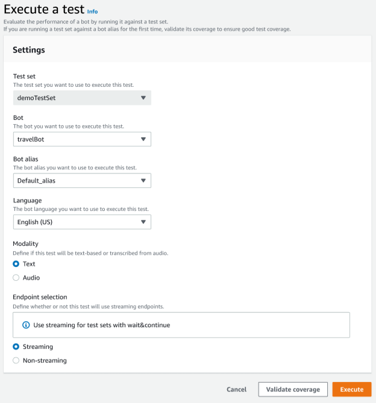

# Execute a test

To execute a test set, you must choose the appropriate bot to run the test against
the test set. You can choose a bot from your AWS account from the drop down menu
under Test Set. This operation will test your selected bot against your validated test
data to report performance metrics against the baseline data from the test set.

###### To execute a test in the Test Workbench

1. In the test set record page, choose **Execute Test**.
2. Select the test set you want to use in the test.
3. Select the name of the bot to use in the test from the **Bot**
   drop down menu.
4. Choose a bot alias, if applicable, from the **Bot alias**
   drop down menu.
5. From the **Languages** selection, choose a version of English.
6. Select **Text** or **Audio** for the Modality type.
7. Choose your Amazon S3 location. (audio only)
8. Select your **Endpoint selection** for your bot. (streaming only)
9. Select the **Validate coverage** button to confirm your test
   in ready to run. If there are any errors present in the validation step, review the previous
   parameters and make corrections.
10. Select **Execute** to run the test.
11. A message confirms that the test is successfully executed.
