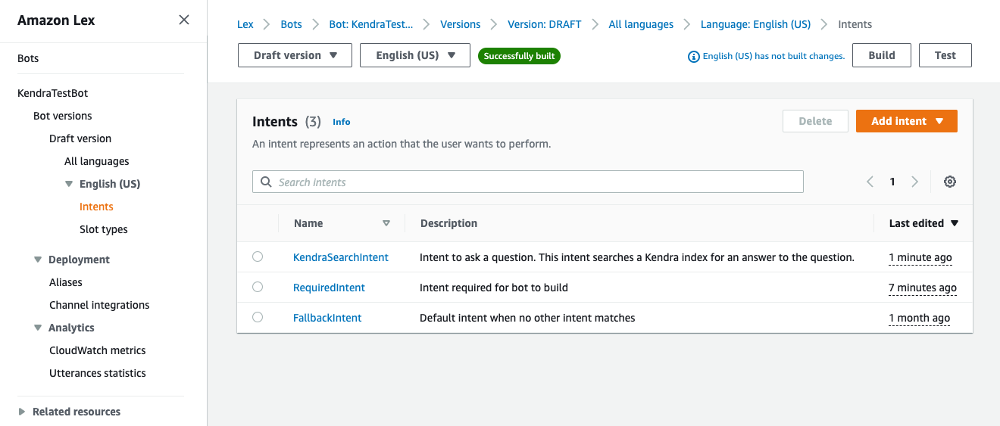
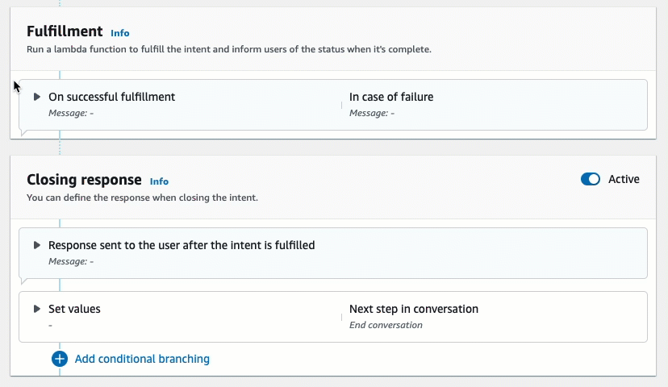

# Example: Creating a

FAQ Bot for an Amazon Kendra Index

This example creates an Amazon Lex V2 bot that uses an Amazon Kendra index
to provide answers to users' questions. The FAQ bot manages the
dialog for the user. It uses the `AMAZON.KendraSearchIntent`
intent to query the index and to present the response to the user.
Here is a summary of how you will create your FAQ bot using an Amazon Kendra index:

1. Create a bot that your customers will interact
   with to get answers from your bot.
2. Create a custom intent. Because the `AMAZON.KendraSearchIntent`
   and `AMAZON.FallbackIntent` are backup intents, your bot requires at
   least one other intent that must contain least one utterance. This intent
   enables your bot to build, but is not used otherwise. Your FAQ bot will therefore
   contain at least three intents, as in the image below:

 3. Add the `AMAZON.KendraSearchIntent` intent to
your bot and configure it to work with your
[Amazon Kendra index](../../../kendra/latest/dg/create-index.md "../../../kendra/latest/dg/create-index.md"). 4. Test the bot by making a query and verifying that the results
from your Amazon Kendra index are documents that answer the query.
**Prerequisites**

Before you can use this example, you need to create an
Amazon Kendra index. For more information, see [Getting started
with the Amazon Kendra console](../../../kendra/latest/dg/gs-console.md "../../../kendra/latest/dg/gs-console.md") in the
_Amazon Kendra Developer Guide_.
For this example, choose the sample dataset
(**Sample AWS documentation**)
as your data source.

###### To create a FAQ bot:

1.  Sign in to the AWS Management Console and open the Amazon Lex console at
    [https://console.aws.amazon.com/lex/](https://console.aws.amazon.com/lex/ "https://console.aws.amazon.com/lex/").
2.  In the navigation pane, choose
    **Bots**.
3.  Choose **Create bot**.

        1. For the **Creation method**,
         choose **Create a blank bot**.
        2. In the **Bot configuration** section,
         give the bot a name that indicates its purpose,
         such as `KendraTestBot`, and an
         optional description. The name must be unique in
         your account.
        3. In the **IAM Permissions** section,
         choose **Create a role with basic Amazon Lex permissions**.
         This will create an
         [AWS Identity and Access Management (IAM)](../../../IAM/latest/UserGuide/introduction.md "../../../IAM/latest/UserGuide/introduction.md")
         role with the permissions that Amazon Lex V2 needs to run your bot.
        4. In the **Children's Online Privacy Protection Act (COPPA)**
         section, choose **No**.
        5. In the **Idle session timeout** and
         **Advanced settings** sections, leave the
         default settings and choose **Next**.
        6. Now you are in the **Add language to bot** section.
         In the menu under **Voice interaction**, select
         **None. This is only a text based application**.
         Leave the default settings for the remaining fields.
        7. Choose **Done**. Amazon Lex V2 creates your bot and a
         default intent called **NewIntent**, and takes you to
         the page to configure this intent

    To successfully build a bot, you must create at least one intent that is separate from
    the `AMAZON.FallbackIntent` and the `AMAZON.KendraSearchIntent`.
    This intent is required to build your Amazon Lex V2 bot, but isn't used for the FAQ response.
    This intent must contain at least one sample utterance and the utterance must not apply
    to any of the questions that your customer asks.

###### To create the required intent:

1. In the **Intent details** section, give
   the intent a name, such as `RequiredIntent`.
2. In the **Sample utterances**
   section, type an utterance in the box next to
   **Add utterance**, such as
   `Required utterance`.
   Then choose **Add utterance**.
3. Choose **Save intent**.
   Create the intent to search an Amazon Kendra index and the
   response message that it should return.

###### To create an AMAZON.KendraSearchIntent intent and

response message:

1. Select **Back to intents list** in the
   navigation pane to
   return to the **Intents** page for
   your bot. Choose **Add intent** and
   select **Use built-in intent** from
   the dropdown menu.
2. In the box that pops up, select the menu under
   **Built-in intent.** Enter
   `AMAZON.KendraSearchIntent`
   in the search bar and then choose it from the list.
3. Give the intent a name, such as
   `KendraSearchIntent`.
4. From the **Amazon Kendra index**
   dropdown menu, choose the index that you want
   the intent to search. The index that you created
   in the **Prerequisites** section
   should be available.
5. Select **Add**.
6. In the intent editor, scroll down to the
   **Fulfillment** section, select the
   right arrow to expand the section, and add the following message in
   the box under **On successful fulfillment**:

```
I found a link to a document that could help you: ((x-amz-lex:kendra-search-response-document-link-1)).
```



For more information about the Amazon Kendra Search Response, see
[Using the Search Response](built-in-intent-kendra-search.md#kendra-search-response "built-in-intent-kendra-search.md#kendra-search-response"). 7. Choose **Save intent**, and then
choose **Build** to build the
bot. When the bot is ready, the banner at the top of the
screen turns green and displays a success message.
Finally, use the console test window to test responses
from your bot.

###### To test your FAQ bot:

1. After the bot is successfully built, choose
   **Test**.
2. Enter `What is Amazon Kendra?` in
   the console test window. Verify that the bot
   responds with a link.
3. For more information about configuring
   `AMAZON.KendraSearchIntent`, see
   [AMAZON.KendraSearchIntent](built-in-intent-kendra-search.md "built-in-intent-kendra-search.md") and
   [KendraConfiguration](../APIReference/API_KendraConfiguration.md "../APIReference/API_KendraConfiguration.md").
