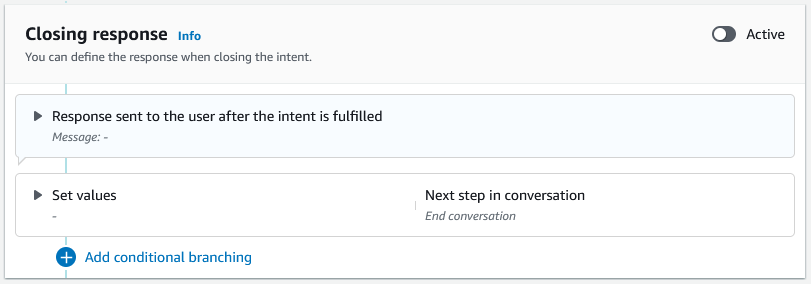

# Closing response

The closing response is sent to your user after their intent
is fulfilled. You can use the closing response to end the
conversation, or you can use it to let the user know that they
can continue with another intent. For example, in a travel booking
bot, you can set the closing
response for the book hotel room intent to this:

|                                                                                     |
| ----------------------------------------------------------------------------------- | ----------------------------------------------------------------------------------------------------------------------------------------------------------------------------------------------------------------------------------------------------------------------------------------------------------------------------------------------------------------------------------------------------------------------------------------------------------------------------------------------------------------------------------------------------------------------------------------------------------------------------------------------------------------------------------------------------------------------------------------------------------------------------------------------------------------------------------------------------------------------------------------------------------------------------------------------------------------------------------- |
| All right, I've booked your hotel room. Is there anything else I can help you with? | You can set values, configure the next steps, and apply conditions after the closing response to the design the conversation path. In the absence of a condition or an explicit next step, Amazon Lex V2 ends the conversation. If you don't supply a closing response, or if none of the conditions evaluates to true, Amazon Lex V2 ends the conversation with your bot.  ###### Note On August 17, 2022, Amazon Lex V2 released a change to the way conversations are managed with the user. This change gives you more control over the path that the user takes through the conversation. For more information, see [Changes to conversation flows in Amazon Lex V2](understanding-new-flows.md "understanding-new-flows.md"). Bots created before August 17, 2022 do not support dialog code hook messages, setting values, configuring next steps, and adding conditions. |
