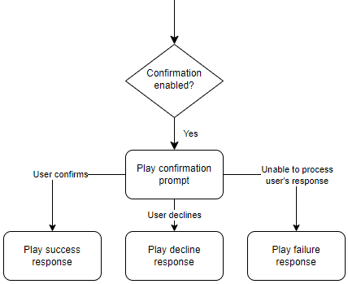
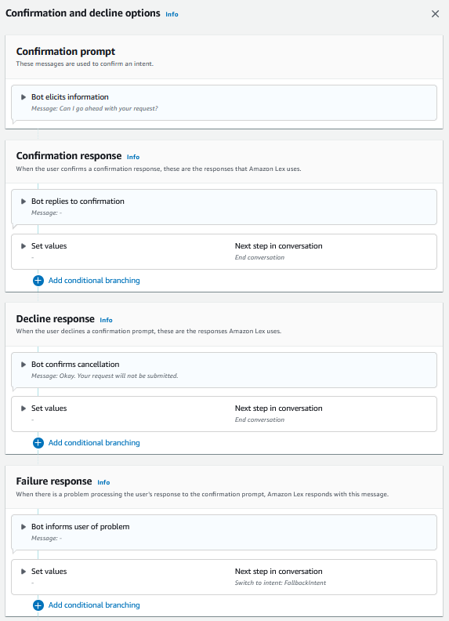

# Confirmation

After the conversation with the user is complete and the slot
values for the intent are filled, you can configure a
confirmation prompt to ask the user if the slot values are
correct. For example, a bot that schedules service appointments
for cars might prompt the user with the following:

|                                                                                                    |
| -------------------------------------------------------------------------------------------------- | ---------------------------------------------------------------------------------------------------------------------------------------------------------------------------------------------------------------------------------------------------------------------------------------------------------------------------------------------------------------------------------------------------------------------------------------------------------------------------------------------------------------------------------------------------------------------------------------------------------------------------------------------------------------------------------------------------------------------------------------------------------------------------------------------------------------------------------------------------------------------------------------------------------------------------------------------------------------------------------------------------------------------------------------------------------------------------------------------------------------------------------------------------------------------------------------------------------------------------------------------------------------------------------------------------------------------------------------------------------------------------------------------------------------------------------------------------------------------------------------------------------------------------------------------------------------------------------------------------------------------------------------------------------------------------------------------------------------------------------------------------------------------------------------------------------------------------------------------------------------------------------------------------------------------------------------------------------------------------------------------------------------------------------------------------------------------------------------------------------------------------------------------------------------------------------------------------------------------------------------------------------------------------------------------------------------------------------------------------------------------------------------------------------------------------------------------------------------------------------------------------------------------------------------------------------------------------------------------------------------------------------------------------------------------------------------------------------------------------------------------------------------------------------------------------------------------------------------------------------------------------------------------------------------------------------------------------------------------------------------------------------------------------------------------------------------------------------------------------------------------------------------- |
| I've got service for your 2017 Honda Civic scheduled for March 25th at 3:00 PM. Is that all right? | You can define 3 types of responses to the confirmation prompt:  • **Confirmation response** – This response is sent to the user when the user confirms the intent. For example, after the user replies "yes" to the prompt "do you want to place the order?"  • **Decline response** – This response is sent to the user when the user declines the intent. For example, after the user replies "no" to the prompt "do you want to place the order?"  • **Failure response** – This response is sent to the user when the confirmation prompt can't be processed. For example, if the user's response couldn't be understood or couldn't be resolved to a yes or a no.  If you don't specify a confirmation prompt, Amazon Lex V2 moves to the fulfillment step or the closing response. You can set values, configure the next steps, and apply conditions corresponding to each response to design the conversation flow. In the absence of a condition or an explicit next step, Amazon Lex V2 moves to the fulfillment step. You can also enable the dialog code hook to validate the information captured in the intent prior to sending it for fulfillment. To use a code hook, enable the dialog code hook in the confirmation prompt advanced options. In addition, configure the next step of the previous state to execute the dialog code hook. For more information, see [Invoke dialog code hook](paths-code-hook.md "paths-code-hook.md"). ###### Note If you use a code hook to trigger the confirmation step at runtime, you must mark the confirmation step as **Active** at build time.  ###### Note On August 17, 2022, Amazon Lex V2 released a change to the way conversations are managed with the user. This change gives you more control over the path that the user takes through the conversation. For more information, see [Changes to conversation flows in Amazon Lex V2](understanding-new-flows.md "understanding-new-flows.md"). Bots created before August 17, 2022 do not support dialog code hook messages, setting values, configuring next steps, and adding conditions. ## Using a Lambda function to validate an intent. You can define a Lambda code hook to validate the intent before you send it for fulfillment. To use a code hook, enable the dialog code hook in the confirmation prompt advanced options. When you use a code hook, you can define the actions that Amazon Lex V2 takes after the code hook runs. You can create three types of responses:  • **Success response** – Sent to the user when the code hook completes successfully.  • **Failure response** – Sent to the user when the code hook doesn't run successfully or when the code hook returns `Failure` in the response.  • **Timeout response** – Sent to the user when the code hook does not complete in its configured timeout period. |
