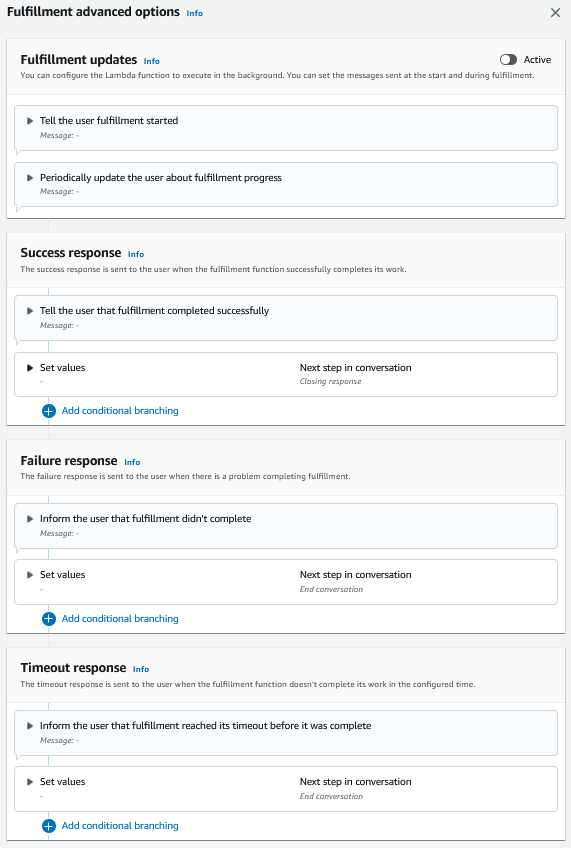

# Fulfillment

After all the slot values are provided by the user for the intent, Amazon Lex V2 fulfills the
user’s request. You can configure the following options for fulfillment.

- **Fulfillment code hook** –
  You can use this option to
  control the fulfillment Lambda invocation. If the option
  is disabled, the fulfillment succeeds without
  invoking the Lambda function.
- **Fulfillment updates** – You can
  enable fulfillment updates for Lambda functions that take more than a few
  seconds to complete, so that the user knows that the process is in
  progress. For more information, see [Configuring fulfillment progress
  updates for your Lex V2 bot](streaming-progress.md "streaming-progress.md"). This
  functionality is only available for streaming conversations.
- **Fulfillment responses** –
  You can configure a success
  response, a failure response, and a timeout response. The
  appropriate response is returned to the user based on the
  status of the fulfillment Lambda invocation.

There are three possible fulfillment responses:

- **Success response** –
  A message sent when the fulfillment
  Lambda completes successfully.
- **Failure response** –
  A message sent if the fulfillment
  failed or Lambda can't be completed for some reason.
- **Timeout response** –
  A message sent if the fulfillment Lambda
  function doesn't finish within the configured
  timeout.
  You can set values, configure the next steps, and apply conditions
  corresponding to each response to design the conversation flow.
  In the absence of a condition or an explicit next step, Amazon Lex V2 moves to closing
  response.

###### Note

On August 17, 2022, Amazon Lex V2 released a change to the way conversations are
managed with the user. This change gives you more control over the path
that the user takes through the conversation. For more information,
see [Changes to conversation flows in Amazon Lex V2](understanding-new-flows.md "understanding-new-flows.md").
Bots created before August 17, 2022 do not support dialog code hook messages,
setting values, configuring next steps, and adding conditions.
