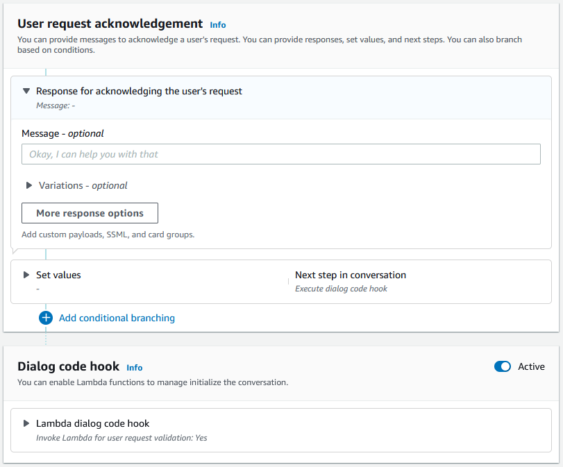

# Initial response

The initial response is sent to the user after Amazon Lex V2
determines the intent and before it starts to elicit slot
values. You can use this response to inform the user of the
intent that was recognized and to prepare them for the
information that you collect to fulfill the intent.

For example, if the intent is to schedule a service
appointment for a car, the initial response might be:

|                                                                                                             |
| ----------------------------------------------------------------------------------------------------------- |
| I can help you schedule an appointment. You'll need to provide the make, model, and year of your car. |

An initial response message isn't required. If you don't
provide one, Amazon Lex V2 continues to follow the next step of
the initial response.

You can configure the following options within the initial
response:

- **Configure next step** –
  You can provide the next step
  in the conversation such as jumping to a specific
  dialog action, eliciting a particular slot, or jumping
  to a different intent. For more information,
  see [Configure next steps in the
  conversation](paths-nextstep.md "paths-nextstep.md").
- **Set values** –
  You can set values for slots and session
  attributes. For more information,
  see [Set values during the
  conversation](paths-setting-values.md "paths-setting-values.md")
- **Add conditional branching** –
  You can apply conditions
  after playing the initial response. When a condition
  evaluates to true, the actions that you define are taken.
  For more information,
  see [Add conditions to branch
  conversations](paths-branching.md "paths-branching.md").
- **Execute dialog code hook** –
  You can define a Lambda code
  hook to initialize data and execute business logic. For
  more information,
  see [Invoke dialog code hook](paths-code-hook.md "paths-code-hook.md"). If the
  option to execute Lambda function is enabled for the
  intent, the dialog code hook is executed by default.
  You can disable dialog code hook by toggling the
  **Active**button.
  In the absence of a condition or an explicit next step,
  Amazon Lex V2 moves to the next slot in priority order.

###### Note

On August 17, 2022, Amazon Lex V2 released a change to the way conversations are
managed with the user. This change gives you more control over the path
that the user takes through the conversation. For more information,
see [Changes to conversation flows in Amazon Lex V2](understanding-new-flows.md "understanding-new-flows.md").
Bots created before August 17, 2022 do not support dialog code hook messages,
setting values, configuring next steps, and adding conditions.
