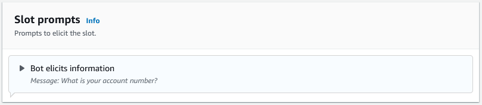
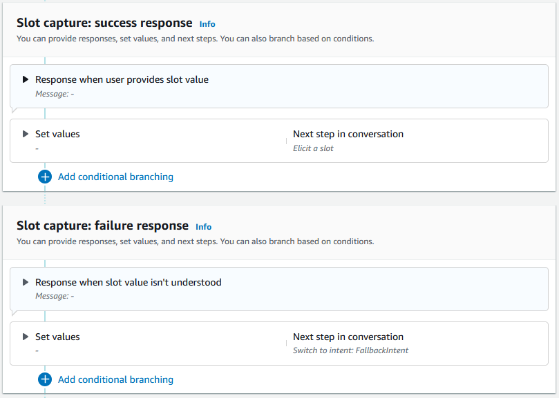
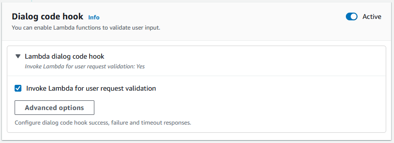

# Slots

Slots are values provided by the user to fulfill the intent.
There are two types of slots:

- **Built-in slot type**
  – You can use built-in slot types to capture
  standard values such as number, name, and city.
  For a list of supported built-in slot types,
  see [Built-in slot types](built-in-slots.md "built-in-slots.md").
- **Custom slot type**
  – You can use custom slot types to
  capture custom values specific to the intent. For example,
  you can use a custom slot type to capture account type as
  “Checking” or “Savings”. For more information,
  see [Custom slot type](custom-slot-types.md "custom-slot-types.md").
  To define a slot in an intent, you have to configure the
  following:

- **Slot info** –
  This field contains a name and an optional
  description for the slot. For example, you can provide slot
  name as “AccountNumber” to capture account numbers. If the
  slot is required as part of the conversation flow for
  fulfilling the intent, it must be marked as required.
- **Slot type** –
  A slot type defines the list of values that a
  slot can accept. You can create a custom slot type or use a
  pre-defined slot type.
- **Slot prompt** –
  A slot prompt is a question posed to the
  user to gather information. You can configure the number
  of retries used to gather information and the variation of
  the prompt used for each retry. You can also enable a Lambda
  function invocation after each retry to process the input
  captured and attempt to resolve to a valid input.
- **Wait and Continue (optional)**
  – By enabling this behavior,
  users can say phrases such as "hold on a second" to make the
  bot wait for them to find the information and provide it.
  This is enabled only for streaming conversations. For more
  information, see [Enabling the
  Amazon Lex V2 bot to wait for the user to provide more information during a pause](wait-and-continue.md "wait-and-continue.md").
- **Slot capture responses** – You can
  configure a success response and a failure response based on the outcome
  of capturing the slot value from user input.
- **Conditional branching**
  – You can apply conditions after
  playing the initial response. When a condition evaluates to
  true, the actions that you define are taken. For more
  information, see [Add conditions to branch
  conversations](paths-branching.md "paths-branching.md").
- **Dialog code hook**
  – You can also use a Lambda code hook
  to validate the slot values and execute business logic.
  For more information, see [Invoke dialog code hook](paths-code-hook.md "paths-code-hook.md").
- **User input type**
  – You can configure input type so the bot can accept
  a specific modality. By default, both audio and DTMF modalities
  are accepted. You can selectively set it to audio only or
  DTMF only.
- **Audio input timeouts and lengths**
  – You can configure audio timeouts including voice timeout and
  silence timeout. Also, you can set the max audio length.
- **DTMF input timeout, characters, and lengths**
  – You can set the DTMF timeout along with the deletion
  character and the end character. Also, you can set the max
  DTMF length.
- **Text length**
  – You can set the max length for text modality.
  After the slot prompt is played, the user provides the slot
  value as an input. If Amazon Lex V2 does not understand a slot
  value provided by the user, it retries eliciting the slot until
  it understands a value or until it exceeds the maximum number
  of retries that you configured for the slot. Using the advanced
  retry settings you can configure the timeouts, restrict the type
  of input, and enable or disable interrupt for the initial
  prompt and retries. After each attempt
  at capturing the input, Amazon Lex V2 can call the Lambda function
  configured for the bot with an invocation label provided for
  retries. You can use the Lambda function, for example, to apply
  your business logic to attempt resolving it to a valid value.
  This Lambda function can be enabled within
  **Advanced options** for slot
  prompts.

You can define responses that the bot should send to the user
once the slot value is entered or if the maximum number of
retries is exceeded. For example, for a bot for scheduling
service for a car, you can send a message to the user when the
vehicle identification number (VIN) is entered:

|                                                                                                          |
| -------------------------------------------------------------------------------------------------------- |
| Thank you for providing the VIN number of your car. I will now proceed to schedule an appointment. |

You can create two responses:

- **Success response** –
  sent when Amazon Lex V2 understands
  a slot value.
- **Failure response** –
  sent when Amazon Lex V2 can't
  understand a slot value from the user after the maximum
  number of retries.
  You can set values, configure the next steps, and apply
  conditions that correspond to each response to design the
  conversation flow.

In the absence of a condition or an explicit next step, Amazon Lex V2
moves to the next slot in priority order.

You can use a Lambda function to validate a slot value that a user has entered and determine
what the next action should be. For
example, you can use the validation function to make sure that the entered value
falls in the correct range, or that is correctly formatted. To activate the Lambda function, choose the **Invoke Lambda function** checkbox and the **Active** button in the **Dialog code hook** section.
You can specify an invocation label for the dialog code hook. This invocation label
can be used in Lambda function to write the business logic corresponding to the slot
elicitation.

Slots that are not required for the intent are not part of the main conversation
flow. However, if a user utterance contains a value that your bot identifies as corresponding to an optional slot, it can popluate the slot with that value. For example, if you configure a
business intelligence bot to have an optional `City` slot and the user utterance `What is the sales for April in San Diego?`, the bot fills the optional slot with `San Diego`. You can configure the business logic to use the optional slot
value, if present.

Slots not required for the intent cannot be elicited using next steps. These
steps can be populated only during intent elicitation (as in the preceding
example) or can be elicited by setting the dialog state within the Lambda function.
If the slot is elicited using the Lambda function, you must use the Lambda function to
decide the next step in the conversation after the slot elicitation is completed. To
enable support for next step while building the bot, you must mark the slot as
required for the intent.

###### Note

On August 17, 2022, Amazon Lex V2 released a change to the way conversations are
managed with the user. This change gives you more control over the path
that the user takes through the conversation. For more information,
see [Changes to conversation flows in Amazon Lex V2](understanding-new-flows.md "understanding-new-flows.md").
Bots created before August 17, 2022 do not support dialog code hook messages,
setting values, configuring next steps, and adding conditions.

The following topics describe how to configure a bot to re-elicit a slot value that has already been filled and how to create a slot that consists of multiple values:

###### Topics

- [Re-eliciting slots](reelicit-slots.md "reelicit-slots.md")
- [Using multiple values in a
  slot](multi-valued-slots.md "multi-valued-slots.md")
