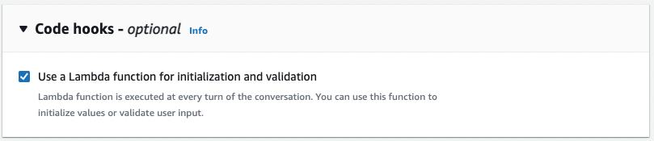
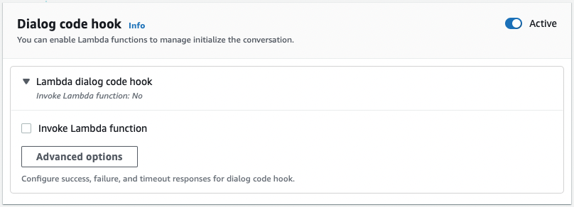

# Attach an AWS Lambda function to a bot using the console

You must first attach a Lambda function to your bot alias before you can invoke it. You can only
attach one Lambda function with each bot alias. Perform these steps to attach the Lambda function
using the AWS console.

1. Sign in to the AWS Management Console and open the Amazon Lex console at
   [https://console.aws.amazon.com/lex/](https://console.aws.amazon.com/lex/ "https://console.aws.amazon.com/lex/").
2. Choose **Bots** from the left side panel and from the list of bots, choose the
   name of the bot that you want to attach a Lambda function to.
3. From the left side panel, select **Aliases** under the **Deployment** menu.
4. From the list of aliases, choose the name of the alias that you want to attach a Lambda function to.
5. In the **Languages** panel, select the language that you want a Lambda function to.
   Select **Manage languages in alias** to add a language if it is not present in the panel.
6. In the **Source** dropdown menu, choose the name of the Lambda function that you want to attach.
7. In the **Lambda function version or alias** dropdown menu, choose the version or alias of the Lambda
   function that you want to use. Then select **Save**. The same Lambda function is used for all intents in a
   language supported by the bot.

###### Setting a intent to invoke a Lambda function using the console

1.  After selecting a bot, select **Intents** in the left side menu under the language of the bot for
    which you want to invoke the Lambda function.
2.  Choose the intent in which you want to invoke the Lambda function to open the intent editor.
3.  There are two options for setting the Lambda code hook:
    1. To invoke the Lambda function after every step of the
       conversation, scroll to the **Code hooks** section
       at the bottom of the intent editor and select the **Use a
       Lambda function for initialization and validation**
       check box, as in the following image:

     2. Alternatively, use the **Dialog code hook** section in the conversation stages
    at which to invoke the Lambda function. The **Dialog code hook** section appears as follows:

    

    There are two ways to control how Amazon Lex V2 calls the code hook for a response:

        * Toggle the **Active** button to mark it as *active* or *inactive*.
         When a code hook is *active*, Amazon Lex V2 will call the code hook. When the code hook
         is *inactive*, Amazon Lex V2 does not run the code hook.
        * Expand the **Lambda dialog code
         hook** section and select the **Invoke
         Lambda function** check box to mark it as
         *enabled* or
         *disabled*. You can only enable or
         disable a code hook when it is marked active. When it is
         marked *enabled*, the code hook is run
         normally. When it is *disabled*, the code
         hook is not called and Amazon Lex V2 acts as if the code hook
         returned successfully. To configure responses after the
         dialog code hook succeeds, fails, or times out, select
         **Advanced options**

    The Lambda code hook can be invoked at the following conversation stages:

        * To invoke the function as the **initial response**, scroll to the **Initial Response** section, expand the arrow next to **Response to acknowledge the user's request**, and select **Advanced options**. Find the **Dialog code hook** section at the bottom of the menu that pops up.
        * To invoke the function after **slot elicitation**, scroll to the **Slots** section, expand the arrow next to the relevant **Prompt for slot**, and select **Advanced options**. Find the **Dialog code hook** section near the bottom of the menu that pops up, just above **Default values**.

        You can also invoke the function after each
         elicitation. To do this, expand **Bot elicits
         information** in the **Slot
         prompts** section, select **More prompt
         options**, and select the check box next to
         **Invoke Lambda code hook after each
         elicitation**.
        * To invoke the function for **intent confirmation**, scroll to the **Confirmation** section, expand the arrow next to **Prompts to confirm the intent**, and select **Advanced options**. Find the **Dialog code hook** section at the bottom of the menu that pops up.
        * To invoke the function for **intent fulfillment**, scroll to the
         **Fulfillment** section. Toggle the
         **Active** button to set the code hook
         to *active*. Expand the arrow next to
         **On successful fulfillment**, and
         select **Advanced options**. Select the
         check box next to **Use a Lambda function for
         fulfillment** under the **Fulfillment
         Lambda code hook** section to set the code hook
         to *enabled*.

4.  Once you set the conversation stages at which to invoke the Lambda function, **Build** the bot again to test the function.
