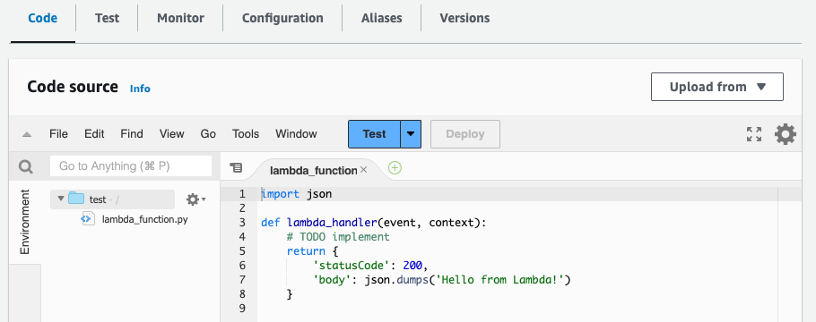

# Creating an AWS Lambda function for your bot

To create a Lambda function for your Amazon Lex V2 bot, access AWS Lambda from your AWS Management Console and create a new function.
You can refer to the [AWS Lambda developer guide](../../../lambda/latest/dg/welcome.md "../../../lambda/latest/dg/welcome.md")
for more details about AWS Lambda.

1. Sign in to the AWS Management Console and open the AWS Lambda console at
   [https://console.aws.amazon.com/lambda/](https://console.aws.amazon.com/lambda/ "https://console.aws.amazon.com/lambda/").
2. Choose **Functions** in the left sidebar.
3. Select **Create function**.
4. You can select **Author from scratch** to start with minimal code, **Use a blueprint**
   to select sample code for common use cases from a list, or **Container image** to select a container
   image to deploy for your function. If you select **Author from scratch**, continue with the following steps:
   1. Give your function a meaningful **Function name** to describe what it does.
   2. Choose a language from the drop down menu under
      **Runtime** to write your function in.
   3. Select an instruction set **Architecture** for your function.
   4. By default, Lambda creates a role with basic permissions. To use an existing role or to create a role
      using AWS policy templates, expand the **Change default execution role** menu and
      select an option.
   5. Expand the **Advanced settings** menu to configure more options.

5. Select **Create function**.
   The following image shows what you see when you create a new function from scratch:


The Lambda handler function differs depending on the language you use. It minimally takes an `event` JSON
object as an argument. You can see the fields in the `event` that Amazon Lex V2
provides at [AWS Lambda input event format for Lex V2](lambda-input-format.md "lambda-input-format.md"). Modify the handler function
to ultimately return a `response` JSON object that matches the format described
in [AWS Lambda response format for Lex V2](lambda-response-format.md "lambda-response-format.md").

- Once you finish writing your function, select **Deploy** to allow the function to be used.
  Remember that you can associate each bot alias with at most one Lambda function. However, you can define as many
  functions as you need for your bot within the Lambda code and call these functions in the Lambda handler function. For example,
  while all intents in the same bot alias must call the same Lambda function, you can create a router function that activates a
  separate function for each intent. The following is a sample router function that you can use or modify for your application:

```
import os
import json
import boto3

# reuse client connection as global
client = boto3.client('lambda')

def router(event):
    intent_name = event['sessionState']['intent']['name']
    fn_name = os.environ.get(intent_name)
    print(f"Intent: {intent_name} -> Lambda: {fn_name}")
    if (fn_name):
        # invoke lambda and return result
        invoke_response = client.invoke(FunctionName=fn_name, Payload = json.dumps(event))
        print(invoke_response)
        payload = json.load(invoke_response['Payload'])
        return payload
    raise Exception('No environment variable for intent: ' + intent_name)

def lambda_handler(event, context):
    print(event)
    response = router(event)
    return response
```

**When to use AWS Lambda functions in bot conversations**

You can use Lambda functions at the following points in a conversation with a user:

- In the initial response after the intent is recognized. For example, after the user says they want to order a pizza.
- After eliciting a slot value from the user. For example, after the user tells the bot the size of pizza they want to order.
- Between each retry for eliciting a slot. For example, if the customer doesn't use a recognized pizza size.
- When confirming an intent. For example, when confirming a pizza order.
- To fulfill an intent. For example, to place an order for a pizza.
- After fulfillment of the intent, and before your bot closes the
  conversation. For example, to switch to an intent to order a drink.

###### Topics

- [Attach an AWS Lambda function to a bot using the console](lambda-attach-console.md "lambda-attach-console.md")
- [Attach an AWS Lambda function to a bot using API operations](lambda-attach-api.md "lambda-attach-api.md")
