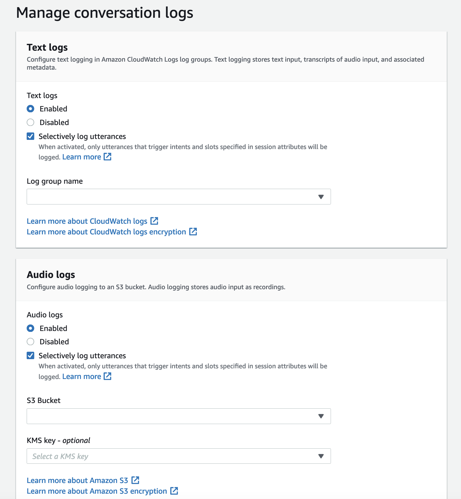
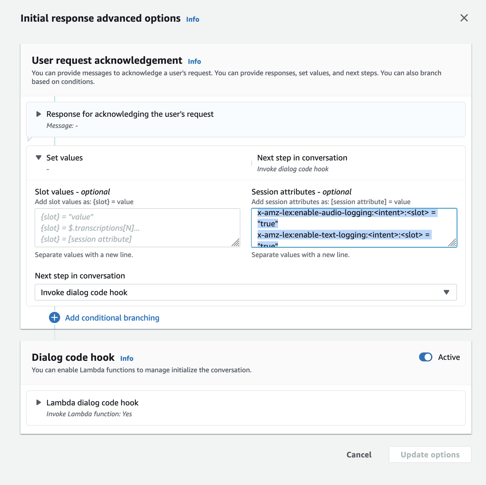

# Manage selective conversation log capture

Using the Lex console, you can enable the selective conversation log capture settings and choose which
slots you want to enable selective conversation log capture capture for.

**Activate selective conversation log capture in the Amazon Lex V2 console:**

1. Sign in to the AWS Management Console and open the Amazon Lex V2 console at [https://console.aws.amazon.com/lexv2/home](https://console.aws.amazon.com/lexv2/home "https://console.aws.amazon.com/lexv2/home").
2. Select **Bots** from the left side panels and choose the bot you want to enable the selective conversation log
   capture. Use an existing bot or create a new one.
3. Choose **Aliases** for your selected bot under the **Deployment** section on the left side panel.
4. Choose your bot’s Alias, then select **Manage conversation logs**.
5. In the **Manage conversation logs** panel, for **Text logs**, choose whether text logs are enabled or disable
   by selecting the radio button. If you choose **Enabled** for text logs, then you will need to enter a **Log group
   name** or choose an existing log group name from the drop down menu. Select the check box for **Selectively log utterances** if you are selectively logging text files.

###### Note

Enable text and/or audio logs by selecting the **Selectively log utterances** check box in the
**conversation logs settings** (text and/or audio) in build time **BotAlias** settings. You must configure
the CloudWatch log group and Amazon S3 bucket to select this option. 6. In the **Audio logs** section, choose whether audio logs are enabled or disable by selecting the radio
button. If you choose **Enabled** for audio logs, you need to specify the Amazon S3 bucket location and (optional)
the KMS key for encrypting your audio data. Select the check box for **Selectively log utterances** if you are selectively logging audio files.

 7. Select **Save** in the bottom right corner of the panel to save your selective conversation log capture settings.
**Activate selective conversation log capture in the Amazon Lex V2 console:**

1. Go to **Intents** and select the **Intent name**, **Initial Response**, **Advanced Settings**, **Set Values**,
   **Session Attributes**.
2. Set the following attributes to based on the intents and slots for which you want to enable selective conversation log capture:
   - `x-amz-lex:enable-audio-logging:`intent`:`slot` = "true"`
   - `x-amz-lex:enable-text-logging:`intent`:`slot` = "true"`

###### Note

Set `x-amz-lex:enable-audio-logging:`intent`:`slot` = "true"` to capture
utterances that contain only a specific slot in the conversation. The action to log an utterance depends on the assessment of `intent` :`slot` within the utterance, in comparison to the session attribute expressions, and the corresponding flag
value. To log an utterance, at least one expression in the session attribute must allow it, with the enable logging flag set to `true`. The value of
`intent` and `slot` can be `"*"` as well. If the slot and/or intent value is `"*"`,
it means that any slot and/or intent value of `"*"` will match with it. Similar to
`x-amz-lex:enable-audio-logging`, a new session attribute called `x-amz-lex:enable-text-logging` will be used to control text logs. 3. Select **Update options** and build the bot to include the updated settings.

###### Note

Your IAM role must have access permission to allow you to write data to the Amazon S3 bucket and
to use a KMS key to encrypt the data. Lex will update your IAM role with Lex permissions to access
CloudWatch Logs log group and the selected Amazon S3 bucket.

**Guidelines for using selective conversation log capture:**

You can only enable selective conversation log capture for text and/or audio logs, when you have enabled text and/or
audio logs in the **Conversation log settings**. By enabling selective conversation log capture for text
and/or audio logs, you disable logging for all intents and slots in the conversation. To generate text and/or audio
logs for particular intents and slots, you must set text or/and audio selective conversation log capture session attributes
for those intents and slots to "true".

- If selective conversation log capture is enabled, and no session attributes with the prefix x-amz-lex:enable-audio-logging are present, logging will be disabled by default for all the utterances. This scenario is also true regarding x-amz-lex:enable-text-logging.
- Utterance logs will be stored exclusively for the segments of text and/or audio conversation if at least one expression in the session attribute allows it.
- The configurations for selective conversation log capture of text and/or audio, as defined in session attributes, will be effective only when selective conversation log capture for text and/or audio is enabled in Conversation Log Settings within bot alias; otherwise, session attributes will be disregarded.
- When selective conversation log capture is enabled, any slot values in SessionState, Interpretations, and Transcriptions for which logging is not enabled using session attributes will be obfuscated in the generated text log.
- The decision to produce audio and/or text logs is evaluated by matching the slot elicited by the bot with the selective conversation log capture session attributes, except for the intent elicitation turn where user can provide slot values along with intent elicitation. In an intent elicitation turn, the slots filled in current turn are matched against the selective conversation log capture session attributes.
- The slots that are considered filled are derived from the session state at the end of the turn. Therefore, any alterations made by the Dialog Codehook Lambda to the slots in session state will influence the behavior of selective conversation log capture.
- In an intent elicitation turn, if multiple slot values are given by the user, the text and/or audio log will only get generated if the text/audio session attributes allow logging for all the slots filled in this turn.
- The recommended operational approach is to set the selective conversation log capture session attribute at the beginning of the session and to refrain from modifying it during the session.
- If any slots contain sensitive data, you should always enable slot obfuscation.
