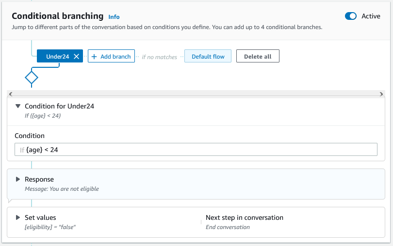

# Add conditions to branch

conversations

You can use _conditional branching_ to control
the path that your customer takes through the conversation with your
bot. You can branch the conversation based on slot values, session
attributes, the contents of the input mode and input transcript
fields, or a response from Amazon Kendra.

You can define up to four branches. Each branch has a condition
that must be satisfied in order for Amazon Lex V2 to follow that branch. If
none of the branches has its condition satisfied, a default branch
is followed.

When you define a branch, you define the action that Amazon Lex V2
should take if the conditions corresponding to that branch evaluate to
true. You can define any of the following actions:

- A response sent to the user.
- Slot values to apply to slots.
- Session attribute values for the current session.
- The next step in the conversation. For more information,
  see [Creating conversation paths](building-paths.md "building-paths.md").


Each conditional branch has a Boolean expression that must be
satisfied for Amazon Lex V2 to follow the branch. There are comparison and
Boolean operators, functions, and quantifier operators that you can
use for your conditions. For example, the following condition returns
true if the {age} slot is less than 24.

```
{age} < 24
```

The following condition returns true if the {toppings} multi-value
slot contains the word "pineapple".

```
{toppings} CONTAINS "pineapple"
```

You can combine multiple comparison operators with a Boolean
operator for more complex conditions. For example, the following
condition returns true if the {make} slot value is "Honda" and the
{model} slot value is "Civic". Use parentheses to set the evaluation
order.

```
({make} = "Honda") AND ({model} = "Civic")
```

The following topics provide details on the conditional branch
operators and functions.

###### Note

On August 17, 2022, Amazon Lex V2 released a change to the way conversations
are managed with the user. This change gives you more control over
the path that the user takes through the conversation. For more information,
see [Changes to conversation flows in Amazon Lex V2](understanding-new-flows.md "understanding-new-flows.md").
Bots created before August 17, 2022 do not support dialog code hook messages, setting values,
configuring next steps, and adding conditions.

###### Topics

- [Comparison
  operators](#branching-comparison "#branching-comparison")
- [Boolean operators](#branching-boolean "#branching-boolean")
- [Quantifier
  operators](#branching-quentifier "#branching-quentifier")
- [Functions](#branching-function "#branching-function")
- [Sample conditional expressions](#sample-conditional-expressions "#sample-conditional-expressions")

## Comparison

operators

Amazon Lex V2 supports the following comparison operators for
conditions:

- Equals (=)
- Not equals (!=)
- Less than (<)
- Less than or equals (<=)
- Greater than (>)
- Greater than or equals (>=)

When using a comparison operator, it uses the following
rules.

- The left-hand side must be a reference. For example,
  to reference a slot value, you use
  `{slotName}`. To reference a session
  attribute value, you use
  `[attribute]`. For input mode and input
  transcript, you use `$.inputMode`
  and `$.inputTranscript`.
- The right-hand side must be a constant and the same
  type as the left hand side.
- Any expression referencing an attribute which has
  not been set is treated as invalid, and is not
  evaluated.
- When you compare a multi-valued slot, the value used
  is a comma-separated list of all interpreted
  values.

Comparisons are based on the slot type of the reference. They
are resolved as follows:

- **Strings** –
  strings are compared based on their ASCII
  representation. The comparison is
  case-insensitive.
- **Numbers** –
  number-based slots are converted from the string
  representation to a number and then compared.
- **Date/Time** –
  time-based slots are compared based on the time series.
  The earlier date or time is considered smaller. For
  durations, shorter periods are considered smaller.

## Boolean operators

Amazon Lex V2 supports Boolean operators to combine comparison
operators. They let you create statements similar to the
following:

```
({number} >= 5) AND ({number} <= 10)
```

You can use the following Boolean operators:

- AND (&&)
- OR (||)
- NOT (!)

## Quantifier

operators

Quantifier operators evaluate the elements of a sequence and
determine if one or more elements satisfy the condition.

- **CONTAINS** –
  determines if the specified value is contained in a
  multi-valued slot and returns true if it is. For
  example, `{toppings} CONTAINS "pineapple"`
  returns true if the user ordered pineapple on their
  pizza.

## Functions

Functions must be prefixed with the string `fn.`.
The argument to the function is a reference to a slot, session attribute, or request attribute. Amazon Lex V2
provides two functions for getting information from the values
of slots, sessionAttribute, or requestAttribute.

- **fn.COUNT()** –
  counts the number of values in a multi-valued slot.

For example, if the slot `{toppings}` contains
the value "pepperoni, pineapple":

`fn.COUNT({toppings}) = 2`

- **fn.IS_SET()** –
  value is true if a slot, session attribute, or request attribute is set in the
  current session.

Based on the previous example:

`fn.IS_SET({toppings})`

- **fn.LENGTH()** –
  value is the length of the value of the session attribute, slot value, or slot attribute
  which is set in the current session. This function does not support multi-value slots or
  composite slots.

Example:

If the slot `{credit-card-number}` contains the value "123456781234":

`fn.LENGTH({credit-card-number}) = 12`

## Sample conditional expressions

Here are some sample conditional expressions. NOTE: `$.` represents the entry
point to the JSON response. The value following `$.` will be parsed within
the response to retrieve the value. Conditional expressions using the JSON path reference
to transcriptions block in the response will only be supported in the same locales which
support ASR transcription scores.

| Value type                                 | Use case                                                              | Conditional expression                                                                                       |
| ------------------------------------------ | --------------------------------------------------------------------- | ------------------------------------------------------------------------------------------------------------ |
| Custom slot                                | `pizzaSize` slot value is equal to large                              | `{pizzaSize} = "large"`                                                                                      |
| Custom slot                                | `pizzaSize` is equal to large or medium                               | `{pizzaSize} = "large"` OR `{pizzaSize} = "medium"`                                                          |
| Custom slot                                | Expressions with `()` and `AND/OR`                                    | `{pizzaType} = "pepperoni"` OR `{pizzaSize} = "medium"` OR `{pizzaSize} = "small"`                           |
| Custom slot (Multi-Valued Slot)            | Check if one of the topping is Onion                                  | `{toppings} CONTAINS "Onion"`                                                                                |
| Custom slot (Multi-Valued Slot)            | Number of toppings are more than 3                                    | `fn.COUNT({topping}) > 2`                                                                                    |
| `AMAZON.AlphaNumeric`                      | `bookingID` is ABC123                                                 | `{bookingID} = "ABC123"`                                                                                     |
| `AMAZON.Number`                            | age slot value is greater than 30                                     | `{age} > 30`                                                                                                 |
| `AMAZON.Number`                            | age slot value is equal to 10                                         | `{age} = 10`                                                                                                 |
| `AMAZON.Date`                              | `dateOfBirth` slot value before 1990                                  | `{dateOfBirth} < "1990-10-01"`                                                                               |
| `AMAZON.State`                             | `destinationState` slot value is equal to Washington                  | `{destinationState} = "washington"`                                                                          |
| `AMAZON.Country`                           | `destinationCountry` slot value is not United States                  | `{destinationCountry} != "united states"`                                                                    |
| `AMAZON.FirstName`                         | `firstName` slot value is John                                        | `{firstName} = "John"`                                                                                       |
| `AMAZON.PhoneNumber`                       | `phoneNumber` slot value is 716767891932                              | `{phoneNumer} = 716767891932`                                                                                |
| `AMAZON.Percentage`                        | Check if percentage slot value is greater than or equals 78           | `{percentage} >= 78`                                                                                         |
| `AMAZON.EmailAddress`                      | `emailAddress` slot value is userA@hmail.com                          | `{emailAddress} = "userA@hmail.com"`                                                                         |
| `AMAZON.LastName`                          | `lastName` slot value is Doe                                          | `{lastName} = "Doe"`                                                                                         |
| `AMAZON.City`                              | City slot value is equal to Seattle                                   | `{city} = "Seattle"`                                                                                         |
| `AMAZON.Time`                              | Time is after 8 PM                                                    | `{time} > "20:00"`                                                                                           |
| `AMAZON.StreetName`                        | `streetName` slot value is Boren Avenue                               | `{streetName} = "boren avenue"`                                                                              |
| `AMAZON.Duration`                          | `travelDuration` slot value is less than 2 hours                      | `{travelDuration} < P2H`                                                                                     |
| Input mode                                 | Input mode is speech                                                  | `$.inputMode = "Speech"`                                                                                     |
| Input transcript                           | Input transcript is equal to "I want a large pizza"                   | `$.inputTranscript = "I want a large pizza"`                                                                 |
| Session attribute                          | check customer_subscription_type attribute                            | `[customer_subcription_type] = "yearly"`                                                                     |
| Request attribute                          | check retry_enabled flag                                              | `((retry_enabled)) = "TRUE"`                                                                                 |
| Kendra response                            | Kendra response contains FAQ                                          | `fn.IS_SET(((x-amz-lex:kendra-search-response-question_answer-question-1)))`                                 |
| Conditional expression with transcriptions | Conditional expressions using transcriptions JSON path                | `$.transcriptions[0].transcriptionConfidence < 0.8 AND $.transcriptions[1].transcriptionConfidence<br>> 0.5` |
| Set session attributes                     | Set session attributes using transcriptions JSON path and slot values | `[sessionAttribute] = "$.transcriptions..." AND<br>[sessionAttribute] = "{<slotName>}"`                      |
| Set slot values                            | Set slot values using session attributes and transcriptions JSON path | `{slotName} = [<sessionAttribute>] AND<br>{slotName} = "$.transcriptions..."`                                |

###### Note

`slotName` refers to the name of a slot in the bot. If the slot is not resolved (null),
or if the slot does not exist, then the assignments are ignored at runtime. `sessionAttribute` refers
to the name of the session attribute that is set by the customer at build time.
