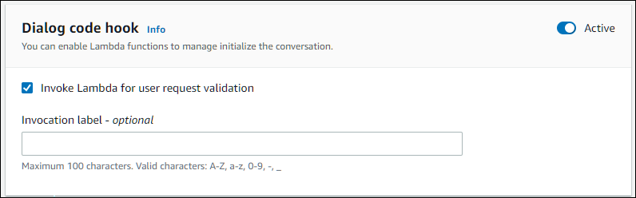
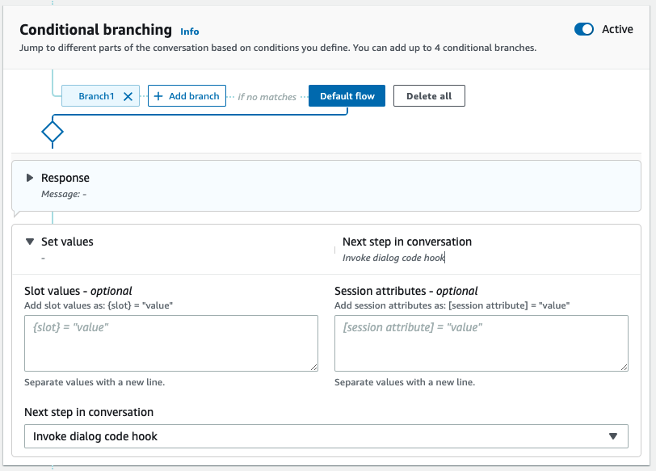
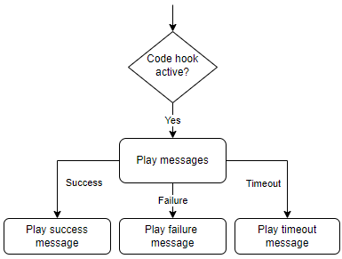

# Invoke dialog code hook

At each step in the conversation when sends a message to the user, you can use a
Lambda function as the next step in the conversation. You can use the function to
implement business logic based on current state of the conversation.

The Lambda function that runs is associated with the bot alias that you are using. To
invoke Lambda function across all dialog code hooks in your intent, you must select
**Use a Lambda function for initializing and validation** for the
intent. For more information
on choosing a Lambda function, see [Creating an AWS Lambda function for your bot](lambda-attach.md "lambda-attach.md").

There are two steps to using a Lambda function. First, you must
activate the dialog code hook at any point in the conversation. Second, you
must set the next step in the conversation to use the dialog code hook.

The following image shows the dialog code hook activated.

Next, set the code hook as the next action for the conversation
step. You can do this by configuring the next step in conversation to Invoke dialog code
hook. The following image shows a conditional branch where invoking
the dialog code hook is the next step for the default path of the
conversation.

When code hooks are active, you can set three responses
to return to the user:

- **Success** –
  Sent when the Lambda function completed
  successfully.
- **Failure** –
  Sent if there was a problem with running the Lambda
  function, or the Lambda function returned an
  `intent.state` value of
  `Failed`.
- **Timeout** –
  Sent if the Lambda function did not complete in its
  configured timeout period.

Choose **Lambda dialog code hook** and then choose **Advanced
options** to see the three options for responses that correspond to the
Lambda function invocation. You can set values, configure the next
steps,
and apply conditions corresponding to each response to design the conversation flow. In
the absence of a condition or an explicit next step, Amazon Lex V2 decides the next step based
on the current state of the conversation.

On the **Advanced options** page you can also
choose to enable or disable your Lambda function invocation. When the function
is enabled, the dialog code hook is invoked with Lambda invocation, followed by
the success, failure or timeout message based on Lambda invocation results.
When the function is disabled, Amazon Lex V2 doesn't run the Lambda function and
proceeds as if the dialog code hook is successful.

You can also set an invocation label that is sent to the Lambda
function when it is invoked by this message. You can use this to help
identify the section of your Lambda function to run.

###### Note

On August 17, 2022, Amazon Lex V2 released a change to the way conversations
are managed with the user. This change gives you more control over
the path that the user takes through the conversation. For more information,
see [Changes to conversation flows in Amazon Lex V2](understanding-new-flows.md "understanding-new-flows.md").
Bots created before August 17, 2022 do not support dialog code hook messages, setting values,
configuring next steps, and adding conditions.
