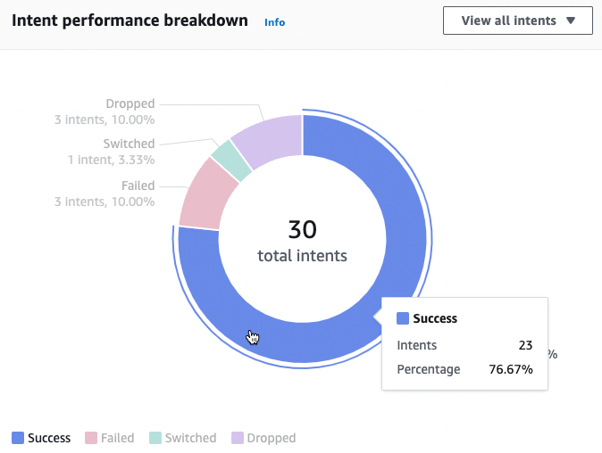
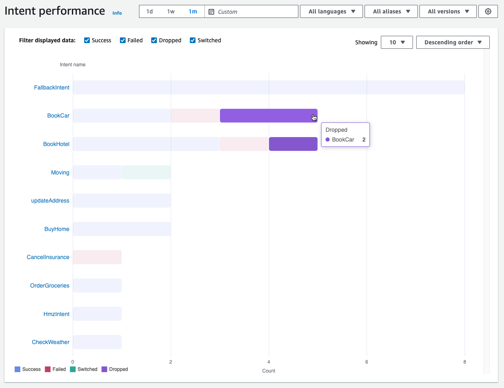

# Performance dashboard: a summary of your bot's

intent and utterance metrics

In the performance dashboard, you can view details about the performance of your bot's
intent fulfillment and utterance recognition.

The **Intent performance breakdown** section displays the total
number of times your bot invoked an intent and breaks down the number and percentage of
times that the intents were categorized as a _success_,
_failed_, _dropped_, and _switched_. See [Intents](analytics-key-definitions.md#analytics-key-definitions-intents "analytics-key-definitions.md#analytics-key-definitions-intents") for an explanation of these
definitions. Hover over a segment of the chart to show a box with the count and
percentage of conversations with that result, as in the following image.

Select **View all intents** to reveal a dropdown menu, from which you
can choose to view a list of intents that the bot elicited. You can also choose to view
intents with a specific result (_success_,
_failed_, _dropped_, or
_switched_). These links take you to the **Intent
performance** subsection of the **Performance dashboard**.
For more information, see [Intent performance](#intent-performance "#intent-performance").

The **Utterance recognition** section summarizes the number of
utterances that were _missed_ and _detected_.
Select **View details** to navigate to a list of utterances for the
bot. Choose the number under **Missed utterances** to see a list of
missed utterances and the number under **Detected utterances** to see a
list of detected utterances for the bot. For more information, see [Utterance recognition](#utterance-recognition "#utterance-recognition").

Select **Intents performance** and **Utterance
recognition** under the **Performance dashboard** in the
left sidebar to view details about intents and utterances in your bot.

## Intent performance

This dashboard summarizes the performance of intents used with your bot in
descending order of frequency. The bar next to each intent visualizes the number of
times the intent was categorized as a _success_,
_failed_, _dropped_, and
_switched_. See [Intents](analytics-key-definitions.md#analytics-key-definitions-intents "analytics-key-definitions.md#analytics-key-definitions-intents") for an explanation of these
definitions. Hover over a segment of the bar to see the number of conversations
using that intent with that result, as in the following image:

###### Note

The dashboard shows the top 1,000 results for a set of filter settings. To get
more targeted results, configure granular filter settings.

At the top of the chart, you can toggle the intent statuses that you want to view
with the **Success**, **Failed**,
**Dropped**, and **Switched** checkboxes.

Select the dropdown menus to the right of **Showing** to adjust
the number of intents to display and whether to display intents in ascending or
descending order of frequency.

Select an intent name to navigate to a page that shows three charts:
**Intent performance breakdown**, **Slot
performance**, and **Intent switches**.

The **Intent performance breakdown** section displays the total
number of times that the bot used the intent and breaks down the number and
percentage of times intent fulfillment was categorized as a
_success_, _failed_,
_dropped_, and _switched_. See [Intents](analytics-key-definitions.md#analytics-key-definitions-intents "analytics-key-definitions.md#analytics-key-definitions-intents") for an explanation of these
definitions. Hover over a segment of the chart to see the count and percentage of
times that intent fulfillment yielded that result.

The **Slot performance** section displays metrics for the slots
that belong to the current intent. To sort by a column, select that column once to
sort in ascending order and twice to sort it in descending order. You can use the
search bar to find a specific slot or use the page number buttons to navigate
through the slots.

###### Note

The dashboard shows the top 1,000 results for a set of filter settings. To
get more targeted results, configure granular filter settings..

The **Intent switches** section lists out the instances in which
the bot switched from the current intent to another one with the following
information:

- **Stage** – The stage of the conversation at which
  the bot switched the intent.
- **Intent switched to** – The intent that the bot
  switched the current intent to.
- **Session count** – The number of sessions in which
  the **Stage** and **Intent switched to**
  combination occurred.

###### Note

The dashboard shows the top 1,000 results for a set of filter settings. To get
more targeted results, configure granular filter settings..

## Utterance recognition

This page lists out all the utterances that were _missed_ and
_detected_ by your bot and provides tools for you to add
sample utterances to intents to help train your bot. See [Utterances](analytics-key-definitions.md#analytics-key-definitions-utterances "analytics-key-definitions.md#analytics-key-definitions-utterances") for an explanation of these
definitions. Use the tabs at the top to switch between a list of **Missed
utterances** and of **Detected utterances**.

###### Note

The dashboard shows the top 1,000 results for a set of filter settings. To get
more targeted results, configure granular filter settings.

To add utterances to an intent:

1. Choose the checkbox next to the utterances that you want to add as sample
   utterances for an intent.
2. Select **Add to intent** and choose the intent to which
   you want to add the utterances in the dropdown menu under
   **Intent**.
3. Select **Add**.
