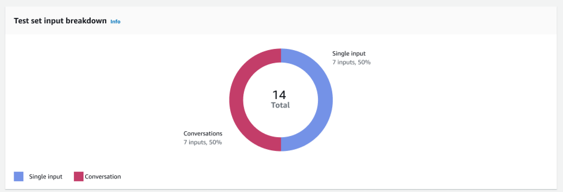
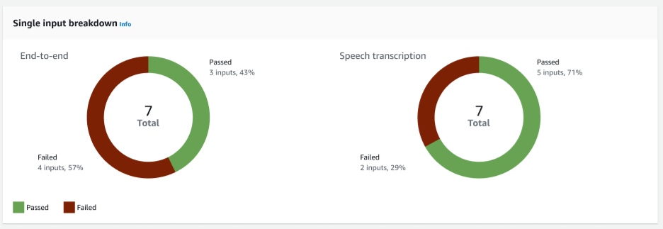
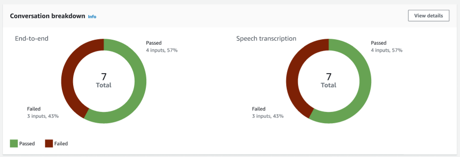
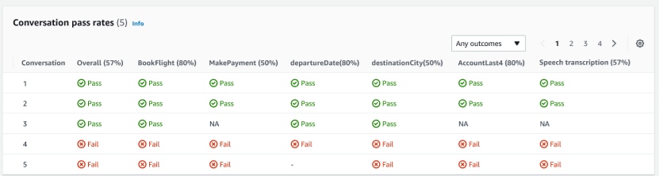
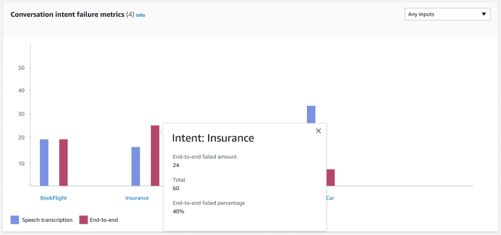
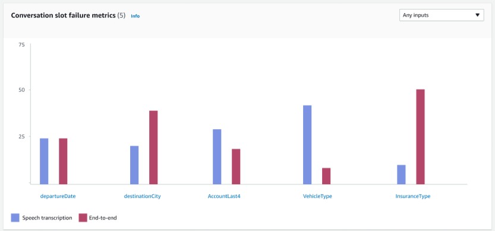
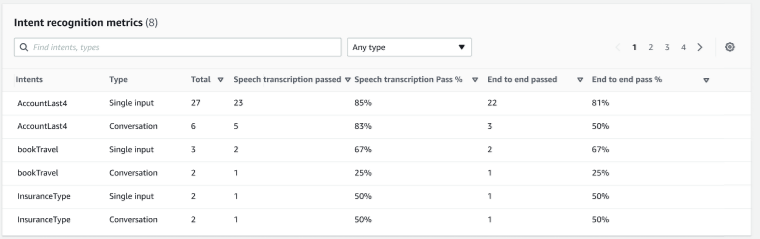
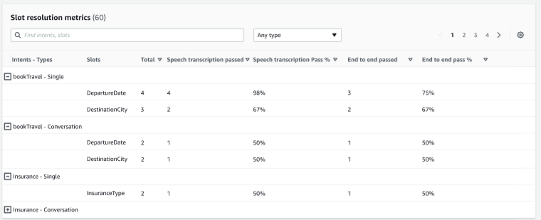
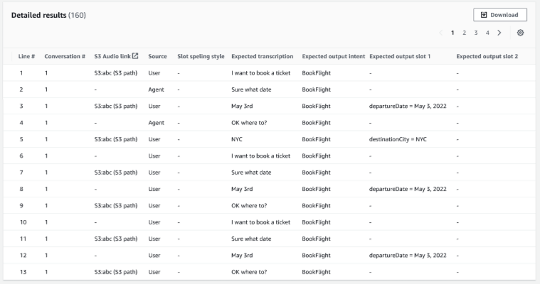

# Test results details in Test Workbench

The test results show the test set details, intents used, and the slots used. It also provides the overall test
set input breakdown includes the overall results, conversation results, intent, and slot
results.

Test results comprise all testing related information such as:

- Test details metadata
- Overall results
- Conversation results
- Intent and slot results
- Detailed results
  **Overall results tab:**

**Test set input breakdown** – This chart shows the
breakdown of number of conversations and single input utterances in the test set.

**Single input breakdown** – Displays two charts that
included end-to-end conversations and speech transcriptions. The number of passed and failed
inputs are indicated on each chart. Note: Speech transcription chart will be visible only for
the audio test set.

**Conversation breakdown** – Displays two charts that
included end-to-end conversations and speech transcriptions. The number of passed and failed
inputs are indicated on each chart. Note: Speech transcription chart will be visible only for
the audio test set.

**Conversation results tab:**

**Conversation pass rates** – The conversation pass
rates table is used to see which intents and slots are used in each conversation in the
test set. You can visualize where the conversation has failed by reviewing which intent
or slot failed, along with the pass percentage of each intent and slot.

**Conversation intent failure metrics** – This metric
shows the top 5 worst performing intents in the test set. This panel shows a chart of what
percent or number of intents were successful or failed based on the bot’s conversation logs
or transcription. A successful intent does not mean that the entire conversation was
successful. These metrics only apply to the value of the intents, regardless of which
intent came before or after.

**Conversation slot failure metrics** – This metric shows
the top 5 worst performing slots in the test set. Indicated the success rate for each slot in
the intent. Bar graph shows both speech transcription and end-to-end conversations for each
slot in the intent.

**Intent and slot results tab:**

**Intent recognition metrics** – Shows a table of how many
intents were recognized successfully. Displays the pass rate of speech transcription
and end-to-end conversations.

**Slot resolution metrics** – Shows the intents and slots
separately, and the success and failure rate of each slot for each intent used in the
conversation or single input. Displays the pass rate of speech transcription and end-to-end
conversations.

**Detailed results tab:**

**Detailed results** – Shows a detailed table on
the conversation log with User and Agent utterances and the expected output and expected
transcription for each slot. You can download this report by selecting the
**Download** button.

The following table lists the result failure error messages with scenarios.

| Scenario                             | Error message                                                                                 | Action                                         |
| ------------------------------------ | --------------------------------------------------------------------------------------------- | ---------------------------------------------- |
| Intent Mismatch                      | Expected BookFlight intent but it was BookHotel intent.                                       | Skip other turns in the conversation           |
| Slot Elicitation mismatch            | Expected departureDate slot to be elicited but it was cabinType.                              | Skip other turns in the conversation           |
| Slot value mismatch                  | Mismatch between expected and actual slot value.                                              | Continue with other turns in the conversations |
| Back-to-back agent prompt is missing | Expected bot to return an agent prompt in this turn but it was not received.                  | Skip other turns in the conversation           |
| Transcription Mismatch               | Expected transcription didn't match actual transcription.                                     | Continue with other turns in the conversations |
| Optional slot not elicited           | Expected to elicit cabinType slot in next turn, however current intent fulfilled before that. | Skip other turns in the conversation           |
| Slot not recognized                  | Expected departureDate slot was not recognized in this turn.                                  | Skip other turns in the conversation           |
| Extra back-to-back agent prompt      | Expected a user turn but it was agent prompt                                                  | Skip other turns in the conversation           |
