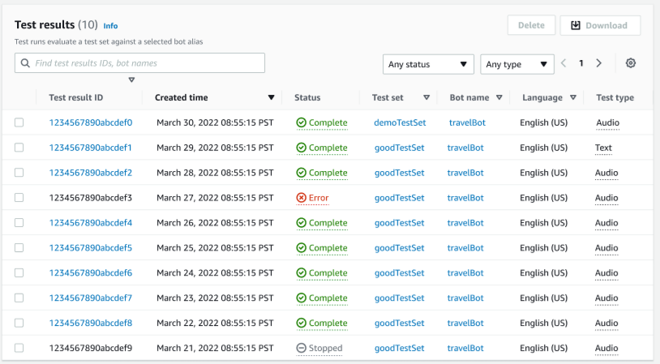

# View test results

Interpret test results from the Test Workbench to determine where the conversation
between your bot and the customer might be failing, or requiring the customer to make
multiple attempts to fulfill the intent.

By locating these issues in your test results, you can optimize your bot’s performance
by improving intent performance using different training data or utterances that are
more consistent with the real time bot transcription values.

You can get a detailed view of intents and slots that had performance discrepancies.
Once you have identified intents or slots that have discrepancies, you can further drill
down and review the utterances and conversation flow.

###### To review test results:

1. Go to the list of test sets from the left side menu to select the
   **Test results** option under Test workbench. NOTE: Test
   results indicate a **Status** of complete if they were
   successful.
2. Select the **Test Result ID** for the test results you want
   to review.
