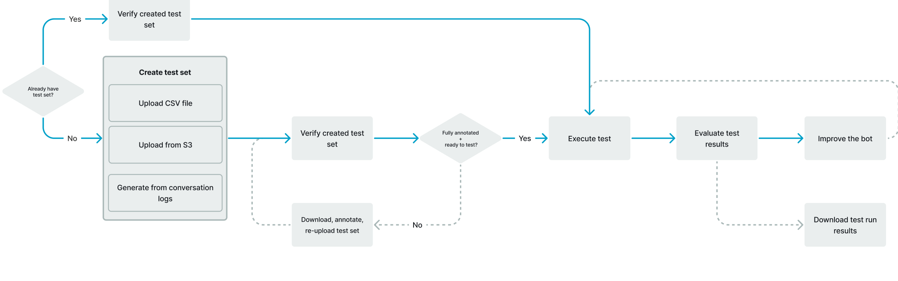

# Evaluating Lex V2 bot performance with the Test Workbench

To improve bot performance, you can evaluate the performance of your bots at scale.
The results for your test evaluation are displayed in simple tables
and charts.

You can use the Test Workbench to create reference test sets that use existing transcription data.
You can test bots to evaluate performance before deployment, and view test result breakdowns at
scale.

Users can use the Test Workbench to establish baseline performance for bots. This covers intent
and slot performance for utterances that are in the form of single-inputs or conversations.
Once a test set is successfully loaded, you can run it against your existing pre-production or
production bots. The Test Workbench helps you identify opportunities for improved slot filling
and intent classification.

###### Topics

- [Generate a test set for Test Workbench](test-sets.md "test-sets.md")
- [Manage test sets](manage-test-sets.md "manage-test-sets.md")
- [Execute a test](execute-test-set.md "execute-test-set.md")
- [Test set coverage in Test Workbench](validation-test-set.md "validation-test-set.md")
- [View test results](test-results-test-set.md "test-results-test-set.md")
- [Test results details in Test Workbench](test-results-details-test-set.md "test-results-details-test-set.md")
