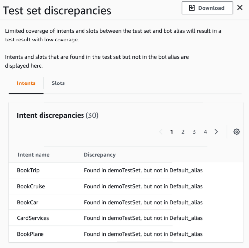

# Test set coverage in Test Workbench

Limited coverage of intents and slots between the test set and the bot can result in expected
performance measures. We recommend that you review the test set coverage ahead of running the test.

###### To review validation coverage

1. In the test set records, choose the **Validate
   coverage** button.
2. The message indicates it is validating coverage between the test set
   and the bot selected.
3. Once the operation is completed, the message indicates
   **Coverage validation successful**.
4. Choose the **View Details** button at the bottom of the window.
5. View the test set discrepancies for intents and slots by choosing the tab for each.
   You can download this data into a CSV format by choosing the
   **Download** button.
6. Review the validation results for your test set data, bot intents, and slots.
   Identify issues and make changes in your bot test set architecture to improve results.
   Upload the edited test set and bot to run the test once you have made
   changes to the CSV file. NOTE: Validation coverage runs against the test set and not
   against the bot. Intents in the bot but not present in the test set will not be covered.
