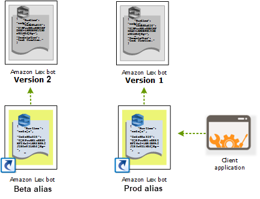
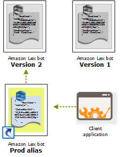

# Versioning and aliases with your Lex V2 bot

Amazon Lex V2 supports creating versions and aliases of bots and bot networks so that you can control the implementation that your client applications use. A version acts as a numbered snapshot of your work. You can point an alias to the version of your bot that you want to be available to your customers. In between creating versions, you can continue to update the `Draft` version of your bot without affecting the user experience.

## Versions

Amazon Lex V2 supports creating versions of bots so that you can control
the implementation that your client applications use. A
_version_ is a numbered snapshot of your work
that you can create for use in different parts of your workflow, such
as development, beta deployment, and production.

### The Draft

version of your Lex V2 bot

When you create an Amazon Lex V2 bot there is only one version, the
`Draft` version.

`Draft` is the working copy of your bot. You can update
only the `Draft` version and until you create your first
version, `Draft` is the only version of the bot that you
have.

The `Draft` version of your bot is associated with the
`TestBotAlias`. The `TestBotAlias` should
only be used for manual testing. Amazon Lex V2 limits the number of runtime
requests that you can make to the `TestBotAlias` alias of
the bot.

### Creating a version for your Lex V2 bot

When you version an Amazon Lex V2 bot you create a numbered snapshot of
the bot so that you can use the bot as it existed when the version
was made. Once you've created a numeric version it will stay the
same while you continue to work on the draft version of your
application.

When you create a version, you can choose the locales to include
in the version. You don't need to choose all of the locales in a
bot. Also, when you create a version you can choose a locale from a
previous version. For example, if you have three versions of a bot,
you can choose one locale from the `Draft` version and
one from version two when you create version four.

If you delete a locale from the `Draft` version,
it is not deleted from a numbered version.

If a bot version is not used for six months, Amazon Lex V2 will mark the
version inactive. When a version is inactive, you can't use runtime
operations with the bot. To make the bot active, rebuild all the
languages associated with the version.

### Updating

an Amazon Lex V2 bot

You can update only the `Draft` version of an Amazon Lex V2
bot. Versions can't be changed. You can create a new version any
time after you update a resource in the console or with the [CreateBotVersion](../APIReference/API_CreateBotVersion.md "../APIReference/API_CreateBotVersion.md") operation.

### Deleting an Amazon Lex V2 bot or version

Amazon Lex V2 supports deleting a bot or version using the console or one
of the API operations:

- [DeleteBot](../APIReference/API_DeleteBot.md "../APIReference/API_DeleteBot.md")
- [DeleteBotVersion](../APIReference/API_DeleteBotVersion.md "../APIReference/API_DeleteBotVersion.md")

## Aliases for your Lex V2 bot

Amazon Lex V2 bots support aliases. An _alias_ is a
pointer to a specific version of a bot. With an alias, you can easily
update the version that your client applications are using. For example,
you can point an alias to version 1 of your bot. When you are ready to
update the bot, you create version 2 and change the alias to point to
the new version. Because your applications use the alias instead of a
specific version, all of your clients get the new functionality without
needing to be updated.

An alias is a pointer to a specific version of an Amazon Lex V2 bot. Use an
alias to allow client applications to use a specific version of the bot
without requiring the application to track which version that is.

When you create a bot, Amazon Lex V2 creates an alias called
`TestBotAlias` that you can use for testing your bot. The
`TestBotAlias` alias is always associated with the
`Draft` version of your bot. You should only use the
`TestBotAlias` alias for testing, Amazon Lex V2 limits the
number of runtime requests that you can make to the alias.

The following example shows two versions of an Amazon Lex V2 bot,
version 1 and version 2. Each of these bot versions has an associated
alias, BETA and PROD, respectively. Client applications use the PROD
alias to access the bot.

When you create a second version of the bot, you can update the alias
to point to the new version of the bot using the console or the [UpdateBotAlias](../APIReference/API_UpdateBotAlias.md "../APIReference/API_UpdateBotAlias.md")
operation. When you change the alias, all of your client applications
use the new version. If there is a problem with the new version, you can
roll back to the previous version by simply changing the alias to point
to that version.

When you set up your client applications to call the [Amazon Lex Runtime V2](../APIReference/API_Operations_Amazon_Lex_Runtime_V2.md "../APIReference/API_Operations_Amazon_Lex_Runtime_V2.md") APIs to let customers interact with your bot, you use the alias that points the version that you want your customers to use.

###### Note

Although you can test the `Draft` version of a bot in
the console, we recommend that when you integrate a bot with your
client application, you first create a version and create an alias
that points to that version. Use the alias in your client
application for the reasons explained in this section. When you
update an alias, Amazon Lex V2 will use the current version for all
in-progress sessions. New sessions use the new version.
