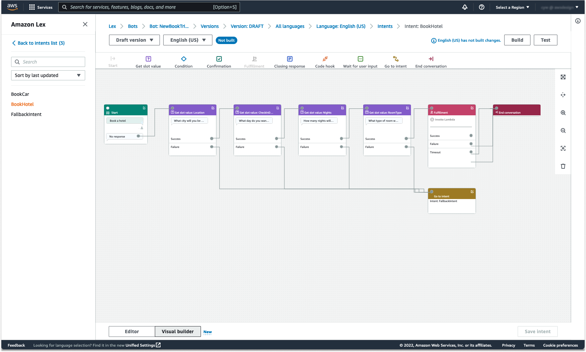

# Using Visual conversation builder

Visual conversation builder is a drag and drop conversation builder to
easily design and visualize conversation paths by using intents within
a rich visual environment.

###### To access the visual conversation builder

1. In the Amazon Lex V2 console, choose a bot and select **Intents** from the left navigation pane.
2. Go to the intent editor in one of the following ways:
   - Select **Add intent** at the top-right corner of the **Intents** section, and then choose to add either an empty intent or a built-in intent.
   - Choose the name of an intent from the **Intents** section.

3. In the intent editor, select **Visual builder** in the pane at the bottom of the screen to access the Visual conversation builder.
4. To return to the menu intent editor interface, select **Editor**.

Visual conversation builder offers a more intuitive user interface with the
ability to visualize and modify the conversation flow. By dragging and dropping
the blocks, you can extend an existing flow or reorder the conversation steps.
You can develop conversation flow with complex branching without writing any
Lambda code.

This change helps to decouple the conversation flow design from other business
logic in Lambda. Visual conversation builder can be used in conjunction with
the existing intent editor and can be used to build conversation flows. However,
it is recommended to use the visual editor view for more complex conversation
flows.

When you save an intent, Amazon Lex V2 can auto-connect intents when it determines that there
are missed connections, Amazon Lex V2 suggests a connection, or you can select your own
connection for the block.

| Action                                                                                                                                                                                                                                                                                                    | Example                                               |
| --------------------------------------------------------------------------------------------------------------------------------------------------------------------------------------------------------------------------------------------------------------------------------------------------------- | ----------------------------------------------------- | ----------------------------------------------------------------------------------------------------------------------------------------------------------------------------------------------------------------------------------------------------------------------------------------------------------------------------------------------------------------------------------------------------------------------------------------------------------------------------------------------------------------------------------------------------------------------------------------------------------------------------------------------------------------------------------------------------------------------------------------------------------------------------------------------------------------------------------------------------------------------------------------------------------------------------------------------------------------------------------------------------------------------------------------------------------------------------------------------------------------------------------------------------------------------------------------------------------------------------------------------------------------------------------------------------------------------------------------------------------------------------------------------------------------------------------------------------------------------------------------------------------------------------------------------------------------------------------------------------------------------------------------------------------------------------------------------------------------------------------------------------------------------------------------------------------------------------------------------------------------------------------------------------------------------------------------------------------------------------------------------------------------------------------------------------------------------------------------------------------------------------------------------------------------------------------------------------------------------------------------------------------------------------------------------------------------------------------------------------------------------------------------------------------------------------------------------------------------------------------------------------------------------------------------------------------------------------------------------------------------------------------------------------------------------------------------------------------------------------------------------------------------------------------------------------------------------------------------------------------------------------------------------------------------------------------------------------------------------------------------------------------------------------------------------------------------------------------------------------------------------------------------------------------------------------------------------------------------------------------------------------------------------------------------------------------------------------------------------------------------------------------------------------------------------------------------------------------------------------------------------------------------------------------------------------------------------------------------------------------------- |
| Adding a block to the workspace                                                                                                                                                                                                                                                                           | Adding a block onto the workspace                     |
| Making a connection between blocks                                                                                                                                                                                                                                                                        | Making a connection between blocks                    |
| Opening the configuration panel on a block                                                                                                                                                                                                                                                                | Open the configuration panel of a block               |
| Zoom to fit                                                                                                                                                                                                                                                                                               | Zoom to fit                                           |
| Delete a block from the conversation flow                                                                                                                                                                                                                                                                 | Delete a block from the conversation flow             |
| Auto clean the workspace                                                                                                                                                                                                                                                                                  | Auto clean the workspace                              | **Terminology:** **Block** – The basic building unit of a conversation flow. Each block has a specific functionality to handle different use cases of a conversation. **Port** – Each block contains ports, which can be used to connect one block to another. Blocks can contain input ports and output ports. Each output port represents a particular functional variation of a block (such as errors, timeouts, or success). **Edge** – An edge is a connection between the output port of one block to the input port of another block. It is a part of a branch in a conversation flow. **Conversation flow** – A set of blocks connected by edges that describes intent level interactions with a customer. **Blocks** Blocks are the building blocks of a conversation flow design. They represent different states within the intent, that spans from the start of the intent, to user input, to the closing. Each block has an entry point and one or many exit points based on the block type. Each exit point can be configured with a corresponding message as the conversation proceeds through the exit points. For blocks with multiple exit points, exit points relate to the status corresponding to the node. For a condition node, the exit points represent the different conditions. Each block has a configuration panel, which opens by clicking on the **Edit** icon on the top right corner of the block. The configuration panel contains detailed fields that can be configured to correspond with each block. The bot prompts and messages can be configured directly on the node by dragging a new block, or they can be modified within the right panel, along with other attributes of the block. **Block types** – Here are the block types that you can use with visual conversation builder.                                                                                                                                                                                                                                                                                                                                                                                                                                                                                                                                                                                                                                                                                                                                                                                                                                                                                                                                                                                                                                                                                                                                                                                                                                                                                                                                                                                                                                                                                                                                                                                                                                                                                                                                                                                   |
| Block Type                                                                                                                                                                                                                                                                                                | Block                                                 |
| ---                                                                                                                                                                                                                                                                                                       | ---                                                   |
| **Start** – The root or first block of the conversation flow. This block can also be configured such that the bot can send an initial response (message the intent has been recognized). For more information, see [Initial response](intent-initial.md "intent-initial.md").                             | A start block in visual conversation builder          |
| **Get slot value** – This block tries to elicit value for a single slot. This block has a setting to wait for customer response to the slot elicitation prompt. For more information, see [Slots](intent-slots.md "intent-slots.md").                                                                     | A get slot value block in visual conversation builder |
| **Condition** – This block contains conditionals. It contains up to 4 custom branches (with conditions) and one default branch. For more information, see [Add conditions to branch conversations](paths-branching.md "paths-branching.md").                                                              | A condition block in visual conversation builder      |
| **Dialog code hook** – This block handles invocation of the dialog Lambda function. This block contains bot responses based on dialog Lambda function succeeding, failing, or timing out. For more information, see [Invoke dialog code hook](paths-code-hook.md "paths-code-hook.md").                   | A code hook block in visual conversation builder      |
| **Confirmation** – This block queries the customer before fulfillment of the intent. It contains bot responses based on customer saying yes or no to the confirmation prompt. For more information, see [Confirmation](intent-confirm.md "intent-confirm.md").                                            | A confirmation block in visual conversation builder   |
| **Fulfillment** – This block handles fulfillment of intent, usually after slots elicitation. It can be configured to invoke Lambda functions, as well as respond with messages, if fulfillment succeeds or fails. For more information, see [Fulfillment](intent-fulfillment.md "intent-fulfillment.md"). | A fulfillment block in visual conversation builder    |
| **Closing response** – This block allows the bot to respond with a message before ending the conversation. For more information, see [Closing response](intent-closing.md "intent-closing.md").                                                                                                           | A closing block in visual conversation builder        |
| **End conversation** – This block indicates the end of the conversation flow.                                                                                                                                                                                                                             | An end block in visual conversation builder           |
| **Wait for user input** – This block can be used to capture input from the customer and switch to another intent based on the utterance.                                                                                                                                                                  | A wait block in visual conversation builder           |
| **Go to intent** – This block can be used to go to a new intent, or to directly elicit a specific slot of that intent.                                                                                                                                                                                    | A go to intent block in visual conversation builder   | **Port types** All blocks contain one input port, which is used to connect its parent blocks. The conversation can only flow to a particular block’s input port from its parent block’s output port. However, blocks can contain zero, one, or many output ports. The blocks without any output ports signify the end of the conversation flow in the current intent (`GoToIntent`, `EndConversation`,`WaitForUserInput`). **Rules of intent design:**  • All flows in an intent begin with the start block.  • Messages corresponding to each exit point are optional.  • You can configure the blocks to set values corresponding to each exit point in the configuration panel.  • Only a single start, confirmation, fulfillment and closing blocks can exist in a single flow within an intent. Multiple conditions, dialog code hook, get slot values, end conversation, transfer, and wait for user input blocks may exist.  • A condition block cannot have a direct connection to a condition block. The same applies for dialog code hook.  • Circular flows are allowed three blocks, but an incoming connector to Start Intent is not allowed.  • An optional slot doesn’t have an incoming connector or an outgoing connection and is primarily used to capture any data present during intent elicitation. Every other slot that is part of the conversation path must be a mandatory slot. Blocks:  • The start block must have an outgoing edge.  • Every get slot value block must have an outgoing edge from the success port, if the slot is required.  • Every condition block must have an outgoing edge from each branch if the block is active.  • A condition block cannot have more than one parent.  • An active condition block must have an incoming edge.  • Every active code hook block must have an outgoing edge from each port: success, failure, and timeout.  • An active code hook block must have an incoming edge.  • An active confirmation block must have an incoming edge.  • An active fulfillment block must have an incoming edge.  • An active closing block must have an incoming edge.  • A condition block must have at least one non-default branch.  • A go to intent block must have an intent specified. Edges:  • A condition block cannot be connected to another condition block.  • A code hook block cannot be connected to another code hook block.  • A condition block can only be connected to zero or one code hook block.  • The connection (code hook -> condition -> code hook) is not valid.  • A fulfillment block cannot have a code hook block as a child.  • A condition block, which is a child of the fulfillment block, cannot have a code hook block child.  • A closing block cannot have a code hook block as a child.  • A condition block that is a child of the closing block cannot have a code hook block child.  • A start, confirmation, or get slot value block can have no more than one code hook block in its dependency chain. ###### Note On August 17, 2022, Amazon Lex V2 released a change to the way conversations are managed with the user. This change gives you more control over the path that the user takes through the conversation. For more information, see [Changes to conversation flows in Amazon Lex V2](understanding-new-flows.md "understanding-new-flows.md"). Bots created before August 17, 2022 do not support dialog code hook messages, setting values, configuring next steps, and adding conditions. |
