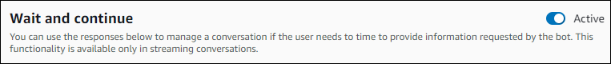

# Enabling the

Amazon Lex V2 bot to wait for the user to provide more information during a pause

When you start a bidirectional stream from an Amazon Lex V2 bot to your
application, you can configure the bot to wait for the user to
provide additional information. There are circumstances when a user
might not be ready to respond to a prompt. For example, a user might
not be ready to provide their credit card information because their
wallet is in another room.

By using the _Wait and continue_ behavior of
the Amazon Lex V2 bot, users can say phrases such as "hold on a second" to
make the bot wait for them to find the information and provide it.
When you enable this behavior, the bot sends periodic reminders to
the user to provide the information. It does not send back
transcript events because there are no user utterances for it to
transcribe.

The Amazon Lex V2 bot automatically manages a streaming conversation. You
don't have to write any additional code to enable this
functionality. When a bot is prompted to wait by the user, the
`state` of the `Intent` is
`Waiting` and the `type` of the
`DialogAction` is `ElicitSlot`. You can
use this information to help customize your application for your
needs. For example, you can configure your application to play music
when the user is looking for their credit card.

You enable the wait and continue behavior for an individual slot.
To learn more about slots, see [Amazon Lex V2 core concepts](how-it-works.md "how-it-works.md").

###### To enable wait and continue

1.  Sign in to AWS Management Console and open the Amazon Lex V2 console at [Amazon Lex V2
    console](https://console.aws.amazon.com/lexv2/ "https://console.aws.amazon.com/lexv2/").
2.  Under **Bots**, select a bot.
3.  Under **Language**, select the language
    of the bot.
4.  Choose **View intents**.
5.  Choose the intent.
6.  Under **Slots**, choose a slot.
7.  Under **Advanced options**, choose
    **Wait and continue**.
8.  Under **Wait and continue** specify the
    following fields:

        * **Response when user wants the bot to
         wait** – This is how the bot
         responds when the user asks it to wait for the
         additional information.
        * **Response if the user needs the bot to
         continue waiting** – This is the
         response the bot sends to remind the user that it's
         still waiting for the information. You can change
         how frequently the bot reminds the user.
        * **Response when the user wants to
         continue** – This is the bot's
         response when the user has the requested
         information.

    For every bot response, you can give multiple variations of the
    response, and one is presented to the user at random. You can also
    choose whether these responses can be interrupted by the
    user.

To test the wait and continue functionality, configure your bot to
wait for user input and start a stream to an Amazon Lex V2 bot. For
information on streaming to a bot, see [Using
the API to start a streaming conversation](using-streaming-api.md "using-streaming-api.md").

You may need to turn off the wait and continue responses. Use the
**Active** toggle to set whether or not the
wait and continue responses are used.

###### Note

Wait and continue is available in the following locales: ca-ES, de-AT, de-DE, en-AU, en-GB, en-IN, en-US, en-ZA, es-419, es-ES, es-US, fr-CA, fr-FR, it-IT, ja-JP, ko-KR, pt-BR, pt-PT, zh-CN, zh-HK.
