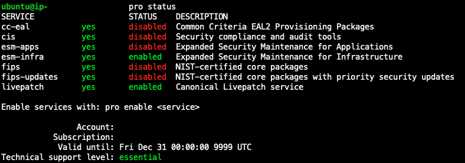

# Convert a license type for Linux in

License Manager

You can use either the License Manager Console or the AWS CLI to convert the license type of
eligible Ubuntu LTS, RHEL, and RHEL for SAP instances.

###### Topics

- [Convert a license type
  using the License Manager console](#convert-license-type-console-linux "#convert-license-type-console-linux")
- [Convert a license type using
  the AWS CLI](#convert-license-type-cli-linux "#convert-license-type-cli-linux")
- [Remove a Ubuntu Pro
  subscription](#remove-subscription-ubuntu-pro "#remove-subscription-ubuntu-pro")

## Convert a license type

using the License Manager console

You can use the License Manager console to convert a license type.

###### Note

Only instances that are in a stopped state and have been associated by
AWS Systems Manager Inventory are displayed.

###### To start a license type conversion in the console

1. Open the License Manager console at [https://console.aws.amazon.com/license-manager/](https://console.aws.amazon.com/license-manager/ "https://console.aws.amazon.com/license-manager/") .
2. From the left navigation pane, choose **License type
   conversion**, then choose **Create license type
   conversion**.
3. For **Source operating system**, choose the platform of the
   instance you want to convert:
   - **RHEL**
   - **RHEL for SAP**
   - **Ubuntu LTS**
   - **Windows BYOL**
   - **Windows license included**

4. (Optional) Filter the available instances by specifying a value for
   **Instance ID** or **Usage operation
   value**.
5. Select the instances whose licenses you want to convert, and then
   choose **Next**.
6. Enter the **Usage operation value** for the license
   type, select the license that you are converting to, and choose
   **Next**.
7. Verify that you are satisfied with your license type conversion
   configuration and choose **Start conversion**.

You can view the status of your license type conversion from the license type
conversion panel. The Conversion status column displays the status of the
conversion as **In progress**, **Completed**,
or **Failed**.

## Convert a license type using

the AWS CLI

To start a license type conversion in the AWS CLI, you should confirm the
license type of your instance is eligible, and then perform a license type
conversion to change to the required subscription. For more information on
eligible subscription types, see [Eligible subscription types for Linux in
License Manager](conversion-types-linux.md "conversion-types-linux.md").

###### Determine the license type of your instance

Verify that you have installed and set up the AWS CLI. For more information,
see Installing, updating, and uninstalling the AWS CLI and Configuring the
AWS CLI.

###### Important

You might need to update the AWS CLI to run certain commands and receive all
required output in the following steps. Verify that you have permissions to
run the `create-license-conversion-task-for-resource` AWS CLI
command. For more information, see [Create IAM policies for License Manager](identity-access-management.md#iam-policy-examples "identity-access-management.md#iam-policy-examples").

To determine the license type currently associated with your instance, run the
following AWS CLI command. Replace the instance ID with the ID of the instance for
which you want to determine the license type:

```
aws ec2 describe-instances --instance-ids `<instance-id>` --query "Reservations[*].Instances[*].{InstanceId: InstanceId, PlatformDetails: PlatformDetails, UsageOperation: UsageOperation, UsageOperationUpdateTime: UsageOperationUpdateTime}"
```

The following is an example response to the `describe-instances`
command. The **UsageOperation** value is the
billing information code associated with the license. A usage operation value of
`RunInstances` indicates that the instance is using AWS
provided licensing. The `UsageOperationUpdateTime` is the time when
the billing code was updated. For more information, see [DescribeInstances](../../../AWSEC2/latest/APIReference/API_DescribeInstances.md "../../../AWSEC2/latest/APIReference/API_DescribeInstances.md") in the _Amazon EC2 API Reference_.

```
`"InstanceId": "i-0123456789abcdef",
"Platform details": "Linux/UNIX",
"UsageOperation": "RunInstances",
"UsageOperationUpdateTime: "2021-08-16T21:16:16.000Z"`
```

### Supported conversions for Red Hat

The following conversions are supported for Red Hat Enterprise Linux (RHEL) products. Each conversion requires specific source and destination license contexts and may have additional requirements.

#### Convert from RHEL for SAP with HA and Update Services (Sold by AWS in AWS Marketplace) to RHEL for SAP with HA and Update Services (Sold by Red Hat in AWS Marketplace)

Example CLI command:

```
aws license-manager create-license-conversion-task-for-resource \
  --resource-arn `<instance_arn>` \
  --source-license-context "UsageOperation=RunInstances:0010,ProductCodes=[{ProductCodeType=marketplace,ProductCodeId=`<source_product_code_id>`}]" \
  --destination-license-context "UsageOperation=RunInstances:00g0,ProductCodes=[{ProductCodeType=marketplace,ProductCodeId=`<destination_product_code_id>`}]"
```

Notes:

- RHEL for SAP with HA and Update Services (Sold by AWS in AWS Marketplace) has many different
  product code IDs (a.k.a. Marketplace code) depending your AWS Marketplace
  product subscription. Please check EC2 describe-instances
  response for the correct product code ID on your
  instances.
- RHEL for SAP with HA and Update Services (Sold by Red Hat in AWS Marketplace) has two different product code IDs: du6111oq9lwrc996awt04qyql (NA & Global) and 952qwcsxkm430zxhpy32i7w8g (EMEA). Which you should use depends on your region. Please check your RHEL for SAP with HA and Update Services subscription in Marketplace to find out which one it is.

Once converted, you cannot convert the instance back to RHEL for SAP with HA and Update
Services (Sold by AWS in AWS Marketplace), unless you are allowlisted for this
private feature, which requires a Support request. For more information,
see [Creating a support case](../../../awssupport/latest/user/case-management.md#creating-a-support-case "../../../awssupport/latest/user/case-management.md#creating-a-support-case").

#### Convert from RHEL for SAP with HA and Update Services (Sold by AWS in AWS Marketplace) to Red Hat Subscriptions (Sold by Red Hat in AWS Marketplace)

Red Hat Subscriptions (Sold by Red Hat in AWS Marketplace) refers to the SaaS subscriptions that customers can purchase from AWS Marketplace. There are also two listings at this moment.

Example CLI command:

```
aws license-manager create-license-conversion-task-for-resource \
  --resource-arn `<instance_arn>` \
  --source-license-context "UsageOperation=RunInstances:0010,ProductCodes=[{ProductCodeType=marketplace,ProductCodeId=`<source_product_code_id>`}]" \
  --destination-license-context "UsageOperation=RunInstances:00g0"
```

Notes:

- RHEL for SAP with HA and Update Services (Sold by AWS in AWS Marketplace) has many different product code IDs (a.k.a. Marketplace code) depending your AWS Marketplace product subscription. Please check EC2 describe-instances response for the correct product code ID on your instances.
- Red Hat Subscriptions (Sold by Red Hat in AWS Marketplace) do not have a product code to add to the instances.
  - Explanations: SaaS product product codes are not attached to EC2 instances, so customers are expected to not include a destination product code when invoking the create-license-conversion-task-for-resource CLI command.

Once converted, you cannot convert the instance back to RHEL for SAP with HA and Update
Services (Sold by AWS in AWS Marketplace), unless you are allowlisted for this
private feature, which requires a Support request. For more information,
see [Creating a support case](../../../awssupport/latest/user/case-management.md#creating-a-support-case "../../../awssupport/latest/user/case-management.md#creating-a-support-case").

#### Convert from Red Hat License-Included (LI) to RHEL (Sold by Red Hat in AWS Marketplace)

Example CLI command:

```
aws license-manager create-license-conversion-task-for-resource \
  --resource-arn `<instance_arn>` \
  --source-license-context "UsageOperation=RunInstances:0010" \
  --destination-license-context "UsageOperation=RunInstances:00g0,ProductCodes=[{ProductCodeType=marketplace,ProductCodeId=`<destination_product_code_id>`}]"
```

Notes:

- RHEL (Sold by Red Hat in AWS Marketplace) has two different product code IDs: 6cd5fxzrad0cu2j23p692xytz (NA & Global) and 6t1yup6mik9ng3ge36n33xqhw (EMEA). Which you should use depends on your region. Please check your RHEL for SAP with HA and Update Services subscription in Marketplace to find out which one it is.

#### Convert from Red Hat Enterprise Linux (RHEL) for AWS to Red Hat License-Included (LI)

Example CLI command:

```
aws license-manager create-license-conversion-task-for-resource \
  --resource-arn `<instance_arn>` \
  --source-license-context "UsageOperation=RunInstances,ProductCodes=[{ProductCodeType=marketplace,ProductCodeId=`<source_product_code_id>`}]" \
  --destination-license-context "UsageOperation=RunInstances:0010"
```

Or this one:

```
aws license-manager create-license-conversion-task-for-resource \
  --resource-arn `<instance_arn>` \
  --source-license-context "UsageOperation=RunInstances:00g0,ProductCodes=[{ProductCodeType=marketplace,ProductCodeId=`<source_product_code_id>`}]" \
  --destination-license-context "UsageOperation=RunInstances:0010"
```

Notes:

- Red Hat Enterprise Linux (RHEL) for AWS has two different product code IDs: 6cd5fxzrad0cu2j23p692xytz (NA & Global) and 6t1yup6mik9ng3ge36n33xqhw (EMEA). Which you should use depends on your region. Please check EC2 describe-instances response for the correct product code ID on your instances.
- Red Hat Enterprise Linux (RHEL) for AWS instances may have usage operation RunInstances or RunInstances:00g0. This depends on whether the instances were originally launched from a Red Hat Enterprise Linux (RHEL) for AWS product AMI or they were later converted into this subscription. Please check EC2 describe-instances response for the correct usage operation on your instances.

Example CLI command:

```
aws license-manager create-license-conversion-task-for-resource \
  --resource-arn `<instance_arn>` \
  --source-license-context "UsageOperation=RunInstances:0010" \
  --destination-license-context "UsageOperation=RunInstances:00g0"
```

Notes:

- Red Hat Subscriptions (Sold by Red Hat in AWS Marketplace) do not have a product code to add to the instances.
  - Explanations: SaaS product product codes are not attached to EC2 instances, so customers are expected to not include a destination product code when invoking the create-license-conversion-task-for-resource CLI command.

- Red Hat Subscriptions (Sold by Red Hat in AWS Marketplace) must be subscribed to by the caller of the CLI command. Subscriptions in other accounts in the same organization are not supported yet.

### Convert from Red Hat Subscriptions (Sold by Red Hat in AWS Marketplace) to Red Hat License-Included (LI)

Example CLI command:

```
aws license-manager create-license-conversion-task-for-resource \
  --resource-arn `<instance_arn>` \
  --source-license-context "UsageOperation=RunInstances:00g0" \
  --destination-license-context "UsageOperation=RunInstances:0010"
```

Notes:

- Red Hat Subscriptions (Sold by Red Hat in AWS Marketplace) do not have a product code that is added to the instances.

### Other requirements

Instances must be in stopped state before creating their license conversion tasks. Customers should not try to start or terminate the instances before the license conversion tasks complete or fail. This is the same requirement for all license type conversions.

If the destination is one of these Marketplace products:

- RHEL for SAP with HA and Update Services (Sold by Red Hat in AWS Marketplace)
- RHEL (Sold by Red Hat in AWS Marketplace)
- Red Hat Subscriptions (Sold by Red Hat in AWS Marketplace)

Then the customer must have an active subscription in Marketplace before invoking the CLI
command. Otherwise, the conversion request might be rejected or might fail.
Unlike in Console, when creating license conversion tasks from CLI, License
Manager does not try to automatically subscribe customers to destination
products.

### Convert to Ubuntu Pro

Before you convert your instance from Ubuntu LTS to Ubuntu Pro, your
instance must have outbound internet access configured to retrieve a
license token from the Canonical servers and install the Ubuntu Pro Client.
For more information, see [Conversion prerequisites for License Manager license
types](conversion-prerequisites.md "conversion-prerequisites.md").

To convert Ubuntu LTS to Ubuntu Pro, follow these steps:

1. Run the following command from the AWS CLI while specifying your
   instance’s ARN:

```
aws license-manager create-license-conversion-task-for-resource \
    --resource-arn `<instance_arn>` \
    --source-license-context UsageOperation=RunInstances \
    --destination-license-context UsageOperation=RunInstances:0g00
```

2. Run the following command from within the instance to retrieve details
   about your Ubuntu Pro subscription status:

```
pro status
```

3. Confirm your output indicates that the instance has a valid Ubuntu Pro
   subscription:



## Remove a Ubuntu Pro

subscription

License type conversion can only be used to convert from Ubuntu LTS to Ubuntu
Pro. If you need to convert from Ubuntu Pro to Ubuntu LTS, you will need to
raise a request to Support. For more information, see [Creating a support case](../../../awssupport/latest/user/case-management.md#creating-a-support-case "../../../awssupport/latest/user/case-management.md#creating-a-support-case").
