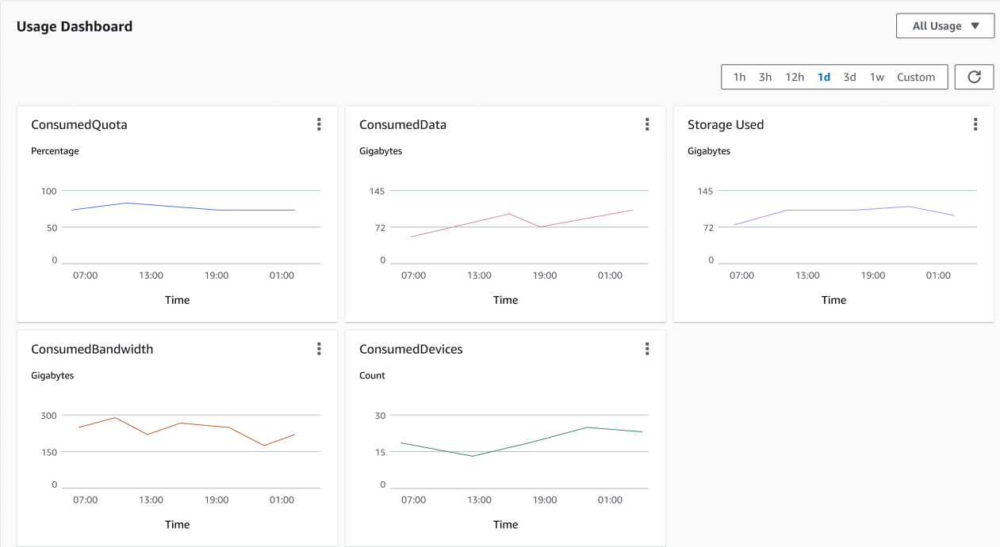

# CloudWatch metrics for buyer accounts in License Manager

When a grant for a seller issued license is configured with **allow submission
of usage records** selected, License Manager emits a CloudWatch metric to the seller account,
root buyer account, and the account against which the usage is being recorded. Buyer
accounts are the AWS accounts who have purchased or been granted a seller issued license.
For more information, see [Granting licenses
to customers](../../seller-issued-licenses.md#isv-grant-licenses "../../seller-issued-licenses.md#isv-grant-licenses").

## Usage dashboard

When a seller or independent software vendor (ISV) application records
usage against a license for a buyer account, the account in which usage is being recorded
and the root buyer account see a CloudWatch widget with usage records on the **Usage
dashboard** page in the License Manager console. Buyers can also see metrics for
accounts that they have distributed licenses to in AWS Organizations. The graphs
on the **Usage dashboard** page are available for every license for which
usage records have been sent.

The following image is an example of the usage dashboard:

