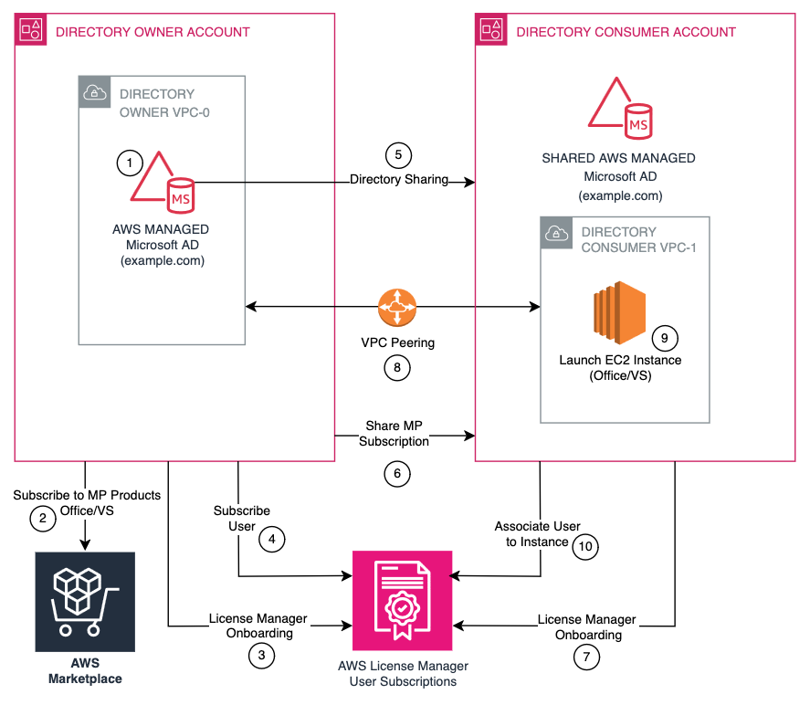

# Get Started with Cross-Account AWS License Manager using Shared AWS Managed Microsoft AD

AWS License Manager supports cross-account functionality using a shared AWS Managed Microsoft AD, enabling organizations to centrally manage user subscriptions from a directory owner account while deploying instances across multiple accounts.

## Terminology

- **Directory owner account** - license admin
  account where the managed AD exists and that is also responsible for managing
  subscriptions.
- **Directory consumer account** - AWS accounts
  where you wat to launch user subscriptions instances using shared AD.

## Prerequisites

Before you begin, ensure you have:

- An AWS Managed Microsoft AD in the directory owner account - set up in directory owner
  account/license admin account from which you want to control
  subscriptions.
- Network connectivity between your directory owner account and all of your
  directory consumer accounts.
- Required IAM permissions - see [User-based subscription IAM roles](user-based-subscription-role.md "user-based-subscription-role.md").
- Subscriptions to the required License Manager products in AWS Marketplace in the directory
  owner account:
  - [Visual Studio Professional 2022](https://aws.amazon.com/Marketplace/pp/prodview-zo3zltrbpgr5i "https://aws.amazon.com/Marketplace/pp/prodview-zo3zltrbpgr5i")
  - [Visual Studio Enterprise 2022](https://aws.amazon.com/Marketplace/pp/prodview-dzstlnjdl3izg "https://aws.amazon.com/Marketplace/pp/prodview-dzstlnjdl3izg")
  - [Office LTSC Professional Plus](https://aws.amazon.com/Marketplace/pp/prodview-bh46d5p2hapns "https://aws.amazon.com/Marketplace/pp/prodview-bh46d5p2hapns")

## Limitations

- User subscriptions management is restricted to the directory owner
  account.
- Cross-region sharing is not supported.
- Consolidated billing through directory owner account - all subscription
  costs are billed to the directory owner account, though subscriptions can exist
  in multiple accounts.
- Network connectivity is required between accounts.

## Network Architecture

## How to set up cross-account License Manager

functionality

To set up cross-account License Manager functionality:

1. Set up the directory owner account/license admin account.
2. Configure directory consumer accounts.
3. Establish network connectivity.
4. Deploy instances and manage user associations.

### Step 1: Set up the Directory Owner/license

admin account

#### Create and share AWS Managed Microsoft AD

1. Create an AWS Managed Microsoft AD in your VPC if it doesn't exist.
2. Share the directory with directory consumer accounts, as described in
   [Sharing your directory](../../../directoryservice/latest/admin-guide/ms_ad_directory_sharing.md "../../../directoryservice/latest/admin-guide/ms_ad_directory_sharing.md").
3. Ensure that the directory is properly configured with the required users
   and groups.

#### Subscribe to products

1. Navigate to AWS Marketplace.
2. Locate and subscribe to your needed products, Visual Studio or Office and
   RDS SAL.
3. Share the Visual Studio or Office subscription with the directory consumer
   accounts using License Manager **Create Grants**. Alternatively,
   you can subscribe to AWS Marketplace products in these accounts as this does not
   impact billing. See [Granted licenses](granted-licenses.md "granted-licenses.md").
4. Verify that the subscription status is active.

#### Register with License Manager

1. Open the License Manager console.
2. Navigate to **User-based subscriptions settings**.
3. Select **Register Identity Provider**.
4. Choose your AWS Managed Microsoft AD.
5. Complete the registration process.

### Step 2: Configure directory consumer accounts - accounts with shared AD

#### Accept shared directory

1. Open the AWS Directory Service console.
2. Navigate to **Shared directories**.
3. Locate and accept the shared directory invitation.
4. Note the new directory ID assigned in your account.

#### Accept MP subscription

In License Manager **Grants** accept the grant for AWS Marketplace products. Alternatively subscribe to AWS Marketplace
products. Learn more in [CreateGrant API](../APIReference/API_CreateGrant.md "../APIReference/API_CreateGrant.md")).

#### Register with License Manager

1. Open the License Manager console.
2. Navigate to **User-based subscriptions** and choose product.
3. Register using the shared directory ID and product.
4. Verify the registration status.

### Step 3: Establish networking connectivity between VPCs

To domain-join your Amazon Amazon EC2 instances to your directory, you need to establish
networking connectivity between the VPCs. There are several options for establishing
networking connectivity between two VPCs. This section shows you how to use Amazon
VPC peering.

#### Set up VPC peering

1. [Create one VPC peering connection](../../../vpc/latest/peering/create-vpc-peering-connection.md#create-vpc-peering-connection-remote "../../../vpc/latest/peering/create-vpc-peering-connection.md#create-vpc-peering-connection-remote") between the directory
   owner VPC-0 and directory consumer VPC-1, then create another connection
   between the directory owner VPC-0 and directory consumer VPC-2.
2. Enable [traffic routing between the peered VPCs](../../../vpc/latest/userguide/VPC_Route_Tables.md#route-tables-vpc-peering "../../../vpc/latest/userguide/VPC_Route_Tables.md#route-tables-vpc-peering") by adding a route
   to your VPC route table that points to the VPC peering connection to
   route traffic to the other VPC in the peering connection.
3. Configure each of the directory consumer VPC route tables by adding the
   peering connection with the directory owner VPC-0. If you want, you can
   also create and attach an Internet Gateway to your directory consumer
   VPCs. This enables the instances in the directory consumer VPCs to
   communicate with the Amazon EC2 Systems Manager agent that performs the domain
   join.

#### Configure security groups

Configure your directory consumer VPCs' [security group](../../../vpc/latest/userguide/VPC_SecurityGroups.md "../../../vpc/latest/userguide/VPC_SecurityGroups.md") to enable outbound traffic by adding the [AWS Managed Microsoft AD protocols and ports](../../../directoryservice/latest/admin-guide/ms_ad_getting_started_prereqs.md "../../../directoryservice/latest/admin-guide/ms_ad_getting_started_prereqs.md") to the outbound rules table. Also,
configure your directory domain controllers VPCs' security group to enable
inbound traffic by adding the AWS Managed Microsoft AD protocols and ports to the inbound
rules table, to allow traffic from directory consumer accounts.

##### Security group requirements

**Consumer Account VPCs:**

- Enable outbound traffic to directory owner VPC
- Allow communication on required AD ports

**Directory Owner VPC:**

- Configure inbound traffic from consumer VPCs
- Add necessary AWS Managed Microsoft AD protocols and ports including:
  - TCP 53 (DNS)
  - UDP 53 (DNS)
  - TCP 88 (Kerberos)
  - UDP 88 (Kerberos)
  - TCP 135 (RPC)
  - TCP 389 (LDAP)
  - UDP 389 (LDAP)
  - TCP 445 (SMB)
  - TCP 464 (Kerberos Password)
  - UDP 464 (Kerberos Password)
  - TCP 636 (LDAPS)
  - TCP 9389 (Active Directory Web Services)
  - TCP 3268-3269 (Global Catalog)
  - TCP 1024-65535 (Dynamic RPC)

Port 9389 is required for Active Directory Web Services (ADWS), which is used by the Active Directory PowerShell module and other management tools to communicate with domain controllers.

### Step 4: Deploy instances and manage user associations

#### Subscribe users (directory owner account only)

1. Open the License Manager console.
2. Navigate to **User-based subscriptions**.
3. Select **Subscribe Users**
4. Enter AWS Managed Microsoft AD user identifiers
5. Choose the product and confirm subscription.

#### Launch instances

Perform this step in any account.

1. Navigate to Amazon EC2 console.
2. Choose **Launch Instance**.
3. Select appropriate License Manager AMI.
4. Configure networking settings.
5. Review and launch.

#### Associate users with instances

Perform this step in any account where the instance exists.

1. Open License Manager console.
2. Navigate to **User Associations**.
3. Select target instance.
4. Choose **Associate Users**.
5. Enter AWS Managed Microsoft AD usernames.
6. Confirm association.

## Troubleshooting

Common issues and solutions:

### Domain join failures

1. Verify network connectivity between accounts.
2. Check security group configurations.
3. Confirm DNS resolution is working.
4. Validate route table entries.

### User subscription issues

1. Confirm user exists in AWS Managed Microsoft AD.
2. Verify subscription status in directory owner account.
3. Check network connectivity.
4. Review error logs.

### Network connectivity issues

1. Test VPC peering connection status.
2. Verify route table configurations.
3. Check security group rules.
4. Confirm DNS resolution.

### DNS resolution problems

1. Verify DHCP option sets.
2. Check DNS server configurations.
3. Test name resolution from consumer instances.

## Additional resources

- [AWS License Manager User Guide](user-based-subscriptions.md "user-based-subscriptions.md")
- [AWS Directory Service Documentation](../../../directoryservice/latest/admin-guide/directory_microsoft_ad.md "../../../directoryservice/latest/admin-guide/directory_microsoft_ad.md")
- [Sharing your directory](../../../directoryservice/latest/admin-guide/ms_ad_directory_sharing.md "../../../directoryservice/latest/admin-guide/ms_ad_directory_sharing.md")
- [How to domain join Amazon EC2 instances to AWS Managed Microsoft AD directory across multiple accounts and VPCs](https://aws.amazon.com/blogs/security/how-to-domain-join-amazon-ec2-instances-aws-managed-microsoft-ad-directory-multiple-accounts-vpcs/ "https://aws.amazon.com/blogs/security/how-to-domain-join-amazon-ec2-instances-aws-managed-microsoft-ad-directory-multiple-accounts-vpcs/")
- [Granted licenses](granted-licenses.md "granted-licenses.md")
