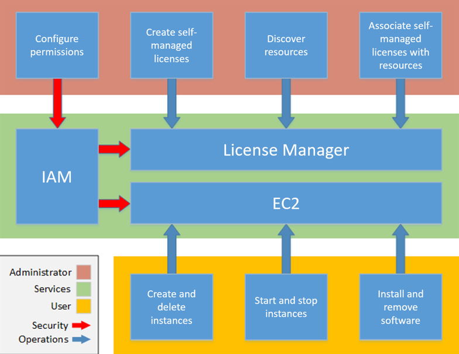

# How License Manager works

Effective software license management relies on the following:

- An expert understanding of language in enterprise licensing agreements
- Appropriately restricted access to operations that consume licenses
- Accurate tracking of license inventory
  Enterprises are likely to have dedicated persons or teams responsible for each of these
  domains. It then becomes a problem of effective communication, particularly between license
  experts and system administrators. License Manager provides a way of pooling knowledge from various domains.
  Crucially, it also integrates natively with AWS services—for example, with the Amazon EC2 control
  plane where instances are created and deleted. This means that License Manager rules and limits capture
  business and operational knowledge, and also translate to automated controls on instance creation
  and application deployment.

The following diagram illustrates the distinct but coordinated duties of license
administrators, who manage permissions and configure License Manager, and users, who create, manage, and
delete resources through the Amazon EC2 console.

If you are responsible for managing licenses in your organization, you can use License Manager to set
up licensing rules, attach them to your launches, and keep track of usage. The users in your
organization can then add and remove license-consuming resources without additional work.

License asset groups extend this capability by providing organization-wide license management that works across multiple AWS regions and accounts. Instead of managing licenses individually in each region and account, License asset groups consolidate licensing information into unified views, enabling centralized oversight and automated compliance monitoring across your entire AWS Organizations.

A licensing expert manages licenses across the entire organization, determining resource
inventory needs, supervising license procurement, and driving compliant license usage. In an
enterprise using License Manager, this work is consolidated through the License Manager console. As shown in the
diagram, this involves setting service permissions, creating self-managed licenses, taking
inventory of computing resources both on-premises and in the cloud, and associating self-managed
licenses with discovered resources. With License asset groups, licensing experts can also create centralized license groups that automatically discover and track software across regions and accounts, reducing the administrative overhead of managing licenses at scale. In practice, this could mean associating a self-managed
license with an approved Amazon Machine Image (AMI) that IT uses as a template for all Amazon EC2
instance deployments.

License Manager saves costs that would otherwise be lost to license violations. While internal audits
reveal violations only after the fact, when it is too late to avoid penalties for non-compliance,
License Manager prevents expensive incidents from ever occurring. License Manager simplifies reporting with built-in
dashboards showing license consumption and resources tracked.

## License asset groups in the license management workflow

License asset groups provide an additional layer of organization and automation to the license management workflow. While traditional license configurations work at the individual license level, License asset groups operate at the organizational level, providing consolidated views and automated management across multiple regions and accounts.

### Relationship with existing License Manager features

License asset groups complement and enhance existing License Manager capabilities:

- **License Configurations** - License asset groups can incorporate both self-managed license configurations and granted licenses, providing a unified view regardless of how licenses were originally created or acquired.
- **Inventory Search** - License asset groups use the same discovery mechanisms as inventory search but automate the grouping and ongoing monitoring of discovered resources based on rulesets.
- **Usage Reports** - License asset groups generate comprehensive reports that span multiple regions and accounts, providing organization-wide visibility that individual license reports cannot achieve.
- **Cross-account Management** - License asset groups are designed specifically for multi-account scenarios, working seamlessly with AWS Organizations to provide centralized license governance.

### License asset groups use case scenarios

License asset groups are particularly valuable in the following scenarios:

- **Multi-region deployments** - When your organization runs workloads across multiple AWS regions and needs consolidated license tracking without managing each region separately.
- **Multi-account organizations** - When using AWS Organizations with multiple accounts and requiring centralized license oversight from a management or delegated administrator account.
- **Automated compliance monitoring** - When you need proactive license expiration notifications and automated compliance tracking across your entire AWS environment.
- **Audit preparation** - When you need comprehensive, organization-wide license usage reports for vendor audits or internal compliance reviews.
