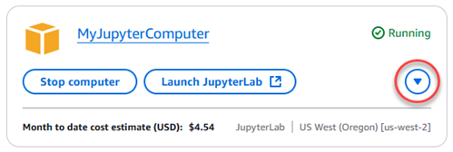

# Access your Lightsail for Research virtual computer's

operating system

Complete the following steps to access the operating system for your Lightsail for Research virtual
computer.

1. Sign in to the [Lightsail for Research console](https://lfr.console.aws.amazon.com/ls/research "https://lfr.console.aws.amazon.com/ls/research").
2. Choose **Virtual computers** in the navigation pane.
3. Locate the name of your virtual computer and then choose the actions button
   dropdown under the computer's status.

###### Note

If the virtual computer is stopped, first choose the
**Start** button to turn it on. 4. Choose **Access operating system**. An operating system
session will open in a new browser window.

###### Important

If your web browser has a pop-up blocker installed, you might need to
allow pop-ups from the **aws.amazon.com**
domain before to opening your session.
