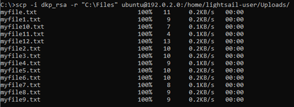
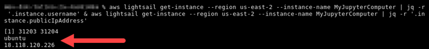
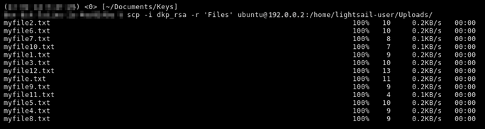

# Transfer files to Lightsail for Research virtual computers using

Secure Copy

You can transfer files from your local computer to a virtual computer in Amazon Lightsail for Research
using Secure Copy (SCP). With this process, you can transfer multiple files, or entire
directories, at one time.

###### Note

You can also establish a remote display protocol connection to your virtual
computer using the browser-based Amazon DCV client available in the Lightsail for Research console. With
the Amazon DCV client, you can quickly transfer individual files. For more information,
see [Access your Lightsail for Research virtual computer's
operating system](access-computer-operating-system.md "access-computer-operating-system.md").

###### Topics

- [Complete the prerequisites](#connect-using-scp-prerequisites "#connect-using-scp-prerequisites")
- [Connect to a virtual computer
  using SCP](#connect-virtual-computer-using-scp "#connect-virtual-computer-using-scp")

## Complete the prerequisites

Complete the following prerequisites before you get started.

- Create a virtual computer in Lightsail for Research. For more information, see [Create a Lightsail for Research virtual computer](create-computer.md "create-computer.md").
- Make sure the virtual computer that you want to connect to is in a running
  state. Also, make note of the name of the virtual computer and the AWS
  Region in which it was created. You will need this information later in this
  process. For more information, see [View Lightsail for Research virtual computer details](view-computer.md "view-computer.md").
- Download and install the AWS Command Line Interface (AWS CLI). For more information, see
  [Installing or updating the latest version of the AWS CLI](../../../cli/latest/userguide/getting-started-install.md "../../../cli/latest/userguide/getting-started-install.md") in the
  _AWS Command Line Interface User Guide for Version 2_.
- Configure the AWS CLI to access your AWS account. For more information,
  see [Configuration basics](../../../cli/latest/userguide/cli-configure-quickstart.md#cli-configure-quickstart-config "../../../cli/latest/userguide/cli-configure-quickstart.md#cli-configure-quickstart-config") in the _AWS Command Line Interface User Guide for
  Version 2_.
- Download and install jq. It's a lightweight and flexible command line JSON
  processor used in the following procedures to extract key pair details. For
  more information about downloading and installing jq, see [Download jq](https://stedolan.github.io/jq/download/ "https://stedolan.github.io/jq/download/") on the
  _jq website_.
- Make sure that port 22 is open on the virtual computer you want to connect
  to. That is the default port used for SSH. It's open by default. But if you
  closed it, you must reopen it before continuing. For more information, see
  [Manage firewall ports for Lightsail for Research virtual computers](manage-ports.md "manage-ports.md").
- Get the Lightsail default key pair (DKP) for your virtual computer. For
  more information, see [Create a Lightsail for Research virtual computer](create-computer.md "create-computer.md").

## Connect to a virtual computer

using SCP

Complete one of the following procedures to connect to your virtual computer in
Lightsail for Research using SCP.

This procedure applies to you if your local computer uses a Windows
operating system. This procedure uses the `get-instance` AWS CLI
command to obtain the username and public IP address of the instance you
want to connect to. For more information, see [get-instance](../../../cli/latest/reference/lightsail/get-instance.md "../../../cli/latest/reference/lightsail/get-instance.md") in the _AWS CLI Command
Reference_.

###### Important

Make sure you get the Lightsail default key pair (DKP) for the
virtual computer you're trying to connect to before you start this
procedure. For more information, see [Get a key pair for a Lightsail for Research virtual computer](get-ssh-keys.md "get-ssh-keys.md"). That procedure outputs the private
key of the Lightsail DKP to a `dkp_rsa` file that is used
in one of the following commands.

1. Open a Command Prompt window.
2. Enter the following command to display the public IP address and
   username of your virtual computer. In the command, replace
   `region-code` with the
   code of the AWS Region in which the virtual computer was created,
   such as `us-east-2`. Replace
   `computer-name` with
   the name of the virtual computer that you want to connect to.

```
aws lightsail get-instance --region `region-code` --instance-name `computer-name` | jq -r ".instance.username" & aws lightsail get-instance --region `region-code` --instance-name `computer-name` | jq -r ".instance.publicIpAddress"
```

**Example**

```
aws lightsail get-instance --region `us-east-2` --instance-name `MyJupyterComputer` | jq -r ".instance.username" & aws lightsail get-instance --region `us-east-2` --instance-name `MyJupyterComputer` | jq -r ".instance.publicIpAddress"
```

The response will display the username and public IP address of
the virtual computer as shown in the following example. Note these
values, because you need them in the following step of this
procedure.

 3. Enter the following command to establish an SCP connection with
your virtual computer and transfer files to it.

```
scp -i dkp_rsa -r "`source-folder`" `user-name`@`public-ip-address`:`destination-directory`
```

In the command, replace:

    * ``source-folder`` with
     the folder on your local computer that contains the files
     you want to transfer.
    * ``user-name`` with the
     username from the previous step of this procedure (such as
     `ubuntu`).
    * ``public-ip-address``
     with the public IP address of your virtual computer from the
     previous step of this procedure.
    * ``destination-directory``
     with the path to the directory on the virtual computer where
     you want to copy your files.

The following example copies all files from the
`C:\Files` folder on the local computer to the
`/home/lightsail-user/Uploads/` directory on the
remote virtual computer.

```
scp -i dkp_rsa -r "`C:\Files`" `ubuntu`@`192.0.2.0`:`/home/lightsail-user/Uploads/`
```

You should see a response similar to the following example. It
shows each file that was transferred from the origin folder to the
destination directory. You should now be able to access those files
on your virtual computer.


This procedure applies to you if your local computer uses a Linux, Unix,
or a macOS operating system. This procedure uses the
`get-instance` AWS CLI command to obtain the username and
public IP address of the instance you want to connect to. For more
information, see [get-instance](../../../cli/latest/reference/lightsail/get-instance.md "../../../cli/latest/reference/lightsail/get-instance.md") in the _AWS CLI Command
Reference_.

###### Important

Make sure you get the Lightsail default key pair (DKP) for the
virtual computer you're trying to connect to before you start this
procedure. For more information, see [Get a key pair for a Lightsail for Research virtual computer](get-ssh-keys.md "get-ssh-keys.md"). That procedure outputs the private
key of the Lightsail DKP to a `dkp_rsa` file that is used
in one of the following commands.

1. Open a Terminal window.
2. Enter the following command to display the public IP address and
   username of your virtual computer. In the command, replace
   `region-code` with the
   code of the AWS Region in which the virtual computer was created,
   such as `us-east-2`. Replace
   `computer-name` with
   the name of the virtual computer that you want to connect to.

```
aws lightsail get-instance --region `region-code` --instance-name `computer-name` | jq -r '.instance.username' & aws lightsail get-instance --region `region-code` --instance-name `computer-name` | jq -r '.instance.publicIpAddress'
```

**Example**

```
aws lightsail get-instance --region `us-east-2` --instance-name `MyJupyterComputer` | jq -r '.instance.username' & aws lightsail get-instance --region `us-east-2` --instance-name `MyJupyterComputer` | jq -r '.instance.publicIpAddress'
```

The response will display the username and public IP address of
the virtual computer as shown in the following example. Note these
values, because you need them in the following step of this
procedure.

 3. Enter the following command to establish an SCP connection with
your virtual computer and transfer files to it.

```
scp -i dkp_rsa -r '`source-folder`' `user-name`@`public-ip-address`:`destination-directory`
```

In the command, replace:

    * ``source-folder`` with
     the folder on your local computer that contains the files
     you want to transfer.
    * ``user-name`` with the
     username from the previous step of this procedure (such as
     `ubuntu`).
    * ``public-ip-address``
     with the public IP address of your virtual computer from the
     previous step of this procedure.
    * ``destination-directory``
     with the path to the directory on the virtual computer where
     you want to copy your files.

The following example copies all files from the
`C:\Files` folder on the local computer to the
`/home/lightsail-user/Uploads/` directory on the
remote virtual computer.

```
scp -i dkp_rsa -r '`Files`' `ubuntu`@`192.0.2.0`:`/home/lightsail-user/Uploads/`
```

You should see a response similar to the following example. It
shows each file that was transferred from the origin folder to the
destination directory. You should now be able to access those files
on your virtual computer.


