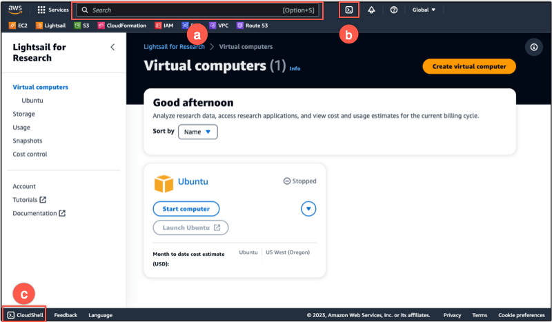
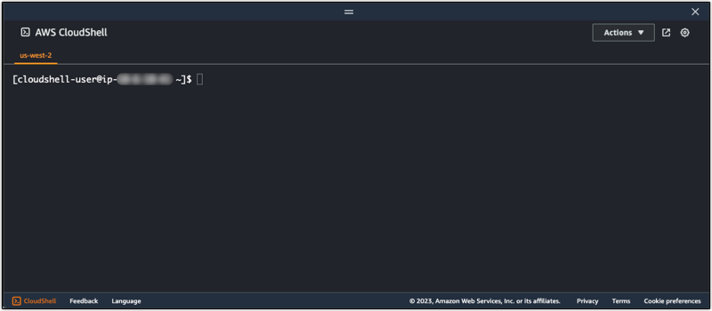
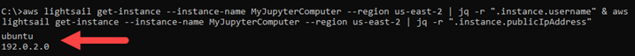
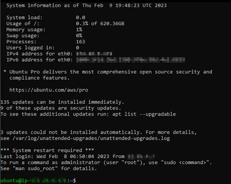
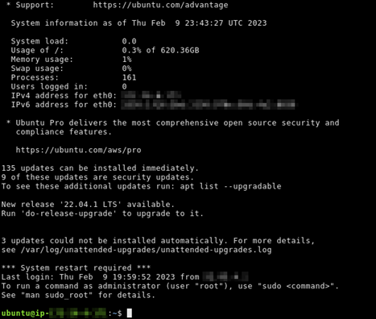

# Connect to a Lightsail for Research virtual computer using Secure

Shell

You can connect to a virtual computer in Amazon Lightsail for Research using the Secure Shell Protocol
(SSH). You can use SSH to manage your virtual computer remotely so that you can sign in
to your computer over the internet and run commands.

###### Note

You can also establish a remote display protocol connection to your virtual
computer using the browser-based Amazon DCV client. Amazon DCV is available in the Lightsail for Research
console. For more information, see [Access your Lightsail for Research virtual computer's
operating system](access-computer-operating-system.md "access-computer-operating-system.md").

###### Topics

- [Complete the prerequisites](#connect-using-ssh-prerequisites "#connect-using-ssh-prerequisites")
- [Connect to a virtual computer
  using SSH](#connect-virtual-computer-using-ssh "#connect-virtual-computer-using-ssh")
- [Continue to the next steps](#connect-using-ssh-next-steps "#connect-using-ssh-next-steps")

## Complete the prerequisites

Complete the following prerequisites before you get started.

- Create a virtual computer in Lightsail for Research. For more information, see [Create a Lightsail for Research virtual computer](create-computer.md "create-computer.md").
- Make sure the virtual computer that you want to connect to is in a running
  state. Also, note the name of the virtual computer and the AWS Region in
  which it was created. You'll need this information later in this process.
  For more information, see [View Lightsail for Research virtual computer details](view-computer.md "view-computer.md").
- Make sure that port 22 is open on the virtual computer that you want to
  connect to. That is the default port used for SSH. It's open by default. But
  if you closed it, you must reopen it before continuing. For more
  information, see [Manage firewall ports for Lightsail for Research virtual computers](manage-ports.md "manage-ports.md").
- Get the Lightsail default key pair (DKP) for your virtual computer. For
  more information, see [Get a key pair for a virtual computer](get-ssh-keys.md#get-dkp-ssh-keys "get-ssh-keys.md#get-dkp-ssh-keys").

###### Tip

If you plan to use AWS CloudShell to connect to your
virtual computer, see [Connect to a virtual computer
using AWS CloudShell](#connect-using-cloudshell "#connect-using-cloudshell") in the next section. For
more information, see [What is AWS CloudShell](../../../cloudshell/latest/userguide/welcome.md "../../../cloudshell/latest/userguide/welcome.md"). Otherwise, continue to the next
prerequisite.

- Download and install the AWS Command Line Interface (AWS CLI). For more information, see
  [Installing or updating the latest version of the AWS CLI](../../../cli/latest/userguide/getting-started-install.md "../../../cli/latest/userguide/getting-started-install.md") in the
  _AWS Command Line Interface User Guide for Version 2_.
- Configure the AWS CLI to access your AWS account. For more information,
  see [Configuration basics](../../../cli/latest/userguide/cli-configure-quickstart.md#cli-configure-quickstart-config "../../../cli/latest/userguide/cli-configure-quickstart.md#cli-configure-quickstart-config") in the _AWS Command Line Interface User Guide for
  Version 2_.
- Download and install jq. It's a lightweight and flexible command line JSON
  processor used in the following procedures to extract key pair details. For
  more information about downloading and installing jq, see [Download jq](https://stedolan.github.io/jq/download/ "https://stedolan.github.io/jq/download/") on the
  _jq website_.

## Connect to a virtual computer

using SSH

Complete one of the following procedures to establish an SSH connection to your
virtual computer in Lightsail for Research.

This procedure applies if you prefer minimal setup to connect to your
virtual computer. AWS CloudShell uses a browser-based, pre-authenticated shell
that you can launch directly from the AWS Management Console. You can run AWS CLI
commands using your preferred shell, such as Bash, PowerShell, or Z shell.
You can do this without downloading or installing command line tools. For
more information, see [Getting started with AWS CloudShell](../../../cloudshell/latest/userguide/getting-started.md "../../../cloudshell/latest/userguide/getting-started.md") in the _AWS CloudShell User
Guide_.

###### Important

Before you start, make sure to get the Lightsail default key pair
(DKP) for the virtual computer that you're connecting to. For more
information, see [Get a key pair for a Lightsail for Research virtual computer](get-ssh-keys.md "get-ssh-keys.md").

1. From the [Lightsail for Research console](https://lfr.console.aws.amazon.com/ls/research "https://lfr.console.aws.amazon.com/ls/research"), launch CloudShell by choosing one
   of the following options:
   1. In the Search box, type "CloudShell", and then choose
      **CloudShell**.
   2. On the navigation bar, choose the **CloudShell** icon.
   3. Choose **CloudShell** on
      the Console Toolbar in the lower left of the console.



When the command prompt displays, the shell is ready for
interaction.

 2. Choose a pre-installed shell to work with. To change the default
shell, enter one of the following program names at the command line
prompt. Bash is the default shell that's running when
you launch AWS CloudShell.

Bash
`bash`

If you switch to Bash, the symbol at
the command prompt updates to `$`.

PowerShell
`pwsh`

If you switch to PowerShell, the symbol at the command
prompt updates to `PS>`.

Z shell
`zsh`

If you switch to Z shell, the symbol at
the command prompt updates to `%`. 3. To connect to a virtual computer from the CloudShell terminal
window, see [Connect to a virtual computer
using SSH on a Linux, Unix, or a macOS local computer](#connect-using-ssh-linux "#connect-using-ssh-linux").
For information about the pre-installed software in the CloudShell
environment, see [AWS CloudShell compute environment](../../../cloudshell/latest/userguide/vm-specs.md#pre-installed-software "../../../cloudshell/latest/userguide/vm-specs.md#pre-installed-software") in the
_AWS CloudShell User Guide_.

This procedure applies if your local computer uses a Windows operating
system. This procedure uses the `get-instance` AWS CLI command to
obtain the username and public IP address of the instance you want to
connect to. For more information, see [get-instance](../../../cli/latest/reference/lightsail/get-instance.md "../../../cli/latest/reference/lightsail/get-instance.md") in the _AWS CLI Command
Reference_.

###### Important

Make sure you get the Lightsail default key pair (DKP) for the
virtual computer you're trying to connect to before you start this
procedure. For more information, see [Get a key pair for a Lightsail for Research virtual computer](get-ssh-keys.md "get-ssh-keys.md"). That procedure outputs the private
key of the Lightsail DKP to a `dkp_rsa` file that is used
in one of the following commands.

1. Open a Command Prompt window.
2. Enter the following command to display the public IP address and
   username of your virtual computer. In the command, replace
   `region-code` with the
   code of the AWS Region in which the virtual computer was created,
   such as `us-east-2`. Replace
   `computer-name` with
   the name of the virtual computer that you want to connect to.

```
aws lightsail get-instance --region `region-code` --instance-name `computer-name` | jq -r ".instance.username" & aws lightsail get-instance --region `region-code` --instance-name `computer-name` | jq -r ".instance.publicIpAddress"
```

**Example**

```
aws lightsail get-instance --region `us-east-2` --instance-name `MyJupyterComputer` | jq -r ".instance.username" & aws lightsail get-instance --region `us-east-2` --instance-name `MyJupyterComputer` | jq -r ".instance.publicIpAddress"
```

The response will display the username and public IP address of
the virtual computer as shown in the following example. Note these
values, because you need them in the following step of this
procedure.

 3. Enter the following command to establish an SSH connection with
your virtual computer. In the command, replace
`user-name` with the
sign-in in username, and replace
`public-ip-address`
with the public IP address of your virtual computer.

```
ssh -i dkp_rsa `user-name`@`public-ip-address`
```

**Example**

```
ssh -i dkp_rsa `ubuntu`@`192.0.2.0`
```

You should see a response similar to the following example, which
shows an SSH connection established with an Ubuntu virtual computer
in Lightsail for Research.



Now that you've successfully established an SSH connection to your
virtual computer, continue to the [next section](#connect-using-ssh-next-steps "#connect-using-ssh-next-steps") for
additional next steps.
This procedure applies if your local computer uses a Linux, Unix, or a
macOS operating system. This procedure uses the `get-instance`
AWS CLI command to obtain the username and public IP address of the instance
you want to connect to. For more information, see [get-instance](../../../cli/latest/reference/lightsail/get-instance.md "../../../cli/latest/reference/lightsail/get-instance.md") in the _AWS CLI Command
Reference_.

###### Important

Make sure you get the Lightsail default key pair (DKP) for the
virtual computer you're trying to connect to before you start this
procedure. For more information, see [Get a key pair for a Lightsail for Research virtual computer](get-ssh-keys.md "get-ssh-keys.md"). That procedure outputs the private
key of the Lightsail DKP to a `dkp_rsa` file that is used
in one of the following commands.

1. Open a Terminal window.
2. Enter the following command to display the public IP address and
   username of your virtual computer. In the command, replace
   `region-code` with the
   code of the AWS Region in which the virtual computer was created,
   such as `us-east-2`. Replace
   `computer-name` with
   the name of the virtual computer that you want to connect to.

```
aws lightsail get-instance --region `region-code` --instance-name `computer-name` | jq -r '.instance.username' && aws lightsail get-instance --region `region-code` --instance-name `computer-name` | jq -r '.instance.publicIpAddress'
```

**Example**

```
aws lightsail get-instance --region `us-east-2` --instance-name `MyJupyterComputer` | jq -r '.instance.username' && aws lightsail get-instance --region `us-east-2` --instance-name `MyJupyterComputer` | jq -r '.instance.publicIpAddress'
```

The response will display the username and public IP address of
the virtual computer as shown in the following example. Note these
values, because you need them in the following step of this
procedure.

 3. Enter the following command to establish an SSH connection with
your virtual computer. In the command, replace
`user-name` with the
sign-in username, and replace
`public-ip-address`
with the public IP address of your virtual computer.

```
ssh -i dkp_rsa `user-name`@`public-ip-address`
```

**Example**

```
ssh -i dkp_rsa `ubuntu`@`192.0.2.0`
```

You should see a response similar to the following example, which
shows an SSH connection established with an Ubuntu virtual computer
in Lightsail for Research.



Now that you've successfully established an SSH connection to your
virtual computer, continue to the [next section](#connect-using-ssh-next-steps "#connect-using-ssh-next-steps") for
additional next steps.

## Continue to the next steps

You can complete the following additional next steps after you've successfully
established an SSH connection to your virtual computer:

- Connect to your virtual computer using SCP to securely transfer files. For
  more information, see [Transfer files to Lightsail for Research virtual computers using
  Secure Copy](connect-using-scp.md "connect-using-scp.md").
