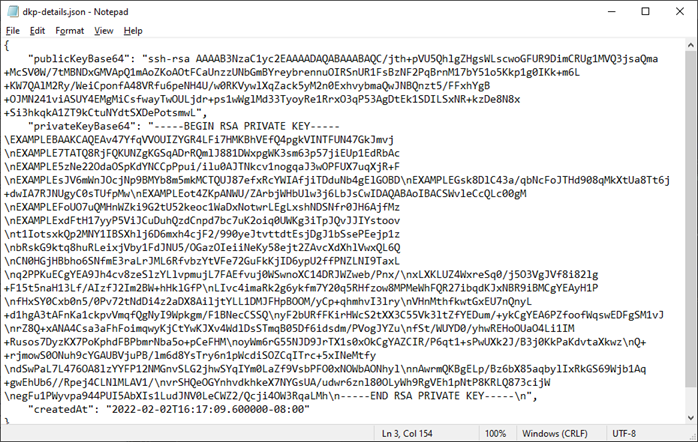
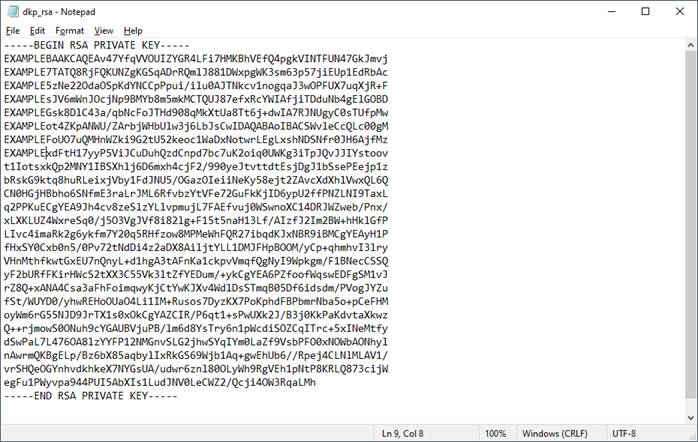
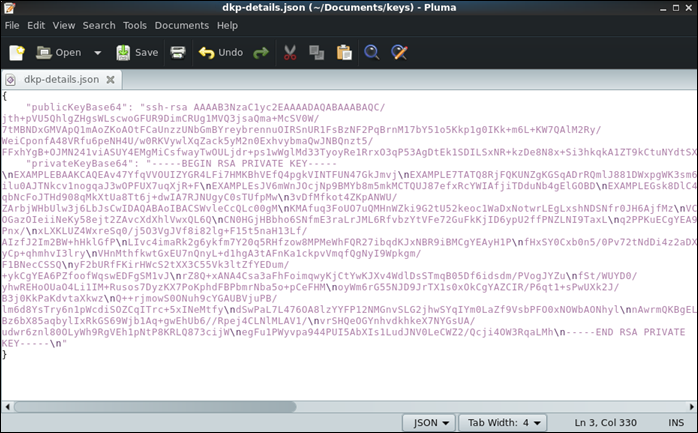
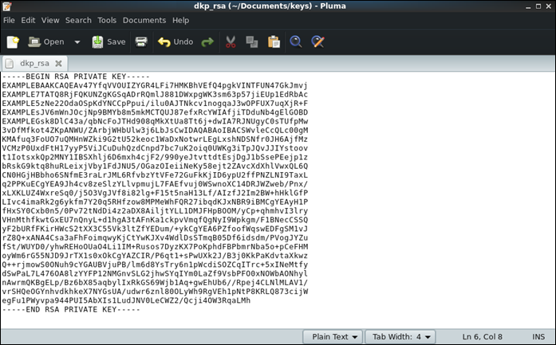

# Get a key pair for a Lightsail for Research virtual computer

A key pair, consisting of a public key and a private key, is a set of security
credentials that you use to prove your identity when connecting to an Amazon Lightsail for Research virtual
computer. The public key is stored on each virtual computer in Lightsail for Research, and you keep the
private key on your local computer. The private key allows you to securely establish a
Secure Shell Protocol (SSH) with your virtual computer. Anyone who possesses the private
key can connect to your virtual computer, so it's important that you store your private
key in a secure place.

An Amazon Lightsail default key pair (DKP) is automatically created the first time that
you create a Lightsail instance or a Lightsail for Research virtual computer. The DKP is specific to
each AWS Region in which you create an instance or virtual computer. For example, the
Lightsail DKP for the US East (Ohio) Region (us-east-2) applies to
all computers that you create in US East (Ohio) in Lightsail and Lightsail for Research that were
configured to use the DKP when they were created. Lightsail for Research automatically stores the public
key of the DKP on the virtual computers you create. You can download the private key of
the DKP at any time by making an API call to the Lightsail service.

In this document, we show you how to get the DKP for a virtual computer. After you
have the DKP, you can establish a connection using numerous SSH clients, such as
OpenSSH, PuTTY, and Windows Subsystem for Linux. You can also use Secure Copy (SCP) to
securely transfer files from your local computer to your virtual computer.

###### Note

You can also establish a remote display protocol connection to your virtual
computer using the browser-based Amazon DCV client. Amazon DCV is available in the Lightsail for Research
console. That RDP client does not require that you obtain a key pair for your
computer. For more information, see [Access a Lightsail for Research virtual computer
application](open-computer-application.md "open-computer-application.md") and [Access your Lightsail for Research virtual computer's
operating system](access-computer-operating-system.md "access-computer-operating-system.md").

###### Topics

- [Complete the prerequisites](#get-ssh-keys-prerequisites "#get-ssh-keys-prerequisites")
- [Get a key pair for a virtual computer](#get-dkp-ssh-keys "#get-dkp-ssh-keys")
- [Continue to the next steps](#get-ssh-keys-next-steps "#get-ssh-keys-next-steps")

## Complete the prerequisites

Complete the following prerequisites before you get started.

- Create a virtual computer in Lightsail for Research. For more information, see [Create a Lightsail for Research virtual computer](create-computer.md "create-computer.md").
- Download and install the AWS Command Line Interface (AWS CLI). For more information, see
  [Installing or updating the latest version of the AWS CLI](../../../cli/latest/userguide/getting-started-install.md "../../../cli/latest/userguide/getting-started-install.md") in the
  _AWS Command Line Interface User Guide for Version 2_.
- Configure the AWS CLI to access your AWS account. For more information,
  see [Configuration basics](../../../cli/latest/userguide/cli-configure-quickstart.md#cli-configure-quickstart-config "../../../cli/latest/userguide/cli-configure-quickstart.md#cli-configure-quickstart-config") in the _AWS Command Line Interface User Guide for
  Version 2_.
- Download and install jq. It's a lightweight and flexible command line JSON
  processor used in the following procedures to extract key pair details from
  JSON outputs of the AWS CLI. For more information about downloading and
  installing jq, see [Download jq](https://stedolan.github.io/jq/download/ "https://stedolan.github.io/jq/download/") on the _jq website_.

## Get a key pair for a virtual computer

Complete one of the following procedures to get the Lightsail DKP for a virtual
computer in Lightsail for Research.

This procedure applies to you if your local computer uses a Windows
operating system. This procedure uses the
`download-default-key-pair` AWS CLI command to obtain the
Lightsail DKP for an AWS Region. For more information, see [download-default-key-pair](../../../cli/latest/reference/lightsail/download-default-key-pair.md "../../../cli/latest/reference/lightsail/download-default-key-pair.md") in the _AWS CLI Command
Reference_.

1. Open a Command Prompt window.
2. Enter the following command to get the Lightsail DKP for a
   specific AWS Region. This command saves the information to a
   `dkp-details.json` file. In the command, replace
   `region-code` with the
   code of the AWS Region in which the virtual computer was created,
   such as `us-east-2`.

```
aws lightsail download-default-key-pair --region `region-code` > dkp-details.json
```

**Example**

```
aws lightsail download-default-key-pair --region `us-east-2` > dkp-details.json
```

There is no response to the command. You can confirm if the
command was successful by opening the `dkp-details.json`
file and seeing if the Lightsail DKP information was saved. The
contents of the `dkp-details.json` file should look like
the following example. The command failed if the file is
blank.

 3. Enter the following command to extract the private key information
from the `dkp-details.json` file and add it to a new
`dkp_rsa` private key file.

```
type dkp-details.json | jq -r ".privateKeyBase64" > dkp_rsa
```

There is no response to the command. You can confirm if the
command was successful by opening the `dkp_rsa` files and
seeing if it contains information. The contents of the
`dkp_rsa` file should look like the following
example. The command failed if the file is blank.



You now have the required private key to establish an SSH or SCP
connection to your virtual computer. Continue to the [next section](#get-ssh-keys-next-steps "#get-ssh-keys-next-steps") for
additional next steps.
This procedure applies to you if your local computer uses a Linux, Unix,
or a macOS operating system. This procedure uses the
`download-default-key-pair` AWS CLI command to obtain the
Lightsail DKP for an AWS Region. For more information, see [download-default-key-pair](../../../cli/latest/reference/lightsail/download-default-key-pair.md "../../../cli/latest/reference/lightsail/download-default-key-pair.md") in the _AWS CLI Command
Reference_.

1. Open a Terminal window.
2. Enter the following command to get the Lightsail DKP for a
   specific AWS Region. This command saves the information to a
   `dkp-details.json` file. In the command, replace
   `region-code` with the
   code of the AWS Region in which the virtual computer was created,
   such as `us-east-2`.

```
aws lightsail download-default-key-pair --region `region-code` > dkp-details.json
```

**Example**

```
aws lightsail download-default-key-pair --region `us-east-2` > dkp-details.json
```

There is no response to the command. You can confirm if the
command was successful by opening the `dkp-details.json`
file and seeing if the Lightsail DKP information was saved. The
contents of the `dkp-details.json` file should look like
the following example. The command failed if the file is
blank.

 3. Enter the following command to extract the private key information
from the `dkp-details.json` file and add it to a new
`dkp_rsa` private key file.

```
cat dkp-details.json | jq -r '.privateKeyBase64' > dkp_rsa
```

There is no response to the command. You can confirm if the
command was successful by opening the `dkp_rsa` files and
seeing if it contains information. The contents of the
`dkp_rsa` file should look like the following
example. The command failed if the file is blank.

 4. Enter the following command to set permissions for the
`dkp_rsa` file.

```
chmod 600 dkp_rsa
```

You now have the required private key to establish an SSH or SCP
connection to your virtual computer. Continue to the [next section](#get-ssh-keys-next-steps "#get-ssh-keys-next-steps") for
additional next steps.

## Continue to the next steps

You can complete the following additional next steps after you've successfully
obtained the key pairs for your virtual computer:

- Connect to your virtual computer using SSH to manage it using command
  line. For more information, see [Connect to a Lightsail for Research virtual computer using Secure
  Shell](connect-using-ssh.md "connect-using-ssh.md").
- Connect to your virtual computer using SCP to securely transfer files. For
  more information, see [Transfer files to Lightsail for Research virtual computers using
  Secure Copy](connect-using-scp.md "connect-using-scp.md").
