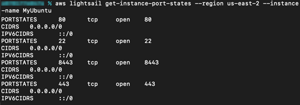
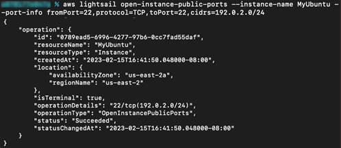
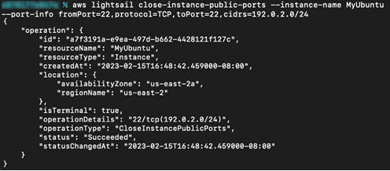

# Manage firewall ports for Lightsail for Research virtual computers

A firewall in Amazon Lightsail for Research controls the traffic allowed to connect to your virtual
computer. You add rules to your virtual computer’s firewall that specify the protocol,
ports, and the source IPv4 or IPv6 addresses that are allowed to connect to it. Firewall
rules are always permissive; you can't create rules that deny access. You add rules to
your virtual computer's firewall to allow traffic to reach your virtual computer. Each
virtual computer has two firewalls; one for IPv4 addresses and another for IPv6
addresses. Both firewalls are independent of each other, and contain a preconfigured set
of rules that filter traffic coming into the instance.

## Protocols

A protocol is the format in which data is transmitted between two computers. You
can specify the following protocols in a firewall rule:

- **Transmission Control Protocol (TCP)** is
  primarily used for establishing and maintaining a connection between clients
  and the application that’s running on your virtual computer. It is a widely
  used protocol, and one that you might often specify in your firewall rules.
- **User Datagram Protocol (UDP)** is primarily
  used for establishing low-latency and loss-tolerating connections between
  clients and the application that’s running on your virtual computer. Its
  ideal use is for network applications in which perceived latency is
  critical, such as gaming, voice, and video communications.
- **Internet Control Message Protocol (ICMP)**
  is primarily used to diagnose network communication issues, such as to
  determine if data is reaching its intended destination in a timely manner.
  Its ideal use is for the Ping utility, which you can use to test the speed
  of the connection between your local computer and your virtual computer. It
  reports how long it takes data to reach your virtual computer and come back
  to your local computer.
- **All** is used to allow all protocol traffic
  to flow into your virtual computer. Specify this protocol when you're unsure
  which protocol to specify. This includes all internet protocols, not only
  the ones specified here. For more information, see [Protocol Numbers](https://www.iana.org/assignments/protocol-numbers/protocol-numbers.xhtml "https://www.iana.org/assignments/protocol-numbers/protocol-numbers.xhtml") on the _Internet Assigned Numbers
  Authority website_.

## Ports

Similar to physical ports on your computer, which let your computer communicate
with peripherals like your keyboard and pointer, firewall ports serve as internet
communications endpoints for your virtual computer. When a client seeks to connect
with your virtual computer, it will expose a port to establish the
communication.

The ports that you can specify in a firewall rule can range from 0 to 65535. When
you create a firewall rule to allow a client to establish a connection with your
virtual computer, you specify the protocol to use. You also specify the port numbers
through which the connection can be established and the IP addresses that are
allowed to establish a connection.

The following ports are open by default for newly created virtual
computers.

- TCP
  - 22 - Used for Secure Shell (SSH).
  - 80 - Used for Hypertext Transfer Protocol (HTTP).
  - 443 - Used for Hypertext Transfer Protocol Secure (HTTPS).
  - 8443 - Used for Hypertext Transfer Protocol Secure (HTTPS).

## Why open and close ports

When you open ports, you allow a client to establish a connection with your
virtual computer. When you close ports, you block connections to your virtual
computer. For example, to allow an SSH client to connect to your virtual computer,
you configure a firewall rule that allows TCP over port 22 only from the IP address
of the computer that needs to establish a connection. In this case, you don't want
to allow any IP address to establish an SSH connection to your virtual computer.
Doing so could lead to a security risk. If this rule is already configured on your
instance's firewall, then you can delete it to block the SSH client from connecting
to your virtual computer.

The following procedures show you how to get the ports that are currently open on your
virtual computer, open new ports, and close ports.

###### Topics

- [Complete the prerequisites](#get-ports-prerequisites "#get-ports-prerequisites")
- [Get port states for a virtual computer](#get-port-states "#get-port-states")
- [Open ports for a virtual computer](#open-ports "#open-ports")
- [Close ports for a virtual computer](#close-ports "#close-ports")
- [Continue to the next steps](#manage-ports-next-steps "#manage-ports-next-steps")

## Complete the prerequisites

Complete the following prerequisites before you get started.

- Create a virtual computer in Lightsail for Research. For more information, see [Create a Lightsail for Research virtual computer](create-computer.md "create-computer.md").
- Download and install the AWS Command Line Interface (AWS CLI). For more information, see
  [Installing or updating the latest version of the AWS CLI](../../../cli/latest/userguide/getting-started-install.md "../../../cli/latest/userguide/getting-started-install.md") in the
  _AWS Command Line Interface User Guide for Version 2_.
- Configure the AWS CLI to access your AWS account. For more information,
  see [Configuration basics](../../../cli/latest/userguide/cli-configure-quickstart.md#cli-configure-quickstart-config "../../../cli/latest/userguide/cli-configure-quickstart.md#cli-configure-quickstart-config") in the _AWS Command Line Interface User Guide for
  Version 2_.

## Get port states for a virtual computer

Complete the following procedure to get the port states for a virtual computer.
This procedure uses the `get-instance-port-states` AWS CLI command to
obtain the firewall port states for a specific Lightsail for Research virtual computer, the IP
addresses allowed to connect to the virtual computer through the ports, and the
protocol. For more information, see [get-instance-port-states](../../../cli/latest/reference/lightsail/get-instance-port-states.md "../../../cli/latest/reference/lightsail/get-instance-port-states.md") in the _AWS CLI Command
Reference_.

1. This step is determined by the operating system of your local
   computer.
   - If your local computer uses a Windows operating system, open a
     Command Prompt window.
   - If your local computer uses a Linux or Unix-based operating system
     (including macOS), open a Terminal window.

2. Enter the following command to get the firewall port states and allowed IP
   addresses and protocols. In the command, replace
   `REGION` with the code of the
   AWS Region in which the virtual computer was created, such as
   `us-east-2`. Replace
   `NAME` with the name of your
   virtual computer.

```
aws lightsail get-instance-port-states --region `REGION` --instance-name `NAME`
```

**Example**

```
aws lightsail get-instance-port-states --region `us-east-2` --instance-name `MyUbuntu`
```

The response will display the open ports and protocols, and the IP CIDR
ranges that are allowed to connect to your virtual computer.



For information about how to open ports, continue to the [next section](#open-ports "#open-ports").

## Open ports for a virtual computer

Complete the following procedure to open ports for a virtual computer. This
procedure uses the `open-instance-public-ports` AWS CLI command. Open
firewall ports to allow connections to be established from a trusted IP address or
range of IP addresses. For example, to allow the IP address `192.0.2.44`,
specify `192.0.2.44` or `192.0.2.44/32`. To allow the IP
addresses `192.0.2.0` to `192.0.2.255`, specify
`192.0.2.0/24`. For more information, see [open-instance-public-ports](../../../cli/latest/reference/lightsail/open-instance-public-ports.md "../../../cli/latest/reference/lightsail/open-instance-public-ports.md") in the _AWS CLI Command
Reference_.

1. This step is determined by the operating system of your local
   computer.
   - If your local computer uses a Windows operating system, open a
     Command Prompt window.
   - If your local computer uses a Linux or Unix-based operating system
     (including macOS), open a Terminal window.

2. Enter the following command to open ports.

In the command, replace the following items:

    * Replace ``REGION`` with the
     code of the AWS Region in which the virtual computer was created,
     such as `us-east-2`.
    * Replace ``NAME`` with the name
     of your virtual computer.
    * Replace ``FROM-PORT`` with the
     first port in a range of ports that you want to open.
    * Replace ``PROTOCOL`` with the
     IP protocol name. For example, TCP.
    * Replace ``TO-PORT`` with the
     last port in a range of ports that you want to open.
    * Replace ``IP`` with the IP
     address or range of IP address that you want to allow to connect to
     your virtual computer.

```
aws lightsail open-instance-public-ports --region `REGION` --instance-name `NAME` --port-info fromPort=`FROM-PORT`, protocol=`PROTOCOL`, toPort=`TO-PORT`,cidrs=`IP`
```

**Example**

```
aws lightsail open-instance-public-ports --region `us-east-2` --instance-name `MyUbuntu` --port-info fromPort=`22`, protocol=`TCP`, toPort=`22`,cidrs=`192.0.2.0/24`
```

The response will display the newly added ports, protocols, and IP CIDR
ranges that are allowed to connect to your virtual computer.



For information about how to close ports, continue to the [next section](#close-ports "#close-ports").

## Close ports for a virtual computer

Complete the following procedure to close ports for a virtual computer. This
procedure uses the `close-instance-public-ports` AWS CLI command. For more
information, see [close-instance-public-ports](../../../cli/latest/reference/lightsail/close-instance-public-ports.md "../../../cli/latest/reference/lightsail/close-instance-public-ports.md") in the _AWS CLI Command
Reference_.

1. This step is determined by the operating system of your local
   computer.
   - If your local computer uses a Windows operating system, open a
     Command Prompt window.
   - If your local computer uses a Linux or Unix-based operating system
     (including macOS), open a Terminal window.

2. Enter the following command to close ports.

In the command, replace the following items:

    * Replace ``REGION`` with the
     code of the AWS Region in which the virtual computer was created,
     such as `us-east-2`.
    * Replace ``NAME`` with the name
     of your virtual computer.
    * Replace ``FROM-PORT`` with the
     first port in a range of ports that you want to close.
    * Replace ``PROTOCOL`` with the
     IP protocol name. For example, TCP.
    * Replace ``TO-PORT`` with the
     last port in a range of ports that you want to close.
    * Replace ``IP`` with the IP
     address or range of IP address that you want to remove.

```
aws lightsail close-instance-public-ports --region `REGION` --instance-name `NAME` --port-info fromPort=`FROM-PORT`, protocol=`PROTOCOL`, toPort=`TO-PORT`,cidrs=`IP`
```

**Example**

```
aws lightsail close-instance-public-ports --region `us-east-2` --instance-name `MyUbuntu` --port-info fromPort=`22`, protocol=`TCP`, toPort=`22`,cidrs=`192.0.2.0/24`
```

The response will display the ports, protocols, and IP CIDR ranges that
have been closed and are no longer allowed to connect to your virtual
computer.



## Continue to the next steps

You can complete the following additional next steps after you've successfully
managed the firewall ports for your virtual computer:

- Get your virtual computer's key pair. With the key pair, you can establish
  a connection using numerous SSH clients, such as OpenSSH, PuTTY, and Windows
  Subsystem for Linux. For more information, see [Get a key pair for a Lightsail for Research virtual computer](get-ssh-keys.md "get-ssh-keys.md").
- Connect to your virtual computer using SSH to manage it using the command
  line. For more information, see [Transfer files to Lightsail for Research virtual computers using
  Secure Copy](connect-using-scp.md "connect-using-scp.md").
- Connect to your virtual computer using SCP to securely transfer files. For
  more information, see [Transfer files to Lightsail for Research virtual computers using
  Secure Copy](connect-using-scp.md "connect-using-scp.md").
