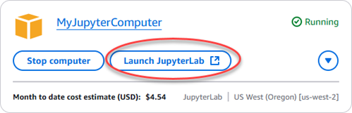
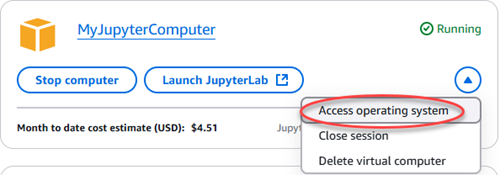
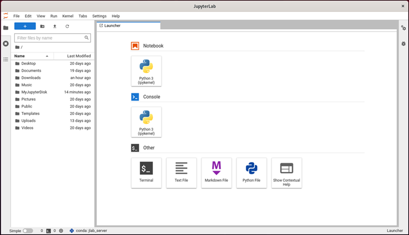
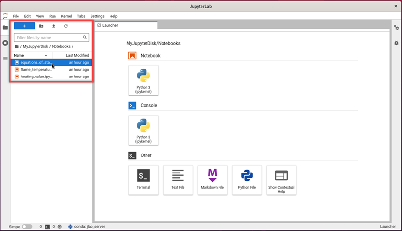
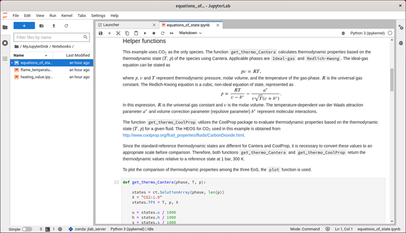
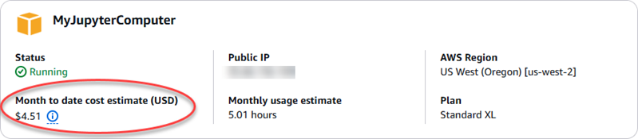
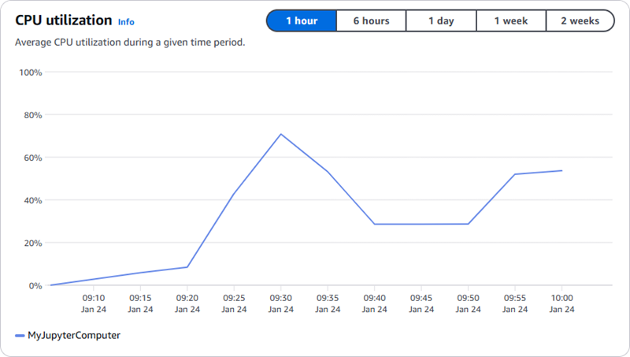
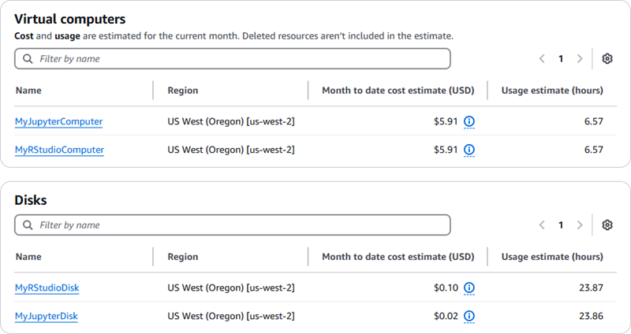

# Launch and use JupyterLab on Lightsail for Research

In this tutorial, we show you how to get started with managing and using your
JupyterLab virtual computer in Amazon Lightsail for Research.

###### Topics

- [Step 1: Complete the prerequisites](#jupyter-prerequisites "#jupyter-prerequisites")
- [Step 2: (Optional) Add storage space](#jupyter-add-storage "#jupyter-add-storage")
- [Step 3: Upload and download files](#jupyter-upload-download "#jupyter-upload-download")
- [Step 4: Launch the JupyterLab
  application](#jupyter-launch-application "#jupyter-launch-application")
- [Step 5: Read the JupyterLab
  documentation](#jupyter-read-documentation "#jupyter-read-documentation")
- [Step 6: (Optional) Monitor usage and
  costs](#jupyter-monitor-usage "#jupyter-monitor-usage")
- [Step 7: (Optional) Create a cost
  control rule](#jupyter-create-cost-control-rule "#jupyter-create-cost-control-rule")
- [Step 8: (Optional) Create a
  snapshot](#jupyter-create-snapshot "#jupyter-create-snapshot")
- [Step 9: (Optional) Stop or delete
  your virtual computer](#jupyter-stop-delete-computer "#jupyter-stop-delete-computer")

## Step 1: Complete the prerequisites

Create a virtual computer using the JupyterLab application if you haven't already.
For more information, see [Create a Lightsail for Research virtual computer](create-computer.md "create-computer.md").

After your new virtual computer is up and running, continue to the launch the
JupyterLab application section of this tutorial.

## Step 2: (Optional) Add storage space

Your virtual computer comes with a system disk. However, as your storage needs
change, you can attach additional disks to your virtual computer to increase its
storage space.

You can also store your working files to an attached disk. Then you can detach the
disk and attach it to a different virtual computer to quickly move your files from
one computer to another.

Alternatively, you can create a snapshot of an attached disk that has your working
files, and then create a duplicate disk from the snapshot. Then you can then attach
the new duplicate disk to another computer to duplicate your work across different
virtual computers. For more information, see [Create a storage disk in the Lightsail for Research console](create-disk.md "create-disk.md") and [Add storage to a virtual computer in Lightsail for Research](attach-disk.md "attach-disk.md").

###### Note

When you attach a disk to your virtual computer using the console, Lightsail for Research
automatically formats and mounts the disk. This process takes a few minutes, so
you should confirm that the disk has reached a **Mounted**
mounting status before you start using it. By default, Lightsail for Research mounts disks to the
`/home/lightsail-user/`<disk-name>` directory.`<disk-name>`` is the name
that you gave your disk.

## Step 3: Upload and download files

You can upload files to your JupyterLab virtual computer, and download files from
it. To do so, you must complete the following steps:

1. Obtain a key pair from Amazon Lightsail. For more information, see [Get a key pair for a Lightsail for Research virtual computer](get-ssh-keys.md "get-ssh-keys.md").
2. After you have the key pair, you can use it to establish a connection
   using the Secure Copy (SCP) utility. SCP lets you upload and download files
   using Command Prompt or Terminal. For more information, see [Transfer files to Lightsail for Research virtual computers using
   Secure Copy](connect-using-scp.md "connect-using-scp.md").
3. (Optional) You can also use the key pair to connect to your virtual
   computer with SSH. For more information, see [Connect to a Lightsail for Research virtual computer using Secure
   Shell](connect-using-ssh.md "connect-using-ssh.md").

###### Note

You can also access your virtual computer’s command line interface and
transfer files by using the browser-based Amazon DCV client. Amazon DCV is
available in the Lightsail for Research console. For more information, see [Access a Lightsail for Research virtual computer
application](open-computer-application.md "open-computer-application.md") and [Access your Lightsail for Research virtual computer's
operating system](access-computer-operating-system.md "access-computer-operating-system.md").

To manage your project files in an attached storage disk, make sure to upload them
to the correct mount directory for the attached disk. When you attach a disk to your
virtual computer using the console, Lightsail for Research automatically formats and mounts the disk
to the
`/home/lightsail-user/`<disk-name>` directory.`<disk-name>`` is the name
that you gave your disk.

## Step 4: Launch the JupyterLab

application

Complete the following procedure to launch the JupyterLab application on your new
virtual computer.

###### Important

Don't update the operating system or the JupyterLab application even if you
are prompted to do so. Instead, choose the option to close or ignore those
prompts. Furthermore, don't modify any of the files that are in the
**/home/lightsail-admin/** directory. These actions might
render the virtual computer unusable.

1. Sign in to the [Lightsail for Research console](https://lfr.console.aws.amazon.com/ls/research "https://lfr.console.aws.amazon.com/ls/research").
2. Choose **Virtual computers** in the navigation pane to
   view the virtual computers that are available in your account.
3. In the **Virtual computers** page, find your virtual
   computer and choose one of the following options to connect to it:
   1. (Recommended) Choose **Launch JupyterLab** to
      launch the JupyterLab application in focused mode. If you haven't
      connected to your virtual computer recently, you might have to wait
      a few minutes while Lightsail for Research prepares your session.

    2. Choose the dropdown menu for the computer, and then choose
   **Access operating system** to access your
   virtual computer's desktop.

   Lightsail for Research runs a few commands to initiate the remote display protocol
   connection. After a few moments, a new browser tab window opens with a
   virtual desktop connection established to your virtual computer. If you
   chose the **Launch application** option, continue to the
   next step of this procedure to open a file in the JupyterLab application. If
   you chose the **Access operating system** option, you can
   open other applications through the Ubuntu desktop.

###### Note

Your browser might prompt you to authorize sharing of your clipboard.
Allowing this lets you copy and paste between your local computer and
your virtual computer.

Ubuntu might also prompt you for an initial setup. Follow the prompts
until you complete the setup and can use the operating system. 4. The JupyterLab application opens. In the launcher menu, you can create a
new notebook, launch the console, launch the terminal, and create various
files.

 5. To open a file in JupyterLab, in the **File Browser**
pane, choose the directory or folder where your project files are stored.
Then choose the file to open.

If you uploaded your project files to an attached disk, look for the
directory where the disk is mounted. By default, Lightsail for Research mounts disks to the
`/home/lightsail-user/`<disk-name>` directory.`<disk-name>``is the
 name you gave your disk. In the following example, the
`MyJupyterDisk`directory represents the mounted disk, and
 the`Notebooks` subdirectory contains our Jupyter notebook
files.

In the following example, we have opened the
`equations_of_state.ipynb` Jupyter notebook file.

For information about how to get started, continue to the [Step 5: Read the JupyterLab
documentation](#jupyter-read-documentation "#jupyter-read-documentation") section of this
tutorial.

## Step 5: Read the JupyterLab

documentation

If you're not familiar with JupyterLab, we recommend that you read their official
documentation. The following JupyterLab online resources are available:

- [JupyterLab
  Documentation](https://jupyterlab.readthedocs.io/en/stable/ "https://jupyterlab.readthedocs.io/en/stable/")
- [Jupyter Discourse
  Forum](https://discourse.jupyter.org/ "https://discourse.jupyter.org/")
- [JupyterLab on StackOverflow](https://stackoverflow.com/questions/tagged/jupyter-lab "https://stackoverflow.com/questions/tagged/jupyter-lab")
- [JupyterLab on
  GitHub](https://github.com/jupyterlab "https://github.com/jupyterlab")

## Step 6: (Optional) Monitor usage and

costs

Month to date cost and usage estimates for your Lightsail for Research resources are displayed in
the following areas of the Lightsail for Research console.

1. Choose **Virtual computers** in the navigation pane of
   the Lightsail for Research console. The month to date cost estimate for your virtual
   computers is listed under each running virtual computer.

 2. To view the CPU utilization for a virtual computer, choose the name of the
virtual computer, and then choose the **Dashboard**
tab.

 3. To view the month to date cost and usage estimates for all of your Lightsail for Research
resources, choose **Usage** in the navigation pane.

## Step 7: (Optional) Create a cost

control rule

Manage the usage and cost of your virtual computers by creating cost control
rules. You can create a **Stop virtual computer on idle** rule that
stops a running computer when it reaches a specified percentage of its CPU
utilization during a given period. For example, a rule can automatically stop a
specific computer when its CPU utilization is equal to or less than 5% during a
30-minute period. This might mean that the computer is idle, and Lightsail for Research stops the
computer so that you don't incur charges for an idle resource.

###### Important

Before you create a rule to stop your virtual computer on idle, we recommend
monitoring its CPU utilization for a few days. Take note of the CPU utilization
while your virtual computer is under different loads. For example, when it's
compiling code, processing an operation, and idling. This will help you
determine an accurate threshold for the rule. For more information, see the
[Step 6: (Optional) Monitor usage and
costs](#jupyter-monitor-usage "#jupyter-monitor-usage") section of this tutorial.

If you create a rule with a CPU utilization threshold that's higher than your
workload, the rule can consecutively stop your virtual computer. For example, if
you start your virtual computer immediately after a rule stops it, the rule
reactivates and the computer stops again.

Detailed instructions for creating, and managing cost control rules can be found
in the following guides:

- [Manage cost control rules in Lightsail for Research](cost-control.md "cost-control.md")
- [Create cost control rules for your Lightsail for Research
  virtual computers](create-cost-control-rules.md "create-cost-control-rules.md")
- [Delete cost control rules for your Lightsail for Research
  virtual computers](delete-cost-control-rules.md "delete-cost-control-rules.md")

## Step 8: (Optional) Create a

snapshot

Snapshots are a point-in-time copy of your data. You can create snapshots of your
virtual computers and use them as baselines to create new computers or for data
backup. A snapshot contains all of the data that's needed to restore your computer
(from the moment when the snapshot was taken).

Detailed instructions for creating, and managing snapshots can be found in the
following guides:

- [Create snapshots of Lightsail for Research virtual computers or
  disks](create-snapshot.md "create-snapshot.md")
- [View and manage virtual computer and disk snapshots in
  Lightsail for Research](view-snapshots.md "view-snapshots.md")
- [Create a virtual computer or disk from a
  snapshot](create-computer-from-snapshot.md "create-computer-from-snapshot.md")
- [Delete a snapshot in the Lightsail for Research console](delete-snapshot.md "delete-snapshot.md")

## Step 9: (Optional) Stop or delete

your virtual computer

After you're done with the virtual computer that you created for this tutorial,
you can delete it. This stops incurring charges for the virtual computer if you
don't need it.

Deleting a virtual computer doesn't delete its associated snapshots or attached
disks. If you created snapshots and disks, you should delete those manually to stop
incurring charges for them.

To save your virtual computer for later, but to avoid incurring charges at
standard hourly prices, you can stop the virtual computer instead of deleting it.
Then you can start it again later. For more information, see [View Lightsail for Research virtual computer details](view-computer.md "view-computer.md"). For more information
about pricing, see [Lightsail for Research pricing](https://aws.amazon.com/lightsail/pricing/#lightsail-for-research "https://aws.amazon.com/lightsail/pricing/#lightsail-for-research").

###### Important

Deleting a Lightsail for Research resource is a permanent action. The deleted data cannot be
recovered. If you might need the data later, create a snapshot of your virtual
computer before you delete it. For more information, see [Create a snapshot](create-snapshot.md "create-snapshot.md").

1. Sign in to the [Lightsail for Research console](https://lfr.console.aws.amazon.com/ls/research "https://lfr.console.aws.amazon.com/ls/research").
2. Choose **Virtual computers** in the navigation
   pane.
3. Choose the virtual computer to delete.
4. Choose **Actions**, then choose **Delete virtual
   computer**.
5. Type **confirm** in the text block. Then, choose
   **Delete virtual computer.**
