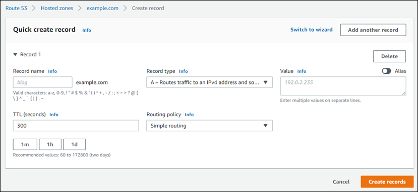
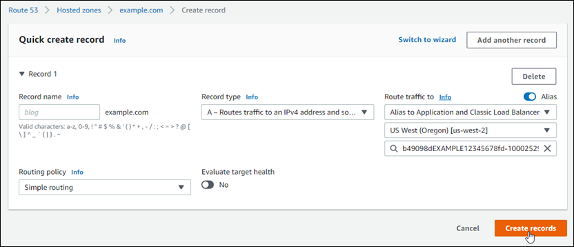

# Point your domain to a Lightsail load balancer

After you [verify that you
control the domain where you want to have encrypted (HTTPS) traffic](verify-tls-ssl-certificate-using-dns-cname-https.md "verify-tls-ssl-certificate-using-dns-cname-https.md"), you need to add an
address (A) record to your domain's DNS hosting provider that points your domain to your
Lightsail load balancer. In this guide, we show you how to add the A record to a Lightsail
DNS zone, and an Amazon Route 53 hosted zone.

## Add an A record using the DNS zone - Assignments

page

1. In the left navigation pane, choose **Domains & DNS**.
2. Choose the DNS zone you want to manage.
3. Choose the **Assignments** tab.
4. Choose **Add assignment**.
5. In the **Select a domain name** field, choose whether to use the
   domain name, or a subdomain of the domain.
6. In the **Select a resource** drop down, select the load balancer you
   want to assign the domain to.
7. Choose **Assign**.

Allow time for the change to propagate through the internet's DNS. This may take a few
minutes to several hours.

## Add an A record using the DNS zone - DNS

records page

1. In the left navigation pane, choose **Domains & DNS**.
2. Choose the DNS zone you want to manage.
3. Choose the **DNS records** tab.
4. Complete one of the following steps depending on the current state of your DNS
   zone:
   - If you haven't added an A record, choose **Add record**.
   - If you previously added an A record, choose the edit icon next to the existing A
     record listed on the page, and then skip to step 5 of this procedure.

5. Choose **A record** in the **Record type** dropdown
   menu.
6. In the **Record name** text box, enter one of the following
   options:
   - Enter `@` to route traffic for the apex of your domain (e.g.,
     `example.com`) to your load balancer.
   - Enter `www` to route traffic for the www subdomain (e.g.,
     `www.example.com`) to your load balancer.

7. In the **Resolves to** text box, choose the name of your Lightsail
   load balancer.
8. Choose the **Save** icon.

Allow time for the change to propagate through the internet's DNS. This may take a few
minutes to several hours.

## Add an A record in Route 53

1. Sign in to the [Route 53 console](https://console.aws.amazon.com/route53 "https://console.aws.amazon.com/route53").
2. In the navigation pane, choose **Hosted zones**.
3. Choose the hosted zone for the domain name that you want to use to route traffic to
   your load balancer.
4. Choose **Create record**.

The **Quick create record** page appears.

###### Note

If you see the **Choose routing policy** page, then choose
**Switch to quick create** to switch to the quick create wizard
before continuing with the following steps. 5. For **Record name**, type `www` if you plan to use the
`www` subdomain (i.e., `www.example.com`) or leave it blank if you
plan to use the apex of the domain (i.e., `example.com`). 6. For **Record type**, choose **A - Routes traffic to an IPv4
address and some AWS resources**. 7. Choose the **Alias** toggle to enable alias records. 8. Choose the following options for **Route traffic to**:

    1. For **Choose endpoint**, choose **Alias to Application
     and Classic Load Balancer**.
    2. For **Choose Region**, choose the AWS Region in which you created
     your Lightsail load balancer.
    3. For **Choose load balancer**, enter or paste the endpoint URL
     (i.e., DNS name) of your Lightsail load balancer.

9. For **Routing Policy**, choose **Simple routing**,
   and disable the **Evaluate target health** toggle.

Lightsail already performs health checks on your load balancer. For more
information, see [Health
checks for your load balancer](enable-set-up-health-checking-for-lightsail-load-balancer-metrics.md "enable-set-up-health-checking-for-lightsail-load-balancer-metrics.md").

Your record should look like the following example.

 10. Choose **Create records** to add the record to your hosted
zone.

###### Note

Allow time for the change to propagate through the internet's DNS. This may take a
few minutes to several hours.
