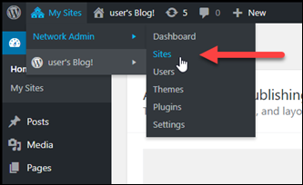
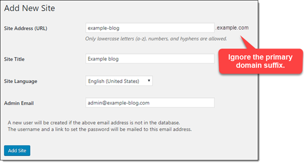
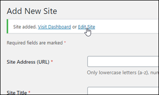
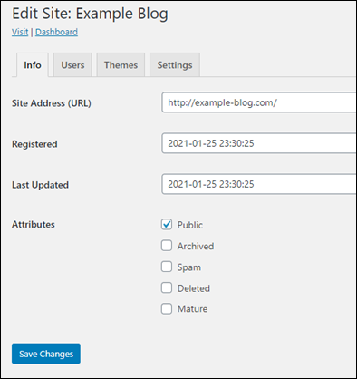
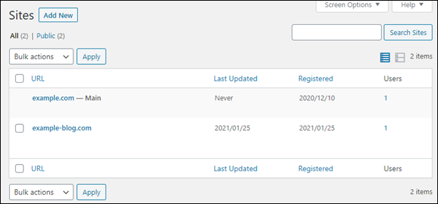
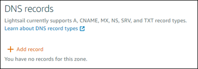
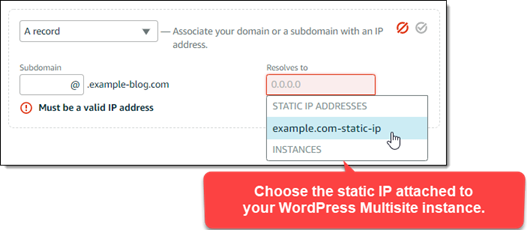
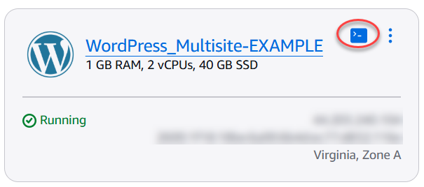
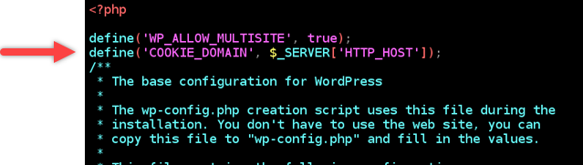

# Add blogs as

domains to your WordPress Multisite on Lightsail

A WordPress Multisite instance in Amazon Lightsail is designed to use multiple domains, or
subdomains, for each blog site that you create within that instance. In this guide, we’ll show
you how to add a blog site using a different domain than your main blog’s primary domain on your
WordPress Multisite instance. For example, if your main blog’s primary domain is
`example.com`, you can create new blog sites that use the
`another-example.com` and `third-example.com` domains on the same
instance.

###### Note

You can also add sites using subdomains to your WordPress Multisite instance. For more
information, see [Add blogs as
subdomains to your WordPress Multisite instance](amazon-lightsail-add-blogs-as-subdomains-to-your-wordpress-multisite.md "amazon-lightsail-add-blogs-as-subdomains-to-your-wordpress-multisite.md").

## Prerequisites

Complete the following prerequisites in the order shown:

1. Create a WordPress Multisite instance in Lightsail. For more information, see [Create an instance](how-to-create-amazon-lightsail-instance-virtual-private-server-vps.md "how-to-create-amazon-lightsail-instance-virtual-private-server-vps.md").
2. Create a static IP and attach it to your WordPress Multisite instance in Lightsail.
   For more information, see [Create a static IP
   and attach it to an instance](lightsail-create-static-ip.md "lightsail-create-static-ip.md").
3. Add your domain to Lightsail by creating a DNS zone, then point it to the static IP
   that you attached to your WordPress Multisite instance. For more information, see [Create a DNS zone to manage your domain’s
   DNS records](lightsail-how-to-create-dns-entry.md "lightsail-how-to-create-dns-entry.md").
4. Define the primary domain for your WordPress Multisite instance. For
   more information, see [Define
   the primary domain for your WordPress Multisite instance](amazon-lightsail-define-the-primary-domain-for-your-wordpress-multisite.md "amazon-lightsail-define-the-primary-domain-for-your-wordpress-multisite.md").

## Add a blog as a

domain to your WordPress Multisite instance

Complete these steps to create a blog site on your WordPress Multisite instance that uses
a domain which is different than your main blog’s primary domain.

###### Important

You must complete step 4 listed in the prerequisites section of this guide before
following these steps.

1. Sign in to the administration dashboard of your WordPress Multisite instance.

###### Note

For more information, see [Get the
application user name and password for your Bitnami instance](log-in-to-your-bitnami-application-running-on-amazon-lightsail.md "log-in-to-your-bitnami-application-running-on-amazon-lightsail.md"). 2. Choose **My Sites**, then **Network Admin**, and
**Sites** in the top navigation pane.

 3. Choose **Add New** to add a new blog site. 4. Enter a site address into the **Site Address (URL)** text box. This
is domain that will be used for the new blog site. For example, if your new blog site will
use `example-blog.com` as the domain, then enter `example-blog` into
the **Site Address (URL)** text box. Ignore the primary domain suffix
displayed on the page.

 5. Enter a site title, select a site language, and enter an admin email. 6. Choose **Add Site**. 7. Choose **Edit Site** in the confirmation banner that appears on the
page. This will redirect you to edit the details of the site that you recently
created.

 8. In the **Edit Site** page, change the subdomain that is listed in the
**Site Address (URL)** text box to the apex domain that you want to
use. In this example, we specified `http://example-blog.com`.

 9. Choose **Save Changes**.

At this point, the new blog site has been created in your WordPress Multisite
instance, but the domain is not yet configured to route to the new blog site. Continue to
the next step to add an address record (A record) to your domain’s DNS zone.



## Add an address record (A record)

to your domain’s DNS zone

Complete these steps to point the domain for your new blog site to your WordPress
Multisite instance. You must perform these steps for every blog site that you create on your
WordPress Multisite instance.

For demonstration purposes, we’ll use the Lightsail DNS zone. However, the steps may be
similar for other DNS zones typically hosted by domain registrars.

###### Important

You can create a maximum of six DNS zones in the Lightsail console. If you need more
DNS zones, we recommend using Amazon Route 53 to manage your domain’s DNS records. For more
information, see [Make
Amazon Route 53 the DNS service for an existing domain](../../../Route53/latest/DeveloperGuide/MigratingDNS.md "../../../Route53/latest/DeveloperGuide/MigratingDNS.md").

1. Sign in to the [Lightsail console](https://lightsail.aws.amazon.com/ "https://lightsail.aws.amazon.com/").
2. In the left navigation pane, choose **Domains & DNS**.
3. Under the **DNS zones** section of the page, choose the DNS zone for
   your new blog site’s domain.
4. In the DNS zone editor, choose the **DNS records** tab. Then, choose **Add record**.

 5. Choose **A record** in the record type drop-down menu. 6. In the **Record name** text box, enter an “at” (@) symbol to create a
record for the root of the domain. 7. In the **Resolves to** text box, choose the static IP address
attached to your WordPress Multisite instance.

 8. Choose the Save icon.

After the change propagates through the internet’s DNS, the domain will route traffic
to the new blog site on your WordPress Multisite instance.

## Enable cookie support to allow

sign in for blog sites

When you add blog sites as domains to your WordPress Multisite instance, you must also
update the WordPress configuration (`wp-config`) file on your instance to enable
cookie support. If you don't enable cookie support, then users might experience a "Error:
Cookies are blocked or not supported" error when trying to sign in to the WordPress
administration dashboard of their blog sites.

1. Sign in to the [Lightsail console](https://lightsail.aws.amazon.com/ "https://lightsail.aws.amazon.com/").
2. On the Lightsail home page, choose the SSH quick connect icon for your WordPress
   Multisite instance.

 3. After your Lightsail browser-based SSH session is connected, enter the following
command to open and edit the `wp-config.php` file of your instance using
Vim:

```
sudo vim /opt/bitnami/wordpress/wp-config.php
```

###### Note

If this command fails, you might be using an older version of the WordPress
Multisite instance. Try running the following command instead.

```
sudo vim /opt/bitnami/wordpress/wp-config.php
```

4. Press **I** to enter insert mode in Vim.
5. Add the following line of text below the `define('WP_ALLOW_MULTISITE',
true);` line of text.

```
define('COOKIE_DOMAIN', $_SERVER['HTTP_HOST']);
```

The file will look like the following when done:

 6. Press the **Esc** key to exit insert mode in Vim, then type
`:wq!` and press **Enter** to save your edits (write) and
quit Vim. 7. Enter the following command to restart the underlying services of the WordPress
instance.

```
sudo /opt/bitnami/ctlscript.sh restart
```

Cookies should now be enabled on your WordPress multisite instance, and users who are
trying to sign in to their blog sites will not encounter the "Error: Cookies are blocked
or not supported" error.

## Next steps

After you add blogs as domains to your WordPress Multisite instance, we recommend that you
get familiar with WordPress Multisite administration. For more information see [Multisite
Network Administration](https://wordpress.org/support/article/multisite-network-administration/ "https://wordpress.org/support/article/multisite-network-administration/") in the WordPress documentation.
