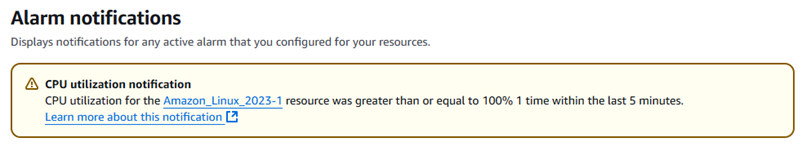
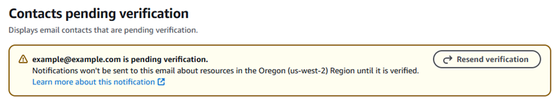

# Review Lightsail alarm notifications and

contacts pending verification

You can review active alarms and notifications for all of your Amazon Lightsail resources
in the Lightsail console on the **Alarm notifications** page. This page
consolidates your alarms that are in the `In alarm` state—alarms that are
enabled and currently breaching your defined thresholds. You can also review your email
contacts that are pending verification. For more information about alarms, see [Metric alarms in Lightsail](amazon-lightsail-alarms.md "amazon-lightsail-alarms.md"). For more
information about notifications for alarms, see [Configure metric notifications for Lightsail
resources](amazon-lightsail-notifications.md "amazon-lightsail-notifications.md").

###### Topics

- [Review alarm
  notifications for active alarms](#amazon-lightsail-alarm-notifications-review-alarms "#amazon-lightsail-alarm-notifications-review-alarms")
- [Review email
  contacts pending verification](#amazon-lightsail-alarm-notifications-review-contacts "#amazon-lightsail-alarm-notifications-review-contacts")

## Review alarm

notifications for active alarms

You can review alarm notifications for Lightsail for all of your resources in the
Lightsail console. Each entry will have additional details about why the alarm is
active and which resource it pertains to. For information on how to add alarms, see
[Configuring an alarm](amazon-lightsail-alarms.md#configuring-alarm "amazon-lightsail-alarms.md#configuring-alarm").

###### To review alarm notifications for active alarms

1. Sign in to the [Lightsail
   console](https://lightsail.aws.amazon.com/ "https://lightsail.aws.amazon.com/").
2. In the left navigation pane, choose **Alarm
   notifications**.
3. Under **Alarm notifications**, you can review your active
   alarms.

## Review email

contacts pending verification

You can review your email contacts that are pending verification in the Lightsail
console. Each entry will include the email address, the AWS Region the notifications
are for, and the ability to resend the verification. For more information on how to add
email contacts, see [Set up notification contacts for Lightsail monitoring](amazon-lightsail-adding-editing-notification-contacts.md "amazon-lightsail-adding-editing-notification-contacts.md").

###### To review your email contacts that are pending verification

1. Sign in to the [Lightsail
   console](https://lightsail.aws.amazon.com/ "https://lightsail.aws.amazon.com/").
2. In the left navigation pane, choose **Alarm
   notifications**.
3. Under **Contacts pending verification**, you can review your
   email contacts that are pending verification.

