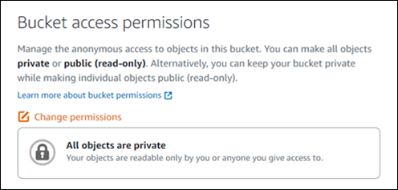
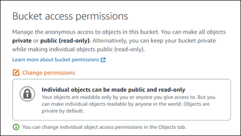
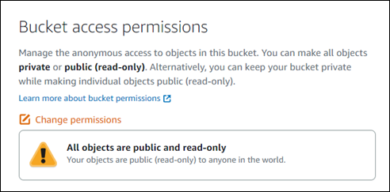
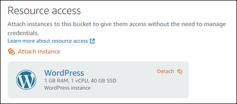
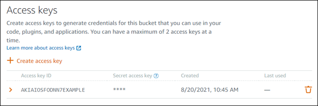
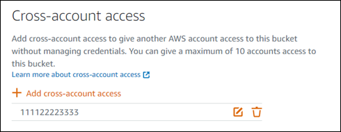

# Secure Lightsail object storage buckets

Amazon Lightsail object storage provides a number of security features to consider as you
develop and implement your own security policies. The following best practices are general
guidelines and don’t represent a complete security solution. Because these best practices might
not be appropriate or sufficient for your environment, treat them as helpful considerations
rather than prescriptions.

###### Contents

- [Preventative security
  best practices](amazon-lightsail-bucket-security-best-practices.md#bucket-security-best-practices-preventative-practices "amazon-lightsail-bucket-security-best-practices.md#bucket-security-best-practices-preventative-practices")
  - [Implement least
    privilege access](amazon-lightsail-bucket-security-best-practices.md#bucket-security-best-practices-least-privilege-access "amazon-lightsail-bucket-security-best-practices.md#bucket-security-best-practices-least-privilege-access")
  - [Verify that your
    Lightsail buckets are not publicly accessible](amazon-lightsail-bucket-security-best-practices.md#bucket-security-best-practices-verify-bucket-permissions "amazon-lightsail-bucket-security-best-practices.md#bucket-security-best-practices-verify-bucket-permissions")
  - [Enable block public
    access in Amazon S3](amazon-lightsail-bucket-security-best-practices.md#bucket-security-best-practices-block-public-access "amazon-lightsail-bucket-security-best-practices.md#bucket-security-best-practices-block-public-access")
  - [Attach instances to
    buckets to grant full programmatic access](amazon-lightsail-bucket-security-best-practices.md#bucket-security-best-practices-attach-instances "amazon-lightsail-bucket-security-best-practices.md#bucket-security-best-practices-attach-instances")
  - [Rotate bucket access keys](amazon-lightsail-bucket-security-best-practices.md#bucket-security-best-practices-rotate-bucket-access-keys "amazon-lightsail-bucket-security-best-practices.md#bucket-security-best-practices-rotate-bucket-access-keys")
  - [Use cross-account
    access to give other AWS accounts access to objects in your bucket](amazon-lightsail-bucket-security-best-practices.md#bucket-security-best-practices-cross-account-access "amazon-lightsail-bucket-security-best-practices.md#bucket-security-best-practices-cross-account-access")
  - [Encryption of data](amazon-lightsail-bucket-security-best-practices.md#bucket-security-best-practices-data-encryption "amazon-lightsail-bucket-security-best-practices.md#bucket-security-best-practices-data-encryption")
  - [Enable versioning](amazon-lightsail-bucket-security-best-practices.md#bucket-security-best-practices-enable-versioning "amazon-lightsail-bucket-security-best-practices.md#bucket-security-best-practices-enable-versioning")

- [Monitoring and auditing
  best practices](amazon-lightsail-bucket-security-best-practices.md#bucket-security-best-practices-monitoring-auditing "amazon-lightsail-bucket-security-best-practices.md#bucket-security-best-practices-monitoring-auditing")
  - [Enable access logging
    and perform periodic security and access audits](amazon-lightsail-bucket-security-best-practices.md#bucket-security-best-practices-enable-access-logging "amazon-lightsail-bucket-security-best-practices.md#bucket-security-best-practices-enable-access-logging")
  - [Identify, tag, and audit your
    Lightsail buckets](amazon-lightsail-bucket-security-best-practices.md#bucket-security-best-practices-identify-tag "amazon-lightsail-bucket-security-best-practices.md#bucket-security-best-practices-identify-tag")
  - [Implement monitoring using
    AWS monitoring tools](amazon-lightsail-bucket-security-best-practices.md#bucket-security-best-practices-monitoring-tools "amazon-lightsail-bucket-security-best-practices.md#bucket-security-best-practices-monitoring-tools")
  - [Use AWS CloudTrail](amazon-lightsail-bucket-security-best-practices.md#bucket-security-best-practices-cloudtrail "amazon-lightsail-bucket-security-best-practices.md#bucket-security-best-practices-cloudtrail")
  - [Monitor AWS security
    advisories](amazon-lightsail-bucket-security-best-practices.md#bucket-security-best-practices-security-advisories "amazon-lightsail-bucket-security-best-practices.md#bucket-security-best-practices-security-advisories")

## Preventative security

best practices

The following best practices can help prevent security incidents with Lightsail
buckets.

### Implement least

privilege access

When granting permissions, you decide who is getting what permissions to which
Lightsail resources. You enable specific actions that you want to allow on those
resources. Therefore, you should grant only the permissions that are required to perform a
task. Implementing least privilege access is fundamental in reducing security risk and the
impact that could result from errors or malicious intent.

For more information about creating an IAM policy to manage buckets, see [IAM policy to manage buckets](amazon-lightsail-bucket-management-policies.md "amazon-lightsail-bucket-management-policies.md").
For more information about the Amazon S3 actions supported by Lightsail buckets, see
[Actions for object storage](../../2016-11-28/api-reference/API_Amazon_S3.md "../../2016-11-28/api-reference/API_Amazon_S3.md") in the _Amazon Lightsail API
reference_.

### Verify that your

Lightsail buckets are not publicly accessible

Buckets and objects are private by default. Keep your bucket private by having the
bucket access permission set to **All objects are private**. For the
majority of use-cases, you don't need to make your bucket or individual objects public. For
more information, see [Configure access permissions for individual objects in a bucket](amazon-lightsail-configuring-individual-object-access.md "amazon-lightsail-configuring-individual-object-access.md").

However, if you are using your bucket to host media for your website or application,
under certain scenarios, you might need to make your bucket or individual objects public.
You can configure one of the following options to make your bucket or individual objects
public:

- If only some of the objects in a bucket need to be public (read-only) to anyone on
  the internet, then change the bucket access permission to **Individual objects
  can be made public and read-only**, and change only the objects that need to
  be public to **Public (read-only)**. This option keeps the bucket
  private, but gives you the option to make individual objects public. Don't make an
  individual object public if it contains sensitive or confidential information that you
  don't want to be publicly accessible. If you make individual objects public, you should
  periodically validate the public accessibility of each individual object.

- If all objects in the bucket need to be public (read-only) to anyone on the
  internet, then change the bucket access permission to **All objects are public
  and read-only**. Don't use this option if any of your objects in the bucket
  contain sensitive or confidential information.

- If you previously changed a bucket to be public, or changed individual objects to be
  public, you can quickly change the bucket and all its objects to be private by changing
  the bucket access permission to **All objects are private**.

### Enable block public

access in Amazon S3

Lightsail object storage resources take into account both Lightsail bucket access
permissions and Amazon S3 account-level block public access configurations when allowing or
denying public access. With Amazon S3 account-level block public access, account administrators
and bucket owners can centrally limit public access to their Amazon S3 and Lightsail buckets.
Block public access can make all Amazon S3 and Lightsail buckets private regardless of how the
resources are created, and regardless of the individual bucket and object permissions that
might have been configured. For more information, see [Block public access for
buckets](amazon-lightsail-block-public-access-for-buckets.md "amazon-lightsail-block-public-access-for-buckets.md").

### Attach instances to

buckets to grant full programmatic access

Attaching an instance to a Lightsail object storage bucket is the most secure way to
provide access to the bucket. The **Resource access** functionality, which
is how you attach an instance to a bucket, grants the instance full programmatic access to
the bucket. With this method, you don't have to store bucket credentials directly in the
instance or application, and you don't have to periodically rotate the credentials. For
example, some WordPress plugins can access a bucket that the instance has access to. For
more information, see [Configure resource access for a bucket](amazon-lightsail-configuring-bucket-resource-access.md "amazon-lightsail-configuring-bucket-resource-access.md") and [Tutorial: Connect a bucket to
your WordPress instance](amazon-lightsail-connecting-buckets-to-wordpress.md "amazon-lightsail-connecting-buckets-to-wordpress.md").

However, if the application is not on a Lightsail instance, then you can create and
configure bucket access keys. Bucket access keys are long term credentials that are not
automatically rotated. For more information, see [Create Lightsail object storage bucket access
keys](amazon-lightsail-creating-bucket-access-keys.md "amazon-lightsail-creating-bucket-access-keys.md").

### Rotate bucket access keys

You can have a maximum of two access keys per bucket. Although you can have two
different access keys at the same time, we recommend that you only create one access key at
a time for your bucket outside of key rotation times. This approach ensures that you can
create a new bucket access key at any time without the possibility of it being in use. For
example, creating the second access key for rotation is helpful if your existing secret
access key is copied, lost, or becomes compromised, and you need to rotate your existing
access key.

If you use an access key with your bucket, you should periodically rotate your keys and
take inventory of the existing keys. Confirm the date an access key was last used, and the
AWS Region in which it was used, correspond with your expectations of how the key should
be used. The date an access key was last used is displayed in the Lightsail console in the
**Access keys** section of the **Permissions** tab of a
bucket's management page. Delete access keys that are not being used.

To rotate an access key, you should create a new access key, configure it on your
software and test it, and then delete the previously used access key. After you delete an
access key, it's gone forever and can't be restored. You can only replace it with a new
access key. For more information, see [Create Lightsail object storage bucket access
keys](amazon-lightsail-creating-bucket-access-keys.md "amazon-lightsail-creating-bucket-access-keys.md") and [Delete access keys for a Lightsail object
storage bucket](amazon-lightsail-deleting-bucket-access-keys.md "amazon-lightsail-deleting-bucket-access-keys.md").

### Use cross-account

access to give other AWS accounts access to objects in your bucket

You can use cross-account access to make objects in a bucket accessible to a specific
individual who has an AWS account without making the bucket and its objects public. If
you've configured cross account access, make sure that the account IDs listed are the
correct accounts that you want to give access to objects in your bucket. For more
information, see [Configure cross-account access for a bucket](amazon-lightsail-configuring-bucket-cross-account-access.md "amazon-lightsail-configuring-bucket-cross-account-access.md").

### Encryption of data

Lightsail performs server-side encryption with Amazon managed keys and encryption of
data in transit by enforcing HTTPS (TLS). Server-side encryption helps reduce risk to your
data by encrypting the data with a key that is stored in a separate service. In addition,
encryption of data in transit helps prevent potential attackers from eavesdropping on or
manipulating network traffic using person-in-the-middle or similar attacks.

### Enable versioning

Versioning is a means of keeping multiple variants of an object in the same bucket. You
can use versioning to preserve, retrieve, and restore every version of every object stored
in your Lightsail bucket. With versioning, you can easily recover from both unintended
user actions and application failures. For more information, see [Enable and suspend bucket
object versioning](amazon-lightsail-managing-bucket-object-versioning.md "amazon-lightsail-managing-bucket-object-versioning.md").

## Monitoring and auditing

best practices

The following best practices can help detect potential security weaknesses and incidents
for Lightsail buckets.

### Enable access logging

and perform periodic security and access audits

Access logging provides detailed records for the requests that are made to a bucket.
This information can include the request type (`GET`, `PUT`), the
resources that are specified in the request, and the time and date that the request was
processed. Enable access logging for a bucket, and periodically perform a security and
access audit to identify the entities that are accessing your bucket. By default,
Lightsail doesn't collect access logs for your buckets. You must manually enable access
logging. For more information, see [Bucket access logs](amazon-lightsail-enabling-bucket-access-logs.md "amazon-lightsail-enabling-bucket-access-logs.md") and [Enable bucket access
logging](amazon-lightsail-enabling-bucket-access-logs.md "amazon-lightsail-enabling-bucket-access-logs.md").

### Identify, tag, and audit your

Lightsail buckets

Identification of your IT assets is a crucial aspect of governance and security. You
need to have visibility of all your Lightsail buckets to assess their security posture and
take action on potential areas of weakness.

Use tagging to identify security-sensitive or audit-sensitive resources, then use those
tags when you need to search for these resources. For more information, see [Tags](amazon-lightsail-tags.md "amazon-lightsail-tags.md").

### Implement monitoring using

AWS monitoring tools

Monitoring is an important part of maintaining the reliability, security, availability,
and performance of Lightsail buckets and other resources. You can monitor and create
notification alarms for the **Bucket size** (`BucketSizeBytes`)
and `Number of objects` (**NumberOfObjects**) bucket metrics in
Lightsail. For example, you might want to be notified when the size of your bucket
increases or decreases to a specific size, or when the number of objects in your bucket goes
up to or down to a specific number. For more information, see [Create bucket metric alarms](amazon-lightsail-adding-bucket-metric-alarms.md "amazon-lightsail-adding-bucket-metric-alarms.md").

### Use AWS CloudTrail

AWS CloudTrail provides a record of actions taken by a user, a role, or an AWS service in
Lightsail. You can use information collected by CloudTrail to determine the request that
was made to Lightsail, the IP address from which the request was made, who made the
request, when it was made, and additional details. For example, you can identify CloudTrail
entries for actions that impact data access, in particular
`CreateBucketAccessKey`, `GetBucketAccessKeys`,
`DeleteBucketAccessKey`, `SetResourceAccessForBucket`, and
`UpdateBucket`. When you set up your AWS account, CloudTrail is enabled by
default. You can view recent events in the CloudTrail console. To create an ongoing record
of activity and events for your Lightsail buckets, you can create a trail in the
CloudTrail console. For more information, see [Logging Data Events for Trails](../../../awscloudtrail/latest/userguide/logging-data-events-with-cloudtrail.md "../../../awscloudtrail/latest/userguide/logging-data-events-with-cloudtrail.md") in the _AWS CloudTrail User
Guide_.

### Monitor AWS security

advisories

Actively monitor the primary email address registered to AWS account. AWS will
contact you, using this email address, about emerging security issues that might affect
you.

AWS operational issues with broad impact are posted on the [AWS Service Health Dashboard](https://status.aws.amazon.com/ "https://status.aws.amazon.com/"). Operational
issues are also posted to individual accounts via the Personal Health Dashboard. For more
information, see the [AWS Health
Documentation](../../../health.md "../../../health.md").
