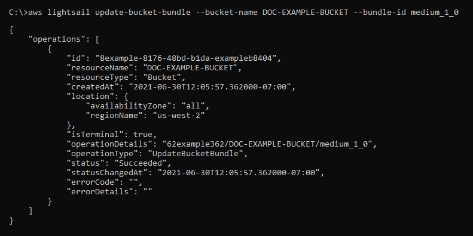

# Adjust Lightsail bucket storage plan for usage fluctuations

In the Amazon Lightsail object storage service, a bucket's storage plan specifies its monthly
cost, storage space quota, and data transfer quota. You can update your bucket's storage plan
only one time within a monthly AWS billing cycle. When you change your bucket's
storage plan, the storage space and network transfer quotas are reset. However, the excess
storage space and data transfer charges you might have incurred from using the previous storage
plan are not covered.

Update your bucket's storage plan if it's consistently going over its storage space or data
transfer quota, or if your bucket's usage is consistently in the lower range of these quotas.
Because your bucket might experience unpredictable usage fluctuations, we strongly recommend
that you update your bucket's storage plan only as a long-term strategy, instead of as a
short-term, monthly cost-cutting measure. Choose a storage plan that will provide your bucket
with an ample storage space and data transfer quota for a long time to come.

For more information about buckets, see [Object storage](buckets-in-amazon-lightsail.md "buckets-in-amazon-lightsail.md").

## Change your bucket's storage

plan using the Lightsail console

Complete the following procedure to change your bucket's storage plan using the
Lightsail console.

1. Sign in to the [Lightsail console](https://lightsail.aws.amazon.com/ "https://lightsail.aws.amazon.com/").
2. In the left navigation pane, choose **Storage**.
3. Choose the name of the bucket for which you want to change the plan.
4. Choose the **Metrics** tab in the bucket management page.
5. Choose **Change storage plan**.
6. In the confirmation prompt that appears, choose **Yes, change** to
   continue to change your bucket storage plan. Otherwise, choose **No,
   cancel**.
7. Choose the plan that you want to use, and then choose **Select
   plan**.
8. In the confirmation prompt that appears, choose **Yes, apply** to
   apply the change to your bucket, or choose **No, go back** to not apply
   it.

## Change your bucket's storage plan using

the AWS CLI

Complete the following procedure to change the plan of your bucket using the AWS Command Line Interface (AWS CLI). You do this by using the
`update-bucket-bundle` command. Note that a bucket storage plan is referred to as
a bucket bundle in the API. For more information, see [update-bucket-bundle](../../../cli/latest/reference/lightsail/update-bucket-bundle.md "../../../cli/latest/reference/lightsail/update-bucket-bundle.md") in the _AWS CLI Command
Reference_.

###### Note

You must install the AWS CLI and configure it for Lightsail and Amazon S3
before continuing with this procedure. For more information, see [Configure the AWS CLI to work with Lightsail](lightsail-how-to-set-up-and-configure-aws-cli.md "lightsail-how-to-set-up-and-configure-aws-cli.md").

1. Open a Command Prompt or Terminal window.
2. Enter the following command to change the plan of your bucket.

```
aws lightsail update-bucket-bundle --bucket-name `BucketName` --bundle-id `BundleID`
```

In the command, replace the following example text with your own:

    * `BucketName` - The name of the bucket for which you want
     to update the storage plan.
    * `BundleID` - The ID of the new bucket bundle you want to
     apply to the bucket. Use the `get-bucket-bundles` command to see a list of
     available bucket bundles and their IDs. For more information, see [get-bucket-bundles](../../../cli/latest/reference/lightsail/get-bucket-bundle.md "../../../cli/latest/reference/lightsail/get-bucket-bundle.md") in the *AWS CLI Command
     Reference*.

Example:

```
aws lightsail update-bucket-bundle --bucket-name `amzn-s3-demo-bucket` --bundle-id `medium_1_0`
```

You should see a result similar to the following example:


