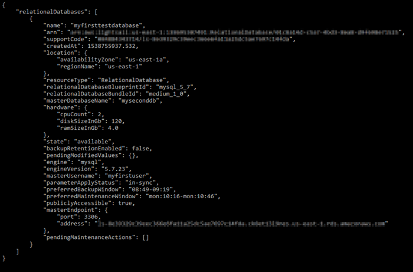
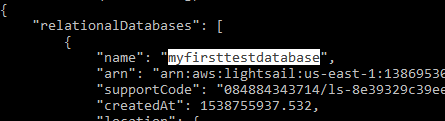
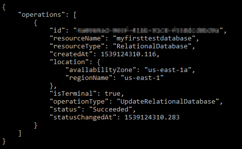

# Schedule

maintenance and backups for Lightsail databases

When a new version of a database is supported by Amazon Lightsail, your existing managed
database can be upgraded to it. There are two kinds of upgrades—minor version upgrades and major
version upgrades. Currently, Lightsail supports only minor version upgrades.

Minor version upgrades, and other database maintenance tasks, are performed automatically
during the preferred maintenance window for your database. The preferred maintenance window is a
30-minute window selected at random from an 8-hour block of time for each AWS Region. It
occurs on a random day of the week. Database backups are performed during the preferred backup
window. The preferred backup window is a 30-minute window selected at random from an 8-hour
block of time for each AWS Region. It also occurs on a random day of the week.

###### Note

For more information about the preferred maintenance window time blocks for each region,
see the [Maintaining a DB Instance](../../../AmazonRDS/latest/UserGuide/USER_UpgradeDBInstance.md "../../../AmazonRDS/latest/UserGuide/USER_UpgradeDBInstance.md") guide in the Amazon Relational Database Service (Amazon
RDS) documentation. For more information about the preferred backup window time blocks for
each region, see the [Working With Backups](../../../AmazonRDS/latest/UserGuide/USER_WorkingWithAutomatedBackups.md#USER_WorkingWithAutomatedBackups.BackupWindow "../../../AmazonRDS/latest/UserGuide/USER_WorkingWithAutomatedBackups.md#USER_WorkingWithAutomatedBackups.BackupWindow") guide in the Amazon RDS documentation.

This guide shows you how to change the preferred maintenance and backup windows, so that
they occur when your database is under its lowest load.

## Prerequisites

You must use the AWS Command Line Interface (AWS CLI) to change your database preferred maintenance and
backup windows.

Complete the following prerequisites:

- **Install the AWS CLI** — For more information, see [Installing the
  AWS CLII](../../../cli/latest/userguide/installing.md "../../../cli/latest/userguide/installing.md").
- **Configure the AWS CLI** — For more information, see
  [Configuring the AWS CLI](https://lightsail.aws.amazon.com/ls/docs/en/articles/lightsail-how-to-set-up-and-configure-aws-cli "https://lightsail.aws.amazon.com/ls/docs/en/articles/lightsail-how-to-set-up-and-configure-aws-cli").

## Change your

database maintenance window

Your database may become unavailable during maintenance or backup operations. Therefore,
you may want to change your preferred maintenance or backup window to a time in which your
database is under its lowest load.

###### To change your database maintenance window

1. Open a Terminal or Command Prompt window.
2. Enter the following command to get the name of the database for which you want to
   change the maintenance window:

```
aws lightsail get-relational-databases
```

You should see a result similar to the following example:



###### Note

If the database that you want to modify is not listed, confirm that your AWS CLI is
configured for the AWS Region where the database is located. For more information, see
[Configure the
AWS CLI](lightsail-how-to-set-up-and-configure-aws-cli.md "lightsail-how-to-set-up-and-configure-aws-cli.md"). 3. Highlight the name of the database that you want to modify and press
**Ctrl+C** if you’re using Windows, or **Cmd+C** if
you’re using macOS, to copy it to your clipboard so that you can use it in the next
step.

 4. Enter one of the following commands depending on the preferred window that you are
changing.

    * Enter the following command to change the database maintenance window.


    ```
    aws lightsail update-relational-database --relational-database-name `DatabaseName` --preferred-maintenance-window `MaintenanceWindow`
    ```

    In the command, replace:


    	+ `DatabaseName` with the name of the database.
    	+ `MaintenanceWindow` with the new maintenance window
    	 time frame.


    	Define the preferred maintenance window time in ddd:hh24:mi-ddd:hh24:mi
    	 format. It also must be in Universal Coordinated Time (UTC) format, and defined
    	 for a minimum window of 30 minutes. The preferred maintenance window cannot
    	 overlap the preferred backup window.
    **Example:**


    ```
    aws lightsail update-relational-database --relational-database-name `myproductiondb` --preferred-maintenance-window `Tue:16:00-Tue:16:30`
    ```
    * Enter the following command to change the database backup window.


    ```
    aws lightsail update-relational-database --relational-database-name `DatabaseName` --preferred-backup-window `BackupWindow`
    ```

    In the command, replace:


    	+ `DatabaseName` with the name of the database.
    	+ `BackupWindow` with the new backup window time
    	 frame.


    	Define the preferred backup window time in hh24:mi-hh24:mi format. It also
    	 must be in Universal Coordinated Time (UTC) format, and defined for a minimum
    	 window of 30 minutes. The preferred backup window cannot overlap the preferred
    	 maintenance window.
    **Example:**


    ```
    aws lightsail update-relational-database --relational-database-name `myproductiondb` --preferred-backup-window `14:00-14:30`
    ```

You should see a result similar to the following example:



## Next

steps

Here are a few guides to help you manage your database:

- [Configure the
  data import mode for your database](amazon-lightsail-configuring-database-data-import-mode.md "amazon-lightsail-configuring-database-data-import-mode.md")
- [Configure the public
  mode for your database](amazon-lightsail-configuring-database-public-mode.md "amazon-lightsail-configuring-database-public-mode.md")
- [Manage your database
  password](amazon-lightsail-managing-database-password.md "amazon-lightsail-managing-database-password.md")
- [Connect to your
  MySQL database](amazon-lightsail-connecting-to-your-mysql-database.md "amazon-lightsail-connecting-to-your-mysql-database.md")
- [Connect to your
  PostgreSQL database](amazon-lightsail-connecting-to-your-postgres-database.md "amazon-lightsail-connecting-to-your-postgres-database.md")
- [Import data
  into your MySQL database](amazon-lightsail-importing-data-into-your-mysql-database.md "amazon-lightsail-importing-data-into-your-mysql-database.md")
- [Import
  data into your PostgreSQL database](amazon-lightsail-importing-data-into-your-postgres-database.md "amazon-lightsail-importing-data-into-your-postgres-database.md")
- [Create a snapshot of
  your database](amazon-lightsail-creating-a-database-snapshot.md "amazon-lightsail-creating-a-database-snapshot.md")
