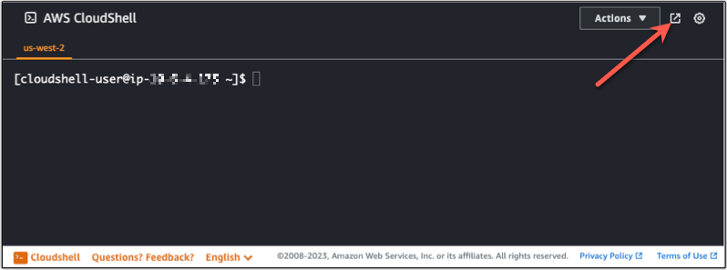
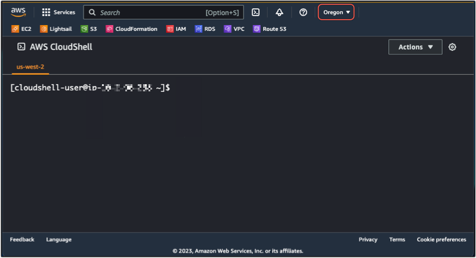
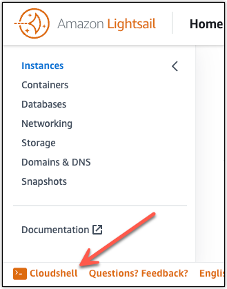
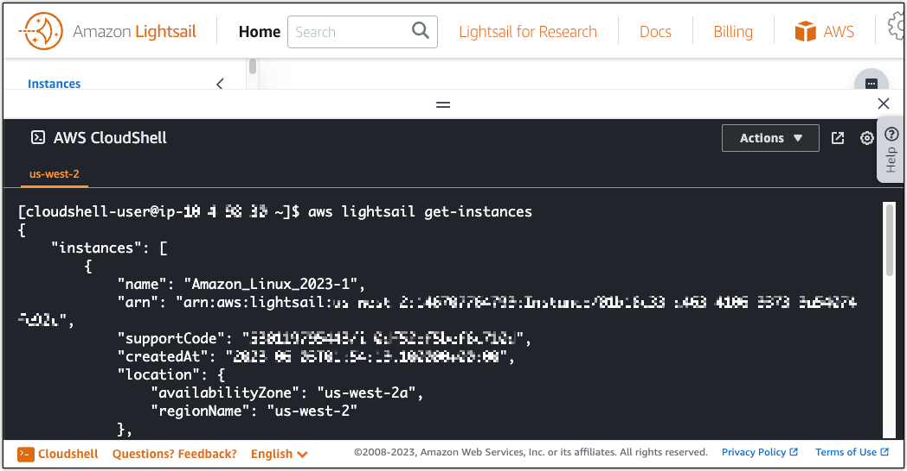

# Manage Lightsail resources with

AWS CloudShell

AWS CloudShell is a browser-based, pre-authenticated shell that you can launch directly from the
Amazon Lightsail console. You can use CloudShell to manage your Lightsail resources from the
command line interface. You can run AWS Command Line Interface (AWS CLI) commands using your preferred shell,
such as Bash, PowerShell, or Z shell. You can do this without downloading or installing
command line tools. For more information, see [What is AWS CloudShell](../../../cloudshell/latest/userguide/welcome.md "../../../cloudshell/latest/userguide/welcome.md").

When you launch CloudShell, a [compute environment](../../../cloudshell/latest/userguide/vm-specs.md#vm-configuration "../../../cloudshell/latest/userguide/vm-specs.md#vm-configuration") that's based on Amazon Linux 2 is created. Within this environment,
you can access an extensive range of pre-installed development tools, such as the AWS CLI. For
a complete list of pre-installed tools, see [Pre-installed software](../../../cloudshell/latest/userguide/vm-specs.md#pre-installed-software "../../../cloudshell/latest/userguide/vm-specs.md#pre-installed-software") in the _CloudShell User
Guide_.

## Persistent storage

With AWS CloudShell, you can use up to 1 GB of persistent storage in each AWS Region at no
additional cost. Persistent storage is located in your home directory
(`$HOME`) and is private to you. Unlike ephemeral
environment resources that are deleted after each shell session ends, data in your home
directory persists between sessions.

If you stop using AWS CloudShell in an AWS Region, data is retained in the persistent
storage of that Region for **120 days** after the end of
your last session. After 120 days, unless you take action, your data is automatically
deleted from the persistent storage of that Region. You can prevent removal by launching
AWS CloudShell again in that AWS Region. For more information about the retention of data in
persistent storage, see [Persistent storage](../../../cloudshell/latest/userguide/limits.md#persistent-storage-limitations "../../../cloudshell/latest/userguide/limits.md#persistent-storage-limitations") in the _CloudShell User
Guide_.

## AWS Regions

In Lightsail, a CloudShell session will open in the AWS Region that provides
the least latency to your physical location. This means that AWS Regions can change
between sessions. Take note of which AWS Region--> your CloudShell session is
located in so that you can use the 1 GB persistent storage. To change the session’s
AWS Region, choose the **Open in new browser tab** icon.
This provides the option to access your CloudShell session in a new browser
window.



In the navigation bar of the new browser tab, choose the name of the AWS Region
that's currently displayed. Then choose the AWS Region that you want to switch
to.



For more information about CloudShell, see the _[CloudShell User Guide](../../../cloudshell/latest/userguide/welcome.md "../../../cloudshell/latest/userguide/welcome.md")_.

## Launch and use AWS CloudShell

Learn how to launch and use an AWS CloudShell session within Lightsail. If you don’t have
permission to run CloudShell, you must add the
`arn:aws:iam::aws:policy/AWSCloudShellFullAccess`
policy to the AWS Identity and Access Management (IAM) identity that you’re using. If you already have the
`arn:aws:iam::aws:policy/AdministratorAccess` policy
attached, you should be able to access CloudShell. For more information, see [Identity and access management for Amazon Lightsail](security_iam.md "security_iam.md").

###### Launch AWS CloudShell

You can launch CloudShell from the Amazon Lightsail console. After the session
begins, you can switch to your preferred shell, such as
`Bash`, `PowerShell`, or
`Z shell`.

Complete the following steps to launch a new AWS CloudShell session in
Lightsail:

1. Sign in to the Lightsail console at
   [https://lightsail.aws.amazon.com/](https://lightsail.aws.amazon.com/ "https://lightsail.aws.amazon.com/").
2. Choose **CloudShell** on the Console Toolbar,
   in the lower left of the console. When the command prompt displays, the shell is
   ready for interaction.

 3. (Optional) To choose a pre-installed shell to work with, enter one of the
following program names at the command line prompt:

**Bash: `bash`**

If you switch to Bash, the symbol at the command prompt updates to
`$`. Bash is the default
shell in AWS CloudShell.

**PowerShell: `pwsh`**

If you switch to PowerShell, the symbol at the command prompt
updates to `PS>`.

**Z shell: `zsh`**

If you switch to Z shell, the symbol at the command prompt updates
to `%`.

###### Example Lightsail API command in AWS CloudShell

There are multiple command line tools that are pre-installed on the CloudShell
session for you to use. In this example, you use the Lightsail
`GetInstances` API operation to view the instances that are in your
Lightsail account. To learn more about the `GetInstances` API
operation, see [GetInstances](../../2016-11-28/api-reference/API_GetInstances.md "../../2016-11-28/api-reference/API_GetInstances.md") in the _Amazon Lightsail API Reference_.

1. Sign in to the Lightsail console at
   [https://lightsail.aws.amazon.com/](https://lightsail.aws.amazon.com/ "https://lightsail.aws.amazon.com/").
2. Choose **CloudShell** on the Console
   Toolbar, in the lower left of the console.
3. Enter the following command after the AWS CloudShell prompt:

```
aws lightsail get-instances
```

You should now see a complete list of instances that are in your
Lightsail account.



## Additional information

See the following documentation for more information about AWS CloudShell:

- [Amazon Lightsail API Reference](../../2016-11-28/api-reference/Welcome.md "../../2016-11-28/api-reference/Welcome.md")
- [Frequently asked questions in AWS CloudShell](../../../cloudshell/latest/userguide/faq-list.md "../../../cloudshell/latest/userguide/faq-list.md")
- [Supported browsers in AWS CloudShell](../../../cloudshell/latest/userguide/browsers.md "../../../cloudshell/latest/userguide/browsers.md")
- [Troubleshooting in AWS CloudShell](../../../cloudshell/latest/userguide/troubleshooting.md "../../../cloudshell/latest/userguide/troubleshooting.md")
- [Working with AWS services in AWS CloudShell](../../../cloudshell/latest/userguide/working-with-aws-cli.md "../../../cloudshell/latest/userguide/working-with-aws-cli.md")
