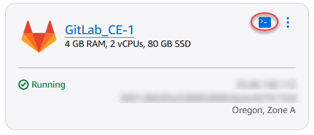
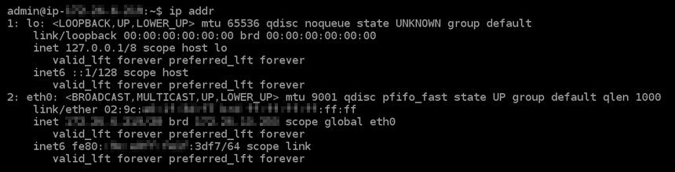
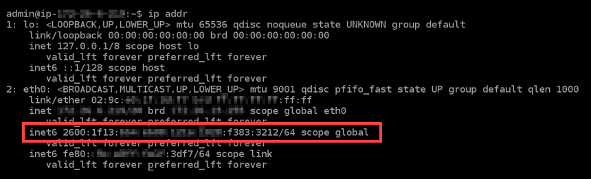
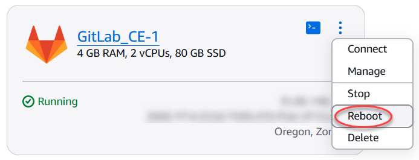

# Configure IPv6 connectivity for GitLab instances in Lightsail

All instances in Amazon Lightsail have a public and a private IPv4 address assigned to them
by default. You can optionally enable IPv6 for your instances to have a public IPv6 address
assigned to them. For more information, see [Amazon Lightsail IP addresses](understanding-public-ip-and-private-ip-addresses-in-amazon-lightsail.md "understanding-public-ip-and-private-ip-addresses-in-amazon-lightsail.md") and [Enable or disable IPv6](amazon-lightsail-enable-disable-ipv6.md "amazon-lightsail-enable-disable-ipv6.md").

After you enable IPv6 for an instance that uses the GitLab blueprint, you must perform an
additional set of steps to make the instance aware of its IPv6 address. In this guide, we show
you the additional steps that you must perform for GitLab instances.

## Prerequisites

Complete the following prerequisites if you haven't already:

- Create a GitLab instance in Lightsail. For more information, see [Create an instance](how-to-create-amazon-lightsail-instance-virtual-private-server-vps.md "how-to-create-amazon-lightsail-instance-virtual-private-server-vps.md").
- Enable IPv6 for your GitLab instance. For more information, see [Enable or disable IPv6](amazon-lightsail-enable-disable-ipv6.md "amazon-lightsail-enable-disable-ipv6.md").

###### Note

New GitLab instances created on or after January 12, 2021, have IPv6 enabled by
default when they are created in the Lightsail console. You must complete the following
steps in this guide to configure IPv6 on your instance even if IPv6 was enabled by
default when you created your instance.

## Configure IPv6 on a GitLab instance

Complete the following procedure to configure IPv6 on a GitLab instance in
Lightsail.

1. Sign in to the [Lightsail console](https://lightsail.aws.amazon.com/ "https://lightsail.aws.amazon.com/").
2. In the **Instances** section of the Lightsail home page, locate the
   GitLab instance that you wish to configure, and choose the browser-based SSH client icon
   to connect to it using SSH.

 3. After you're connected to your instance, enter the following command to view the IP
addresses configured on your instance.

```
ip addr
```

You will see a response similar to one of the following examples:

    * If your instance does not recognize its IPv6 address, then you will not see it
     listed in the response. You should continue to complete steps 4 through 9 of this
     procedure.


    
    * If your instance does recognize its IPv6 address, then you will see it listed in
     the response with a `scope global` as shown in this example. You should
     stop here; you do not need to complete steps 4 through 9 of this procedure because
     your instance is already configure to recognize its IPv6 address.


    

4. Toggle back to the Lightsail console.
5. In the **Instances** section of the Lightsail home page, choose the
   actions menu (⋮) for the GitLab instance, and choose **Reboot**.



Wait a few minutes for your instance to be done rebooting before continuing to the
next step. 6. Toggle back to the SSH session of your GitLab instance. 7. Enter the following command to view the IP addresses configured on your instance, and
confirm that it is now recognizing its assigned IPv6 address.

```
ip addr
```

You will see a response similar to the following example. If your instance does
recognize its IPv6 address, then you will see it listed in the response with a label of
`scope global` as shown in this example.


