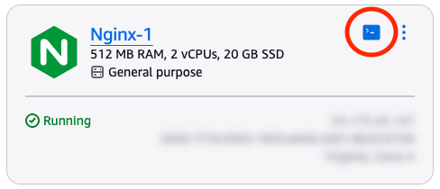
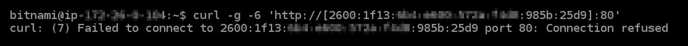
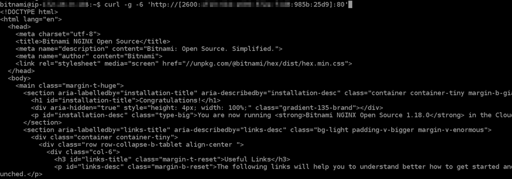
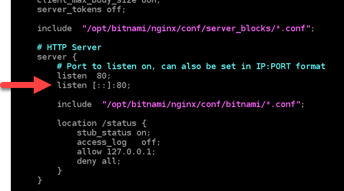

# Configure IPv6 connectivity for Nginx instances in Lightsail

All instances in Amazon Lightsail have a public and a private IPv4 address assigned to them
by default. You can optionally enable IPv6 for your instances to have a public IPv6 address
assigned to them. For more information, see [Amazon Lightsail IP addresses](understanding-public-ip-and-private-ip-addresses-in-amazon-lightsail.md "understanding-public-ip-and-private-ip-addresses-in-amazon-lightsail.md") and [Enable or disable IPv6](amazon-lightsail-enable-disable-ipv6.md "amazon-lightsail-enable-disable-ipv6.md").

After you enable IPv6 for an instance that uses the Nginx blueprint, you must perform an
additional set of steps to make the instance aware of its IPv6 address. In this guide, we show
you the additional steps that you must perform for Nginx instances.

## Prerequisites

Complete the following prerequisites if you haven't already:

- Create an Nginx instance in Lightsail. For more information, see [Create an instance](how-to-create-amazon-lightsail-instance-virtual-private-server-vps.md "how-to-create-amazon-lightsail-instance-virtual-private-server-vps.md").
- Enable IPv6 for your Nginx instance. For more information, see [Enable or disable IPv6](amazon-lightsail-enable-disable-ipv6.md "amazon-lightsail-enable-disable-ipv6.md").

###### Note

New Nginx instances created on or after January 12, 2021, have IPv6 enabled by
default when they are created in the Lightsail console. You must complete the following
steps in this guide to configure IPv6 on your instance even if IPv6 was enabled by
default when you created your instance.

## Configure IPv6 on a Nginx instance

Complete the following procedure to configure IPv6 on a Nginx instance in
Lightsail.

1. Sign in to the [Lightsail console](https://lightsail.aws.amazon.com/ "https://lightsail.aws.amazon.com/").
2. In the **Instances** section of the Lightsail home page, locate the
   Ubuntu instance that you wish to configure, and choose the browser-based SSH client
   icon to connect to it using SSH.

 3. After you're connected to your instance, enter the following command to determine if
your instance is listening to IPv6 requests over port 80. Be sure to replace
`<IPv6Address>` with the IPv6 address assigned to your
instance.

```
curl -g -6 'http://[`<IPv6Address>`]'
```

Example:

```
curl -g -6 'http://[`2001:0db8:85a3:0000:0000:8a2e:0370:7334`]'
```

You will see a response similar to one of the following examples:

    * If your instance is not listening to IPv6 requests over port 80, then you will see
     a response with a **Failed to connect** error message.
     You should continue to complete steps 4 through 9 of this procedure.


    
    * If your instance is listening to IPv6 requests over port 80, then you will see a
     response with the HTML code of the home page of your instance as shown in the
     following example. You should stop here; you do not need to complete steps 4 through 9
     of this procedure because your instance is already configure to for IPv6.


    

4. Enter the following command to open the nginx.conf configuration file using
   Vim.

```
sudo vim /opt/bitnami/nginx/conf/nginx.conf
```

5. Press `I` to enter insert mode in Vim.
6. Add the following text below the `listen 80;` text that is already in the
   file. You might need to scroll down in Vim to see the section where you need to add the
   text.

```
listen [::]:80;
```

The file will look like the following when done:

 7. Press the **Esc** key to exit insert mode in Vim, then type
`:wq!` and press **Enter** to save your edits (write) and
quit Vim. 8. Enter the following command to restart the services of your instance.

```
sudo /opt/bitnami/ctlscript.sh restart
```

9. Enter the following command to determine if your instance is listening to IPv6
   requests over port 80. Be sure to replace `<IPv6Address>`
   with the IPv6 address assigned to your instance.

```
curl -g -6 'http://[`<IPv6Address>`]'
```

Example:

```
curl -g -6 'http://[`2001:0db8:85a3:0000:0000:8a2e:0370:7334`]'
```

You will see a response similar to the following example. If your instance is
listening to IPv6 requests over port 80, then you will see a response with the HTML code
of the home page of your instance.


