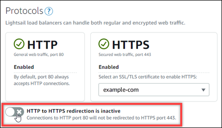

# Redirect HTTP to HTTPS for Lightsail load balancers

After you configure HTTPS on your Amazon Lightsail load balancer, you can configure an HTTP
to HTTPS redirect so that users who browse to your website or web application using an HTTP
connection are automatically redirected to the encrypted HTTPS connection. For more
information about load balancers, see [Load balancers](understanding-lightsail-load-balancers.md "understanding-lightsail-load-balancers.md").

## Complete the

prerequisites

Complete the following prerequisites if you haven't already:

- Create a load balancer and attach instances to it. For more
  information, see [Create a load balancer and attach instances to
  it](create-lightsail-load-balancer-and-attach-lightsail-instances.md "create-lightsail-load-balancer-and-attach-lightsail-instances.md").
- Create an SSL/TLS certificate and attach it to your load balancer to enable
  HTTPS. For more information, see [Create an SSL/TLS certificate for your Lightsail load balancer](create-tls-ssl-certificate-and-attach-to-lightsail-load-balancer-https.md "create-tls-ssl-certificate-and-attach-to-lightsail-load-balancer-https.md"). For
  more information about certificates, see [SSL/TLS certificates](understanding-tls-ssl-certificates-in-lightsail-https.md "understanding-tls-ssl-certificates-in-lightsail-https.md").

## Configure HTTPS redirection on your load balancer using the Lightsail console

Complete the following procedure to configure HTTPS redirection on your load balancer
using the Lightsail console.

1. Sign in to the [Lightsail
   console](https://lightsail.aws.amazon.com/ "https://lightsail.aws.amazon.com/").
2. In the left navigation pane, choose **Networking**.
3. Choose the name of the load balancer for which you want to configure HTTPS
   redirection.
4. Choose the **Inbound traffic** tab.
5. In the **Protocols** section of the page, you can perform one
   of the following actions:



    * Toggle the direction option to active to turn on HTTP to HTTPS
     redirection.
    * Toggle the direction option to inactive to turn off HTTP to HTTPS
     redirection.

Your change takes a few moments to become effective.

## Configure HTTP to HTTPS redirect for a load balancer with the AWS CLI

Complete the following procedure to configure HTTPS redirection on your load balancer
using the AWS Command Line Interface (AWS CLI). You do this
by using the `update-load-balancer-attribute` command. For more information,
see [update-load-balancer-attribute](../../../cli/latest/reference/lightsail/update-load-balancer-attribute.md "../../../cli/latest/reference/lightsail/update-load-balancer-attribute.md") in the _AWS CLI Command
Reference_.

###### Note

You must install the AWS CLI and configure it for Lightsail before
continuing with this procedure. For more information, see [Configure the AWS CLI to work with Lightsail](lightsail-how-to-set-up-and-configure-aws-cli.md "lightsail-how-to-set-up-and-configure-aws-cli.md").

1. Open a Command Prompt or Terminal window.
2. Enter the following command to configure HTTPS redirection on your load
   balancer.

```
aws lightsail update-load-balancer-attribute --load-balancer-name `LoadBalancerName` --attribute-name HttpsRedirectionEnabled --attribute-value `AttributeValue`
```

In the command, replace the following example text with your own:

    * `LoadBalancerName` with the name of the load
     balancer for which you want to activate or deactivate HTTP to HTTPS
     redirection.
    * `AttributeValue` with `true` to
     activate redirection, or `false` to deactivate
     redirection.


    ###### Note

    The `HttpsRedirectionEnabled` attribute in the command
     specifies that you wish to edit whether HTTPS redirection is enabled
     or disabled for the specified load balancer.

Examples:

    * To activate HTTP to HTTPS redirection on your load balancer:


    ```
    aws lightsail update-load-balancer-attribute --load-balancer-name `MyLoadBalancer` --attribute-name HttpsRedirectionEnabled --attribute-value `true`
    ```
    * To deactivate HTTP to HTTPS redirection on your load balancer:


    ```
    aws lightsail update-load-balancer-attribute --load-balancer-name `MyLoadBalancer` --attribute-name HttpsRedirectionEnabled --attribute-value `false`
    ```

Your change takes a few moments to become effective.
