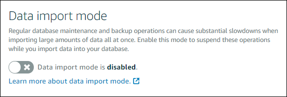

# Import large datasets to your Lightsail database without delays

Regular database backup operations can cause substantial delays, or slowdowns, when
importing large amounts of data all at once. Enable the data import mode for your
Amazon Lightsail managed database to suspend these operations while you import large amounts of
data.

###### Important

All emergency restore backups are deleted when data import mode is enabled. Create a
snapshot of your database if you would like to have a backup before data import mode is
enabled. For more information, see [Create a snapshot of your
database](amazon-lightsail-creating-a-database-snapshot.md "amazon-lightsail-creating-a-database-snapshot.md").

###### To configure the data import mode for your database

1. Sign in to the [Lightsail console](https://lightsail.aws.amazon.com/ "https://lightsail.aws.amazon.com/").
2. In the left navigation pane, choose **Databases**.
3. Choose the name of the database for which you want to configure data import mode.
4. On the **Connect** tab, under the **Data import mode**
   section, use the toggle to turn on the data import mode. Likewise, after the import is
   complete, use the toggle to turn it off.

Now that the data import mode is enabled, database backup operations are suspended. We
recommend that you enable data import mode temporarily. Use it only when it’s necessary for
you to import large amounts of data into your database. Disable data import mode as soon as
you’re done to restore backup operations.

###### Note

Your import may be slowed depending on the amount of data that you're importing. For
more information, see [Optimizing data import](https://lightsail.aws.amazon.com/ls/docs/en/articles/amazon-lightsail-choosing-a-database#optimizing-your-data-import "https://lightsail.aws.amazon.com/ls/docs/en/articles/amazon-lightsail-choosing-a-database#optimizing-your-data-import").
